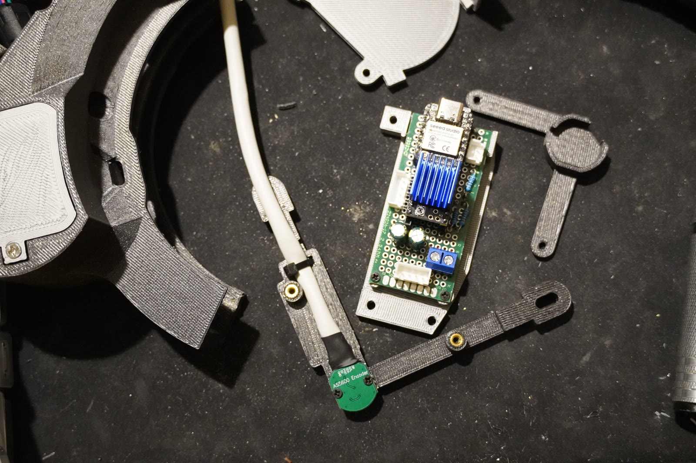

<!--
SPDX-FileCopyrightText: 2026 Matteo Beretta
SPDX-License-Identifier: CC-BY-4.0
-->

<picture>
  <source media="(prefers-color-scheme: dark)" srcset="brand/png/wheelly-logo-horizontal-reversed-3x.png">
  
</picture>

**A motorised filter wheel for astrophotography, made out of a manual one.**

A stepper motor pushes the filter disc through a spring-loaded friction clutch,
an AS5600 magnetic sensor reads where the disc actually is, and an ESP32-S3
talks to your imaging software. Nothing is cut away from the original wheel: the
motorisation clamps around it, and it can come off again.

It was designed around a **manual five-position wheel for 2-inch filters, a
StarDikor** — that is the wheel in every picture, and the wheel every
measurement was taken from. It is not tied to it: the CAD is parametric, and
*[Not all wheels are the same](#not-all-wheels-are-the-same)* below says which
handful of numbers describe yours.

Everything needed to build one is here — the parametric CAD, the firmware, the
INDI driver, the wiring of the board, and a step-by-step assembly guide whose
pictures are rendered from the CAD model itself.

https://github.com/user-attachments/assets/5631b3ca-ad4b-4891-8fa0-1e935ccc16f4

<table><tr>
<td width="50%"></td>
<td width="50%"></td>
</tr><tr>
<td>The printed parts, the board and the AS5600 sensor on its bracket.</td>
<td>The INDI driver's panel in Ekos.</td>
</tr></table>

<p><a href="https://github.com/sponsors/teoteo"></a></p>

## The three guides

| guide | what it takes you through |
|---|---|
| **[Hardware assembly guide](docs/assembly/README.md)** · [Italiano](docs/assembly/it/README.md) | printing, heat-set inserts, clutch, motor, sensor — chapter by chapter, with pictures rendered from the model |
| **[Board assembly guide](pcb/en_wheelly-wiring-diagrams.pdf)** · [board layout](pcb/en_board-layout.svg) · [construction notes](pcb/README.md) | the perfboard hole by hole, as you hold it: where every part sits and every wire runs, printable at 1:1 |
| **[INDI driver guide](docs/driver/README.md)** · [Italiano](docs/driver/it/README.md) | every command and option of the control panel in Ekos: calibration, tolerances, motor |

The same three, as web pages with pictures side by side and a language switch, are on the project's site: **<https://teoteo.github.io/Wheelly/>**. The printable STEP and STL files are attached to each [release](https://github.com/teoteo/Wheelly/releases); what is known not to be right yet is in [`ROADMAP.md`](ROADMAP.md).

## What it is made of

| | |
|---|---|
| **Drive** | NEMA 14 stepper, TMC2208 driver, friction clutch with a co-printed TPU tyre |
| **Position** | AS5600 magnetic encoder on the wheel axis — the driver knows where the disc *is*, not where it was told to go |
| **Brain** | Seeed XIAO ESP32-S3 on a piece of perfboard |
| **Talks to** | INDI (Ekos, KStars) today; the serial protocol is deliberately not tied to one ecosystem, so ASCOM can follow |
| **Printed in** | ASA for the parts that stay, PETG for prototypes, TPU 87A-95A for the tyre and the gaskets (tried on 87A, calculated up to 95A) |

## Where things are

| folder | what is in it |
|---|---|
| [`docs/assembly/`](docs/assembly/) | **the assembly guide** — chapter by chapter, pictures rendered from the model |
| [`docs/driver/`](docs/driver/) | **the INDI driver's control panel** — every command and option, with the part of the panel it talks about |
| `mechanics/wheelly-cad/` | the CAD, in CadQuery: `src/` the generators, `build.py`, `ui.py` the parameter editor |
| [`mechanics/others/`](mechanics/others/README.md) | where to download the makers' models of the **bought** parts (not shipped: needed only to regenerate the CAD) |
| `firmware/` | the ESP32-S3 firmware, a simulator that runs on a PC, and its test bench |
| `driver/indi-wheelly/` | the INDI driver, derived from `INDI::FilterWheel` |
| `pcb/` | the board: how it is built, the bill of materials, the wiring diagrams |
| `brand/` | the logo and the brand guide — **not** under the open licences, see below |

## Building it

```sh
# the CAD: solids, drawings, checks, and the assembly guide
cd mechanics/wheelly-cad
./.venv/bin/python build.py

# the firmware tests, on a PC, no hardware needed
firmware/test/run_all.sh

# the INDI driver
cmake -S driver/indi-wheelly -B build && cmake --build build
```

The full CAD build takes about twenty minutes and ends with the checks; the
assembly guide is regenerated from the assembly it has just produced, so the
guide cannot describe a machine other than the one modelled.

### Installing the INDI driver

It is an ordinary INDI driver: build it, install it, and Ekos finds it in the
filter wheel list.

It needs **libindi with its headers** — `libindi-dev` on Debian and Ubuntu,
`libindi` on Arch and therefore on AstroArch, where there is no separate `-dev`
package.

```sh
cmake -S driver/indi-wheelly -B build -DCMAKE_BUILD_TYPE=Release \
      -DCMAKE_INSTALL_PREFIX=/usr
cmake --build build
sudo cmake --install build
```

That installs `indi_wheelly` next to the other drivers and `indi_wheelly.xml`
into `share/indi/`, which is the directory INDI reads to know what it can offer.
**Use the same prefix your distribution's INDI uses**, normally `/usr`: with
cmake's default `/usr/local` the XML lands in `/usr/local/share/indi`, where
Ekos will not look for it, and the wheel simply never appears in the list.

In Ekos it then shows up as **Wheelly** under *Filter Wheels*. Pick the serial
port the board enumerated on and connect.

To try the whole thing without any hardware:

```sh
python3 driver/indi-wheelly/driver_bench.py
```

It starts the firmware simulator on a pseudo-serial port, attaches the real
driver under `indiserver`, and talks to it with the same XML Ekos uses — so what
the test sees is what Ekos would see.

## Not all wheels are the same

Smaller filters? A seven-slot wheel? A body of a different diameter? You do not
have to redraw anything, and you do not have to fork the project: the CAD is
parametric and it comes with an editor.

**How many filters is not a CAD question at all.** The firmware holds up to
twelve slots, a new wheel starts at five, and how many *this* one has is kept in
the wheel's own memory — the driver asks it, and is told. One firmware, one driver, any
wheel: nobody has to pick "the 7-slot version" from a list.

**The shape of your wheel is a handful of numbers.** The ones that describe the
wheel you already own, with the values of the five-position StarDikor this was
designed around:

| parameter | here | what it is |
|---|---|---|
| `D_body` | 158 mm | the outside diameter of the wheel body |
| `H_body` | 23 mm | how tall it is |
| `R_disc` | 72.5 mm | the radius the clutch presses on |
| `D_plane_opening` | 70.5 mm | the flat milled on the body |

Everything else — the collar, the arm, where the motor sits, the box — is
derived from those and from the parts you have.

**The editor:**

```sh
cd mechanics/wheelly-cad
./.venv/bin/python ui.py          # opens http://localhost:8760
```

Change an expression and the derived values recompute in front of you, the
drawings redraw, and the dimension chains say immediately what else moves.
Nothing is written to disk on its own: the *export* button hands you
`src/parameters_local.py`, a file that overrides the base one and leaves
`src/parameters.py` untouched. Your wheel is a short diff, not a fork.

Then rebuild:

```sh
./.venv/bin/python build.py
```

The checks now run over *your* numbers — and they are meant to complain if a
change breaks a fit. The assembly guide is regenerated too, with your parts and
your dimensions in the text.

One thing to know: the editor does not reload the files by itself. Restart it
after editing the generators or the parameters.

## Status

**Work in progress.** The mechanics are being printed, measured and corrected —
most of the defects found so far were found with a part in hand, not by a
check — and the assembly guide, fourteen chapters, is written and follows the
model as it changes. Expect things to move.

## What is next

- **An ASCOM / Alpaca driver — only if there is demand for it.** Wheelly speaks
  INDI today, and INDI is what it is developed and tested on: there is no
  Windows machine in this project. The serial protocol was deliberately kept
  free of INDI's vocabulary, so an ASCOM driver for Windows, or an Alpaca one
  any client can reach over the network, needs no change in the firmware.
  It will be built if people ask for it — open an issue, or
  [sponsor the repository](https://github.com/sponsors/teoteo) and say so.

## Support the project

Wheelly is free, and it stays free. If it saves you the price of a commercial
filter wheel, or you just want the next piece to arrive sooner, sponsor it:

<p><a href="https://github.com/sponsors/teoteo"></a></p>

Monthly or once, on GitHub Sponsors — the *Sponsor* button at the top of this
page goes to the same place.

It pays for Claude tokens, for filament, for the parts that get printed three
times before they fit, and for the hours. Nothing in the project is held back
for sponsors:
there is no paid version, no private repository and no feature behind a
paywall.

## Licences, and the one thing that is not open

The design is open — MIT for the firmware, LGPL-2.1-or-later for the INDI
driver (the licence of INDI itself), CERN-OHL-P-2.0 for the hardware,
CC-BY-4.0 for the documentation. Build it, change it, sell it. The details are
in [`LICENSING.md`](LICENSING.md).

The **name and the logo** are not part of that: they say who made the machine,
and a permissive licence covers the work, not the name. What you may do with
them without asking — and it is most things — is in
[`TRADEMARK.md`](TRADEMARK.md).
