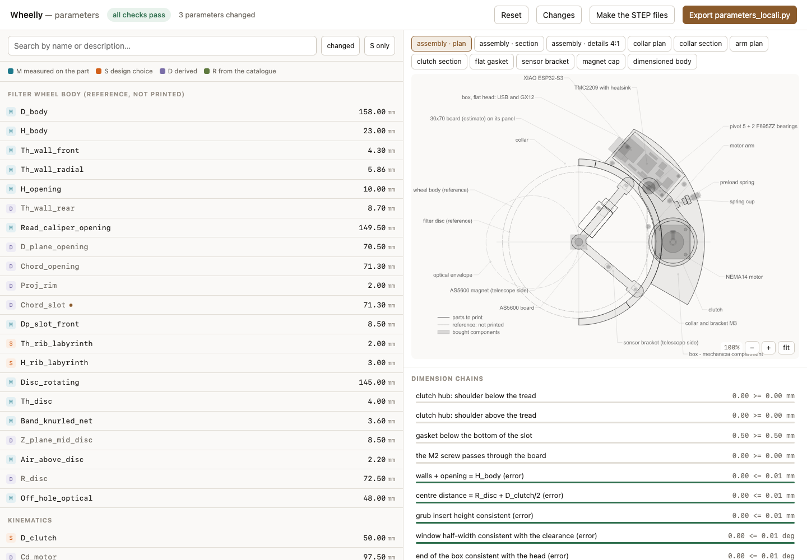

<!--
SPDX-FileCopyrightText: 2026 Matteo Beretta
SPDX-License-Identifier: CC-BY-4.0
-->

*[Leggi in italiano](it/01-the-parameters-page.md)*

# Chapter 1 — Making it fit your wheel

*The published version of this chapter, with pictures side by side and a pinned table of contents, is in [the guide](01-the-parameters-page.html).*

Wheelly is not a single object: it is a set of generators that draw the parts around the wheel you actually own. The page in this chapter is where you tell them what that wheel is - its diameter, how many filters it holds, which magnet you glued on - and everything downstream, from the printed parts to the drawings, follows from it.

> **Maybe skip this one.** If you are building on the same wheel this project was drawn around - a Ø158 mm manual filter wheel - and you are using the same Ø8 × 1 mm diametral magnet, you can skip straight to the next chapter: the parts as published already fit, and the numbers on this page are the ones they were generated from.

## What this chapter needs

| Qty | Part | |
|---:|---|---|

**Tools:** a computer with Python 3.12, a web browser, a caliper, for the one measurement that goes back into the model.

<h3>Step 1 — Get the generators running</h3><ul><li>The parts are not STL files that happen to exist: they are <b>generated</b>, and to change one you run the generator. You need Python 3.12 and two libraries - CadQuery, which builds the solids, and ezdxf, which writes the drawings.</li><li>From the repository: `cd mechanics/wheelly-cad`, then `uv venv --python python3.12 .venv` and `VIRTUAL_ENV=.venv uv pip install cadquery ezdxf`. Plain `python -m venv` and `pip install cadquery ezdxf` work as well, just slower.</li><li><b>Careful:</b> Always call the interpreter inside `.venv`, never the system one: `./.venv/bin/python`. The system Python has neither library, and the error it gives you points at the wrong thing.</li></ul>

<table><tr>
<td width="55%"></td>
<td valign="top"><h3>Step 2 — Open the page</h3><ul><li>`./.venv/bin/python ui.py` opens the editor on <b>http://127.0.0.1:8760/</b> and brings up a browser. `--porta N` puts it somewhere else, `--no-apri` leaves the browser alone - which is what you want over SSH.</li><li>The page lists every parameter in sections, with what it means, where it is used, and whether it was <b>measured on a real part</b>, declared by a supplier, or assumed. That last column is worth reading before you trust a number: most of the defects this project has found came from assumed values nobody checked.</li><li><b>Careful:</b> The page does not reload the files by itself. Change a generator or a parameter on disk and you must <b>restart it</b> - otherwise you are looking at the values it read when it started, and they will disagree with what the build produces.</li><li>The drawing on the right redraws as you type, and under it the <b>dimensional chains</b> show what each change did to the fits that matter - shaft engagement, gasket squeeze, whether the <b>M2</b> screw still passes. A change that breaks one turns red there, before you have printed anything.</li></ul></td>
</tr></table>

<h3>Step 3 — Change what you need, and only that</h3><ul><li>Edits go into `src/parameters_local.py`, which <b>overrides</b> `src/parameters.py` and leaves the base untouched. That way your wheel and the reference wheel stay side by side, and a future update of the project does not silently take your numbers away.</li><li>The ones that matter for a different wheel are the rotating disc diameter, the number of filter positions, and the magnet - diameter and thickness. Change the magnet and the sensor bracket moves with it: the air gap is a consequence, not a setting.</li><li>Everything else has a default that works. A parameter you do not understand is a parameter you should leave alone - each one says which parts depend on it, and some feed six.</li></ul>

<h3>Step 4 — Build, and check it built</h3><ul><li>`./.venv/bin/python build.py` regenerates everything: solids, drawings and the checks. It takes about twenty minutes.</li><li>`./.venv/bin/python build.py --solo-dxf` does the 2D geometry only, in seconds. Use it while you iterate on a dimension, and the full build to confirm nothing now collides.</li><li><b>Careful:</b> <b>Read the end of the build before you print.</b> The checks are the point: they measure the solids that came out and say whether parts intersect, whether screws still reach, whether the wheel still clears the box. A build that ended in an error leaves the previous STEP files on disk, and they look exactly like good ones.</li><li>The parts to print come out in `out/`, and nothing else does: `out/tools/` holds the test jigs and `out/drawings/` the drawings. Opening one folder to send a job is how a jig gets printed instead of a part, and that costs an hour.</li></ul>
