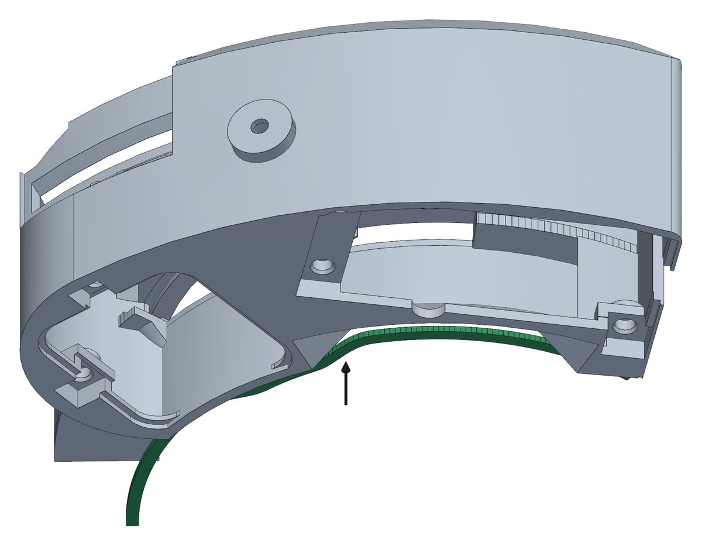
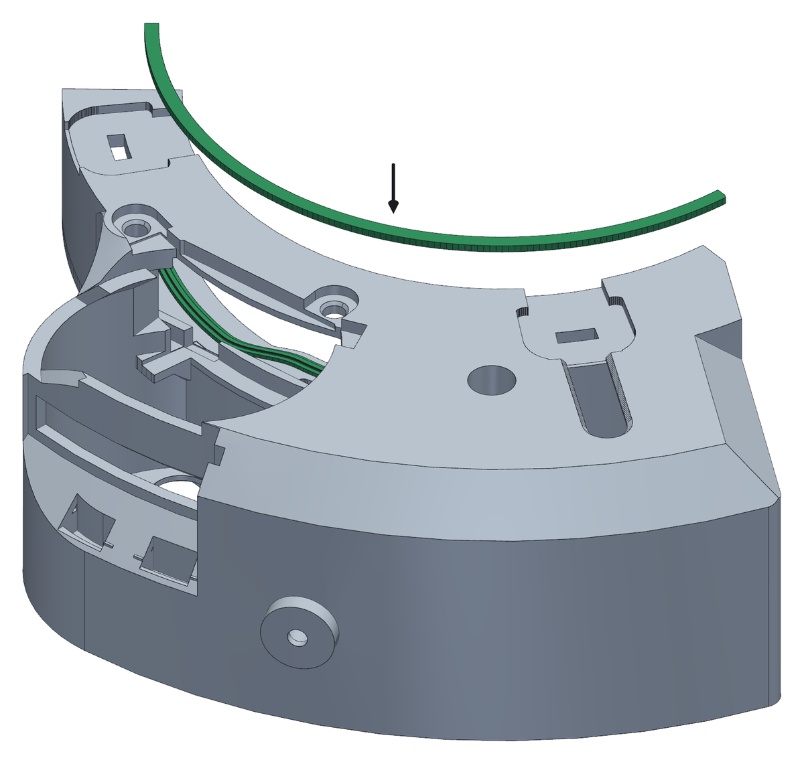

<!--
SPDX-FileCopyrightText: 2026 Matteo Beretta
SPDX-License-Identifier: CC-BY-4.0
-->

*[Leggi in italiano](it/03-collar-and-gaskets.md)*

# Chapter 3 — The collar and its gaskets

*The published version of this chapter, with pictures side by side and a pinned table of contents, is in [the guide](03-collar-and-gaskets.html).*

Two TPU gaskets keep dust out of the wheel where the collar meets it. They are arcs, not rings - the collar is an arc of 130° and so are they - and they are held in their grooves by small buttons that click into sockets. This is bench work: the collar does not go near the wheel until chapter 10.

## What this chapter needs

| Qty | Part | |
|---:|---|---|
| 1 | front gasket | printed, TPU 87A-95A |
| 1 | rear gasket | printed, TPU 87A-95A |

**Tools:** your hands - nothing else.

<table><tr>
<td width="55%"></td>
<td valign="top"><h3>Step 1 — The gasket on the camera side</h3><ul><li>Start at one end and press the gasket into the groove, working along it. The buttons underneath click into their sockets as you go: that is what holds it while you handle the collar.</li><li>The lip faces out of the groove. The groove is 3.0 mm wide and 1.5 mm deep, the gasket is 2.8 mm wide, so it goes in without stretching - if you are stretching it, it is the wrong way round.</li><li>When it is home, 0.5 mm of lip stand proud of the face. That half millimetre is the squash: it is what seals when the wheel body is finally pushed on.</li><li>The gaskets are TPU; their squash is calculated for 95A, and a softer one seals with less force. If you printed them separately they came off the plate flat, lip up; if you have a multi-material printer you can print them straight onto the collar instead, and then there is nothing to fit here.</li></ul></td>
</tr></table>

<table><tr>
<td width="55%"></td>
<td valign="top"><h3>Step 2 — And the one on the telescope side</h3><ul><li>Turn the collar over and do the same in the groove on the other face.</li><li><b>Careful:</b> Take more care over this one. On the camera side there are two barriers in series - this gasket and a labyrinth rib behind it - while on the telescope side the gasket is the only thing between the dust and your filters.</li><li>Run a finger along both when you have finished: the lip should stand the same all the way round, with no section sitting proud where a button did not click home.</li></ul></td>
</tr></table>
