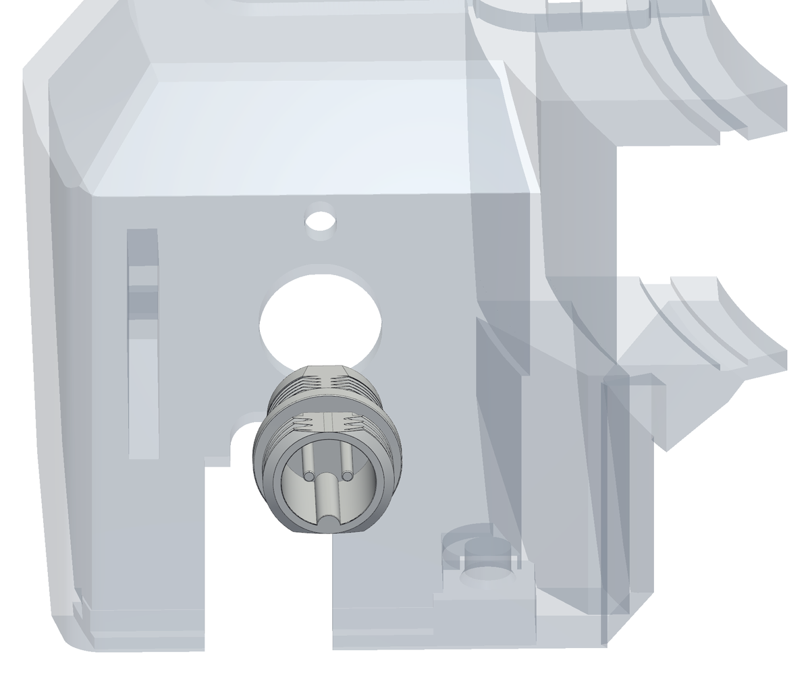
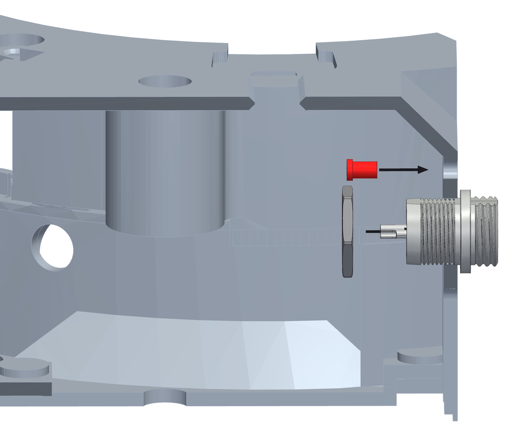
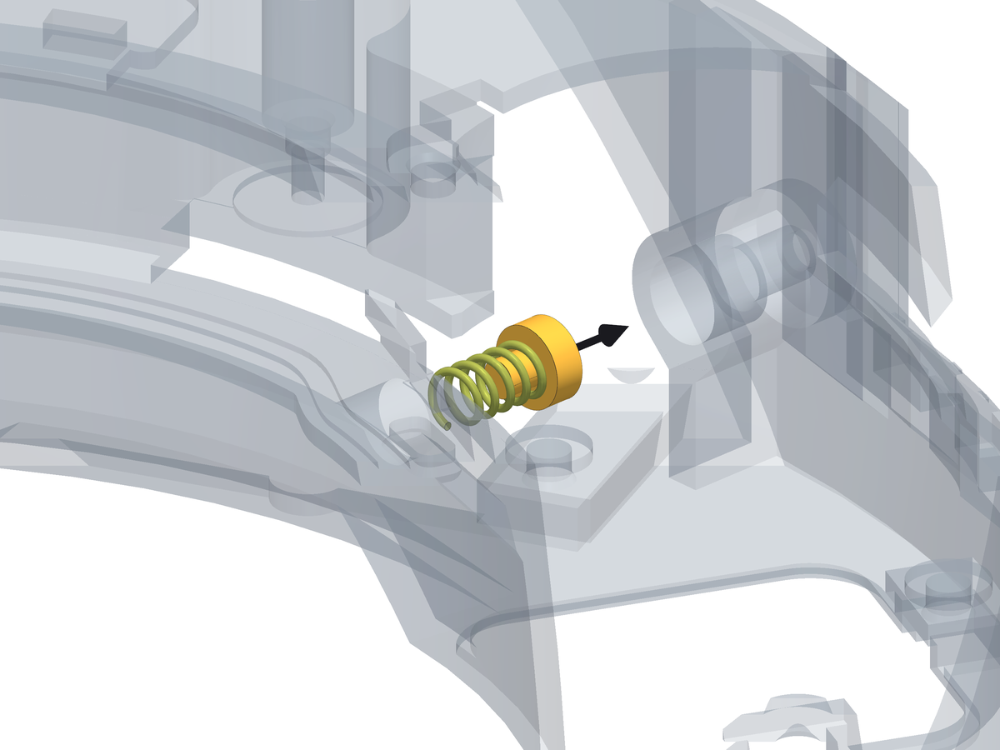

<!--
SPDX-FileCopyrightText: 2026 Matteo Beretta
SPDX-License-Identifier: CC-BY-4.0
-->

*[Leggi in italiano](it/04-spring-and-connector.md)*

# Chapter 4 — The spring and the connector, before the arm

*The published version of this chapter, with pictures side by side and a pinned table of contents, is in [the guide](04-spring-and-connector.html).*

Two things go into the box before the arm does. The preload spring and its cup sit between their seat in the box and the flank of the arm plate: once the arm is in, there is no room left to put them there. And the <b>GX12</b> connector and the status LED go into the head of the box now, while nothing is in the way of the nut.

## What this chapter needs

| Qty | Part | |
|---:|---|---|
| 1 | GX12 connector, 2 pins | panel socket with its nut, and the matching plug for the 12 V lead |
| 1 | D1 red LED, 3 mm | outside the board; if it comes pre-wired for 12 V, take its resistor off |
| 1 | preload spring | compression spring, wire 0.9, Ø6.7 outside, 13.5 mm free, 11.1 mm fitted, 5.7 N/mm (the prototype's came from a clothes peg) |
| 1 | spring cup | printed, ASA |

**Tools:** a 14 mm spanner, for the nut of the <b>GX12</b> connector, a soldering iron, to wire the connector and the LED first.

<table><tr>
<td width="55%"></td>
<td valign="top"><h3>Step 1 — The GX12 connector, from outside the head</h3><ul><li>Wire them first, on the bench: two wires on the <b>GX12</b>&#x27;s pins, for the 12 V terminal on the board (J3), and two on the LED&#x27;s legs, for its 2-way <b>JST XH</b> plug (J5). Make them long enough to reach the board: the board is on the panel, and the panel comes off downwards. Once they are in the head, there is no room for the iron.</li><li>The head of the box is the flat wall at the far end. The <b>GX12</b> connector goes into its Ø12.2 mm hole <b>from the outside</b>, pins first, until its body sits against the outer face.</li><li>Hold it there: the nut goes on from inside in the next step.</li></ul></td>
</tr></table>

<table><tr>
<td width="55%"></td>
<td valign="top"><h3>Step 2 — Its nut and the status LED, from inside</h3><ul><li>Reach in through the electronics opening in the floor. Run the nut onto the connector from inside and tighten it against the inner face of the head.</li><li>The status LED sits just above the connector: push it into its hole from inside until its collar stops on the wall.</li><li>Leave both sets of wires long enough inside to reach the board: the board is on the panel, and the panel comes off downwards, so those wires have to follow it.</li></ul></td>
</tr></table>

<table><tr>
<td width="55%"></td>
<td valign="top"><h3>Step 3 — The spring and its cup, into their seat in the box</h3><ul><li>Find the boss inside the box, on the outer wall, in line with the arm. The spring goes into it <b>from the inside</b>, pushed outwards until it bottoms. (The prototype&#x27;s spring came from a clothes peg: 0.9 mm wire, Ø6.7 mm outside - any spring with those measures and about 5.7 N/mm will do.)</li><li>The cup goes on the outer end of the spring, dished side towards the spring: it is what the preload screw will push on.</li><li>The box is upside down and the hatch under the motor is still open: that is the way in. Bring spring and cup up through the hatch, across towards the seat, and push them into it along its axis.</li><li>The spring is 13.5 mm free and will end up 11.1 mm long with the machine together. Do not try to set anything now - that is what the grub screw is for, once the arm is in (chapter 8).</li></ul></td>
</tr></table>
