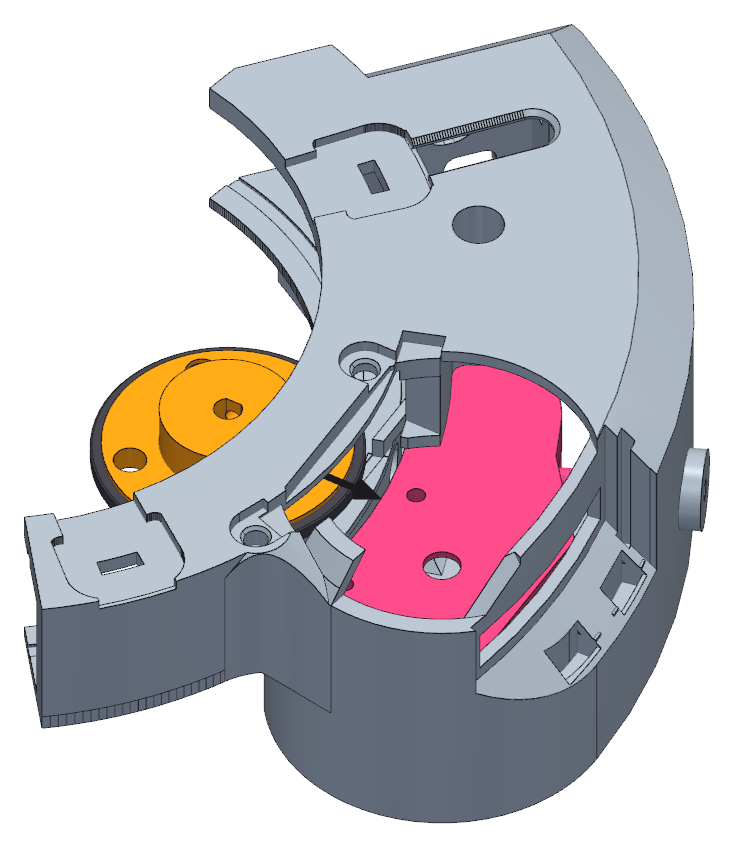

<!--
SPDX-FileCopyrightText: 2026 Matteo Beretta
SPDX-License-Identifier: CC-BY-4.0
-->

*[Leggi in italiano](it/06-clutch-before-the-motor.md)*

# Chapter 6 — The clutch, before the motor

*The published version of this chapter, with pictures side by side and a pinned table of contents, is in [the guide](06-clutch-before-the-motor.html).*

The clutch is what pushes the filter disc: a printed ASA hub with a co-printed TPU tyre around it, gripping the motor shaft on its milled flat through a grub screw. It goes in now, before the motor: once it is on the shaft it cannot be lifted off - the roof of the box is a millimetre above it - so it is put in place first, from the middle of the collar, and the motor comes up into it. Its insert is already in, from chapter 2.

## What this chapter needs

| Qty | Part | |
|---:|---|---|

**Tools:** your hands - nothing else.

<table><tr>
<td width="55%"></td>
<td valign="top"><h3>Step 1 — Slide the clutch in from the middle of the collar</h3><ul><li>The wheel is not in yet, so the middle of the collar is empty. Lower the clutch into it from the telescope side, flat, tyre down, hub collar up.</li><li>Slide it outwards, level, through the gap in the collar ring, until it sits over the arm where the motor shaft will come up.</li><li>Turn it so its <b>four holes</b> stand over the four holes in the arm: the motor screws go through them, later, from above.</li><li>It just rests on the arm for now. The motor comes up into it next.</li></ul></td>
</tr></table>
