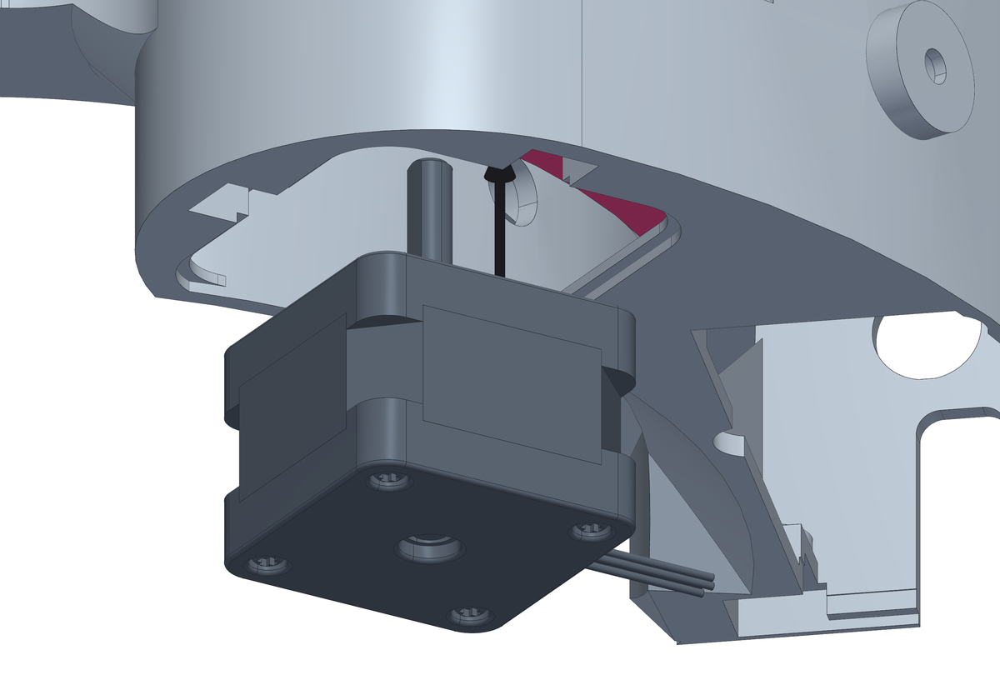
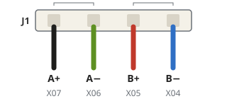
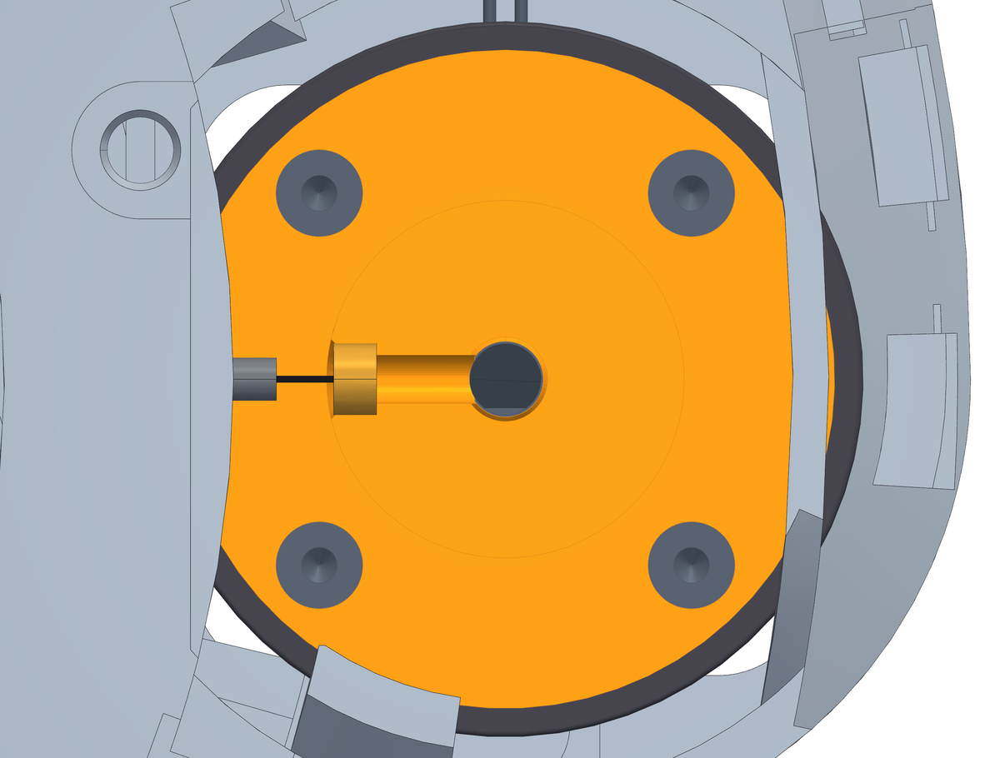
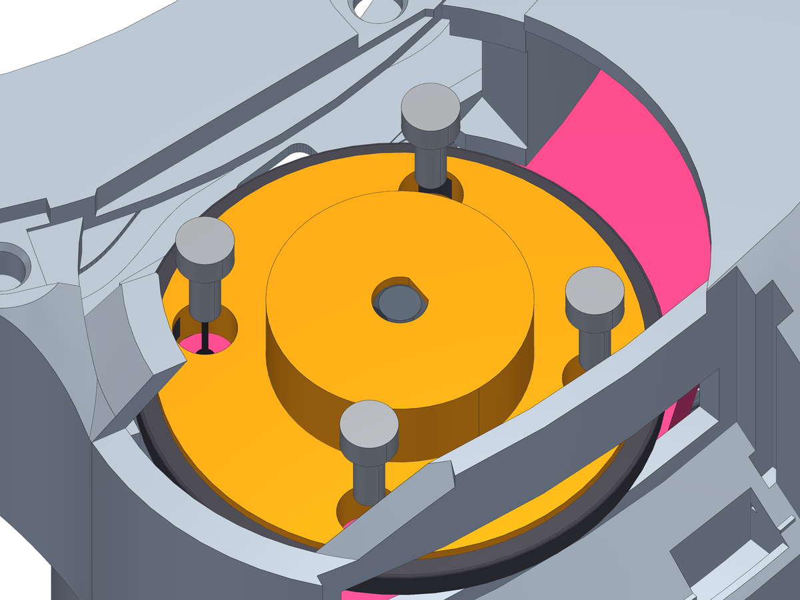
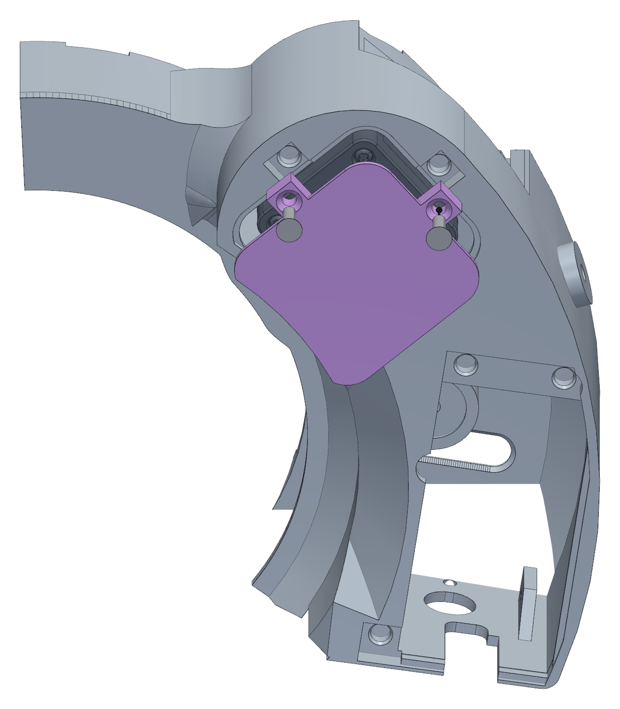

<!--
SPDX-FileCopyrightText: 2026 Matteo Beretta
SPDX-License-Identifier: CC-BY-4.0
-->

*[Leggi in italiano](it/07-motor-into-the-clutch.md)*

# Chapter 7 — The motor, up into the clutch

*The published version of this chapter, with pictures side by side and a pinned table of contents, is in [the guide](07-motor-into-the-clutch.html).*

The motor comes in last of the mechanism, from below through the hatch in the floor, and its shaft finds the clutch that is already waiting over the arm. Then the clutch is locked on the shaft, the four motor screws go in from above through the holes in the clutch, and the hatch is closed.

## What this chapter needs

| Qty | Part | |
|---:|---|---|
| 1 | stepper motor | NEMA 14 14HS10-0404S |
| 1 | M3 grub screw · clutch | M3 × 10 headless hex GRUB SCREW (10.0 mm from the shaft flat to the insert) |
| 4 | M3 screw · motor | M3 × 8, hex socket head (8.0 mm needed under the head) |
| 1 | motor hatch cover | printed, ASA |
| 2 | M3 screw · hatch cover | M3 × 8, countersunk head (8.0 mm needed under the head) |

**Tools:** 1.5 mm hex key, for the clutch grub screw, 2.5 mm hex key, for the motor screws, a PH0 screwdriver, for the countersunk hatch screws.

<table><tr>
<td width="55%"></td>
<td valign="top"><h3>Step 1 — Bring the motor up through the hatch, into the clutch</h3><ul><li>Wire it first, on the bench: its four leads go into the J1 plug, a 4-way <b>JST XH</b>, with the pairs side by side - <b>black+green</b> and <b>red+blue</b>, the pairs chapter 13 checks. Leave them long enough to reach the board.  The motor&#x27;s wires in J1, in the order they sit on the board. Black and green are phase A, red and blue phase B: each pair side by side, never split.</li><li>Bend the four leads down along the body of the motor first: they pass the hatch beside it, and they are wires.</li><li>Turn the shaft so that its milled flat lines up with the flat in the clutch&#x27;s bore, which you can see from above.</li><li>From below, through the hatch, push the motor up: the shaft goes through the arm and into the clutch, and the motor&#x27;s front face comes flat against the arm.</li><li>Turn it so the leads come out towards the electronics bay and the four holes in the motor face line up with the arm&#x27;s.</li><li><b>Careful:</b> Keep the order in the drawing - black A+, green A-, red B+, blue B-. The firmware inverts the motor&#x27;s DIR signal for exactly this order: with a phase the other way round every move runs away from its target, and the fix is then in the firmware (`mechanics_esp32.cpp`), not in the wiring you have already crimped.</li></ul></td>
</tr></table>

<table><tr>
<td width="55%"></td>
<td valign="top"><h3>Step 2 — Lock it with the grub screw</h3><ul><li>Push the clutch down onto the shaft as far as it goes. Turn the shaft by hand until the grub screw hole faces the middle of the collar: the key comes in from there, through the gap in the ring.</li><li>Drive the <b>M3 × 10</b> grub screw into the insert with a 1.5 mm hex key, until it sits on the flat of the shaft.</li><li>The section shows what you cannot see from outside: the flat of the bore is already resting on the flat of the shaft, so the grub screw only has to hold the clutch down - the torque goes through the flats, not through friction.</li><li><b>Careful:</b> Tighten firmly but without leaning on it: on its thin side the insert is held by 1.0 mm of ASA.</li><li>Check by hand that the clutch cannot be turned on the shaft and cannot be pulled off.</li></ul></td>
</tr></table>

<table><tr>
<td width="55%"></td>
<td valign="top"><h3>Step 3 — Four screws, from the top, through the clutch</h3><ul><li>Turn the clutch until its four holes stand over the four holes in the arm. Through the opening over the motor, drop each <b>M3 × 8</b> screw through its hole in the clutch and drive it into the motor&#x27;s own threads with a 2.5 mm hex key, through the same hole.</li><li>Cross them like a wheel - one, then the one opposite - and pull them down evenly. The motor face has to end up flat on the arm, because everything the clutch does depends on the shaft being square to it.</li><li><b>Careful:</b> Do not force them. These thread into the motor&#x27;s own holes and there is nothing to gain past snug.</li></ul></td>
</tr></table>

<table><tr>
<td width="55%"></td>
<td valign="top"><h3>Step 4 — Close the hatch under the motor</h3><ul><li>The square hatch in the floor under the motor is how the motor comes in. Once it is on the arm, close it.</li><li>The cover goes in from below, flat face out: its rim sits on the step round the hatch and it ends up flush with the floor.</li><li>Fix it with two <b>M3 × 8</b> countersunk screws through its ears, into the inserts beside the hatch - a PH0 screwdriver.</li></ul></td>
</tr></table>
