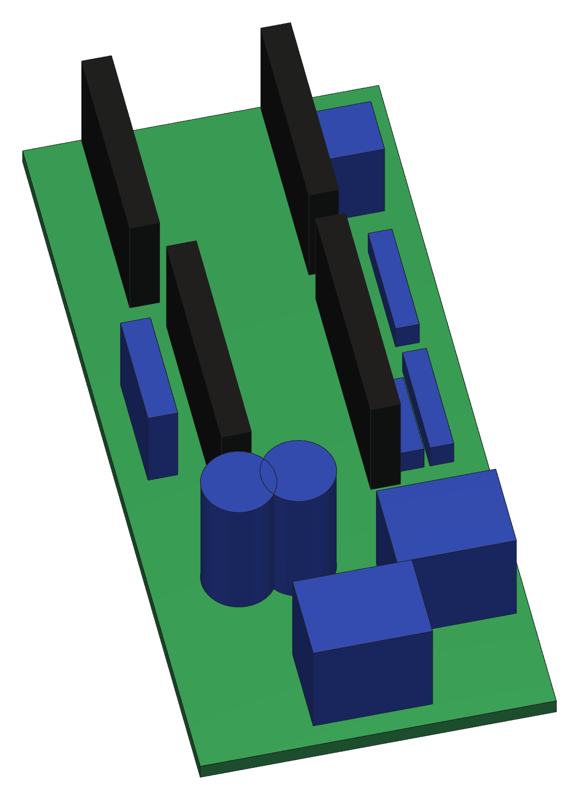
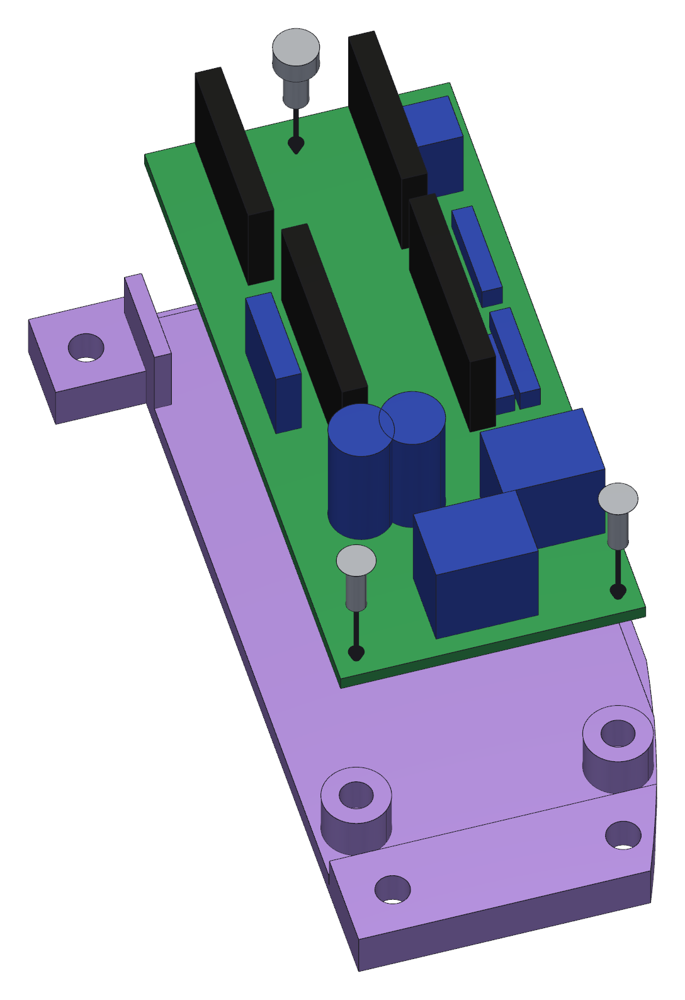
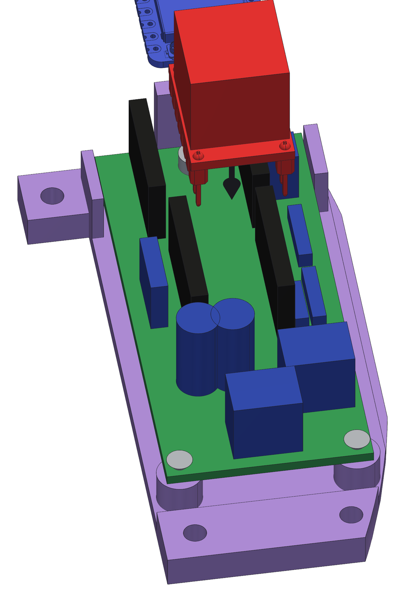

<!--
SPDX-FileCopyrightText: 2026 Matteo Beretta
SPDX-License-Identifier: CC-BY-4.0
-->

*[Leggi in italiano](it/09-board-in-its-panel.md)*

# Chapter 9 — The board in its panel

*The published version of this chapter, with pictures side by side and a pinned table of contents, is in [the guide](09-board-in-its-panel.html).*

The electronics live on a piece of perfboard screwed to the panel that closes the underside of the box. Board and panel come out together, as one piece, which is how you get at a XIAO or a driver once the machine is on a telescope. This chapter puts the board in the panel; what goes where on the board is not repeated here - the wiring booklet in `pcb/` is drawn for someone with the perfboard in hand and the iron hot.

## What this chapter needs

| Qty | Part | |
|---:|---|---|
| 1 | perfboard | double-sided, pitch 2.54, cut to 70 × 30.3 (24 × 10 holes) |
| 2 | female pin strip, 1 × 7 | round pins through both sides, body 3.0 mm - the XIAO's socket |
| 2 | female pin strip, 1 × 8 | the driver's socket |
| 1 | C1 electrolytic capacitor | 47 µF 63 V, Ø6.35 × 13 mm (M) - bulk at the driver's VM, required, and its place on the board matters |
| 1 | C2 electrolytic capacitor | 47 µF 63 V - optional, bulk at the 12 V input |
| 1 | R1 resistor | 10 kΩ ¼ W - pull-up on EN, not in series |
| 1 | R2 resistor | 1 kΩ ¼ W - in series on TX; leave it out if the driver module already has one |
| 1 | R3 resistor | 1 kΩ ¼ W - in series with the LED |
| 1 | J1 JST XH socket, 4 ways | pitch 2.5 - motor phases A± B±, one connector; with its plug |
| 1 | J3 screw terminal block, 2 ways | pitch 5.08 - 12 V in |
| 1 | J4 JST XH socket, 4 ways | pitch 2.5 - sensor: SDA, SCL, VCC, GND; with its plug |
| 1 | J5 JST XH socket, 2 ways | pitch 2.5 - status LED; with its plug |
| 2 | M2 screw · board | M2 × 6, countersunk head (5.5 mm needed under the head) |
| 1 | M2.5 screw · board | M2.5 × 6, hex socket head (5.5 mm needed under the head) |
| 1 | U1 Seeed XIAO ESP32-S3 | native USB-C; FPC antenna on U.FL |
| 1 | U2 TMC2208 stepstick driver, with its heatsink | 8+8 pin module, Rsense 0.110 Ω (M, marked R110). A TMC2208, not a TMC2209: see pcb/BOM.md |

**Tools:** soldering iron, a Ø2.7 mm drill bit, for hole B05 of the perfboard, 2 mm hex key, for the <b>M2.5</b> screw, a PH0 screwdriver for the countersunk <b>M2</b> screws.

<table><tr>
<td width="55%"></td>
<td valign="top"><h3>Step 1 — Build the board first, on the bench</h3><ul><li>The board is a 70 × 30.3 mm piece of 2.54 mm perfboard, 24 × 10 holes, cut to shape with two flats.</li><li><b>Careful:</b> One hole has to be drilled before anything is soldered, while the board is still bare: <b>B05</b> - second column from the head end, row 05, between the two rows of XIAO pins - goes from the Ø2 mm of the printed grid to Ø2.7 mm. That is the hole the third screw uses, and an <b>M2.5</b> will not pass the grid as it comes. It is far easier now than with the components on.</li><li>Wire it as the booklet in `pcb/` shows. Solder <b>sockets</b>, not the modules: the XIAO and the driver have to come out again, and the day one of them fails you do not want a soldering iron anywhere near the telescope.</li><li>Keep the tall parts short. There is 50.5 mm of head room between the board and the roof of the compartment, and that is all there is.</li><li><b>Careful:</b> Do the whole board now and test it on the bench, powered over USB, before it ever goes into the machine. Everything is reachable while it is lying on the table and almost nothing is, later.</li></ul></td>
</tr></table>

<table><tr>
<td width="55%"></td>
<td valign="top"><h3>Step 2 — Drop the board into the panel and screw it down</h3><ul><li>Screw the board down <b>before</b> the XIAO and the driver go in: the <b>M2.5 × 6</b> at the head end is under the XIAO, and with the module in place it cannot be reached.</li><li>The board <b>drops in from above</b>, between the two smooth guides that square it up, and lands on the three posts you put the inserts in back in chapter 2.</li><li>Two <b>M2 × 6</b> countersunk screws at the wide end, through the two printed holes; one <b>M2.5 × 6</b> at the head end, through the hole you opened to Ø2.7 mm - a 2 mm hex key for that one. They are not interchangeable.</li><li><b>Careful:</b> The guides square the board, they do not hold it down: do not force the board sideways under them. An earlier panel had a lip that covered the edge of the board, and it broke.</li></ul></td>
</tr></table>

<table><tr>
<td width="55%"></td>
<td valign="top"><h3>Step 3 — Plug in the XIAO and the driver</h3><ul><li>The XIAO ESP32-S3 goes into its two rows of sockets, USB port towards the head of the board.</li><li>The TMC2208 driver goes into its own socket, standing up.</li><li><b>Careful:</b> Check the orientation of both against the booklet before you push them home. A driver in backwards is the one mistake here that destroys something.</li></ul></td>
</tr></table>
