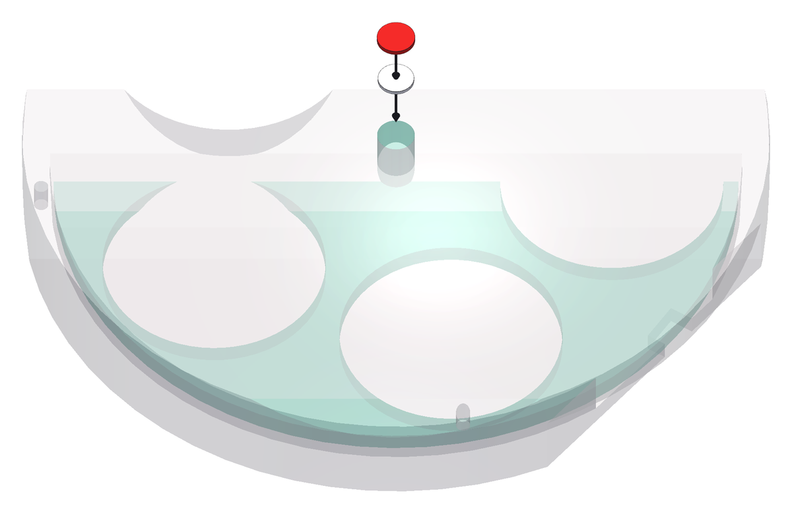
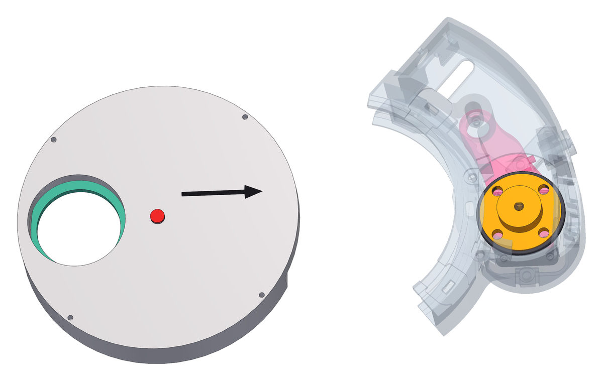

<!--
SPDX-FileCopyrightText: 2026 Matteo Beretta
SPDX-License-Identifier: CC-BY-4.0
-->

*[Leggi in italiano](it/10-the-wheel-body.md)*

# Chapter 10 — The wheel body

*The published version of this chapter, with pictures side by side and a pinned table of contents, is in [the guide](10-the-wheel-body.html).*

Now the machine goes onto the wheel it was built around: a Ø158 mm manual filter wheel. The collar is a half ring, open on the side away from the box, so the wheel does not drop in along its axis - it slides in sideways, between the two gaskets, until its centre is on the collar&#x27;s centre. The magnet goes on the disc before that, because afterwards there is no way to reach it.

## What this chapter needs

| Qty | Part | |
|---:|---|---|
| 1 | magnet spacer | printed, ASA |
| 1 | magnet | Ø8 × 1, **DIAMETRICALLY MAGNETISED** |

**Tools:** cyanoacrylate or epoxy for the magnet, a screwdriver to fit the screws of the wheel&#x27;s detent.

<table><tr>
<td width="55%"></td>
<td valign="top"><h3>Step 1 — The detent off, the magnet on the hub of the filter disc</h3><ul><li>With the wheel still in your hands, turn its disc through a full revolution: the knurled rim sticks 2 mm out of the window in the side of the body, and that is what your thumb is for. Feel it drop into each detent - the spring click stop that holds a manual wheel on each filter - and listen for anything that catches.</li><li>Now take the detent off: unscrew it from the wheel body and put it away somewhere safe, with its spring and any small parts - you need it to use the wheel by hand again. Then screw the detent&#x27;s screws back into their holes in the body, so they do not get lost.</li><li><b>Careful:</b> The detent must come off, always. The motor turns the disc by friction, through the clutch, and it cannot climb out of the notches: it stalls against them, humming, and the wheel never reaches its filter. If a move ever stalls or slips later, the driver&#x27;s log sends you back to this step.</li><li>Turn the disc once more: it must now go round smoothly, with no clicks.</li><li><b>Careful:</b> This is the last time you turn it by the rim: the clutch takes that same window, and the box closes it. Once the machine is on, the disc still turns by hand through the grip in the back of the box, rolling the tyre of the clutch with a thumb - see chapter 13.</li><li>Now find the centre of the filter disc on the telescope side. The <b>Ø7.6 × 0.8 mm</b> printed spacer goes there first, centred on the axis - print four, it is a part that gets lost.</li><li>The <b>Ø8 × 1 mm</b> magnet goes on the spacer, with about 0.5 mm of glue. Centre it: what the sensor reads is the direction of the field, and a magnet off centre reads as an error that changes with the angle.</li><li><b>Careful:</b> The magnet must be magnetised <b>across its diameter</b>, not through its thickness. An axially magnetised magnet looks identical, is easy to buy by mistake, and gives no useful reading at all - and you will not find out until everything is together.</li><li>Stacked up, the face of the magnet ends 2.3 mm above the face of the disc. Nothing here is adjustable, so take the time to get it flat.</li></ul></td>
</tr></table>

<table><tr>
<td width="55%"></td>
<td valign="top"><h3>Step 2 — Slide the wheel into the collar</h3><ul><li>Hold the arm back against the spring - the clutch has to be out of the way, because where the wheel is going the tyre is already.</li><li>Bring the wheel in <b>sideways</b>, from the open side of the collar, with the magnet facing the telescope side. The two gasket lips will spread as the rim passes them.</li><li>Push until the wheel is home against the collar flange and the magnet is on the axis. Then let the arm go: the clutch closes on the rim of the filter disc by itself.</li><li>Check by eye, all the way round, that the wheel is home against the collar flange and that the magnet sits on the axis. This is what you have instead of turning it: the window the rim came through is now full of clutch.</li></ul></td>
</tr></table>
