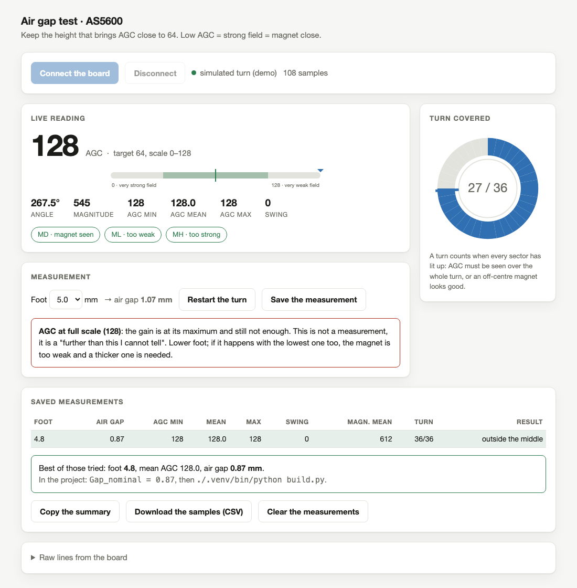

<!--
SPDX-FileCopyrightText: 2026 Matteo Beretta
SPDX-License-Identifier: CC-BY-4.0
-->

*[Leggi in italiano](it/11-setting-the-air-gap.md)*

# Chapter 11 — Setting the air gap

*The published version of this chapter, with pictures side by side and a pinned table of contents, is in [the guide](11-setting-the-air-gap.html).*

The sensor reads a magnet through a gap of less than a millimetre, and that gap is set by one dimension of one printed part - the pad the bracket stands on. Too far and the field is too weak to resolve; too close and the magnet touches the chip. This chapter finds the right height by measuring, not by calculating, because the stack it depends on includes the glue.

> **Maybe skip this one.** If you are building on the same wheel this project was drawn around - a Ø158 mm manual filter wheel, Ø145 mm across the rotating disc - with the same Ø8 × 1 mm diametral magnet, skip straight to the next chapter: the bracket as published already carries the height this procedure arrived at. Come back here only if the readings in chapter 13 come out poor.

## What this chapter needs

| Qty | Part | |
|---:|---|---|
| 1 | U3 AS5600 magnetic encoder module | round Ø16.85 flattened to 15, a row of 8 pads; needs the VDD5V-VDD3V3 bridge, after which it no longer takes 5 V |

**Tools:** any ESP32 board on a breadboard - it does not have to be the XIAO, 2 × <b>M2 × 4</b> screws, cylinder or countersunk head, a 2 mm flat screwdriver, or the driver for those heads, a caliper, Chrome or Edge: the test page uses Web Serial.

<h3>Step 1 — Why this cannot be calculated</h3><ul><li>The design stack says the spacer and magnet sit 1.8 mm above the hub face. Glued on a real pivot it <b>measures 2.3</b> - half a millimetre disappears into the two joints and the print tolerance of the spacer.</li><li>Half a millimetre is not a detail here: without counting it the bracket comes out that much too low, and the real gap was <b>0.07 mm</b> - the magnet grazing the chip.</li><li>So the height is chosen by trying feet of known thickness and reading what the sensor says. It takes twenty minutes and it is the only way to include the glue.</li></ul>

<h3>Step 2 — Print the feet and the spacer</h3><ul><li>`out/tools/gap_gauges.step` holds 7 feet, 4.6 to 5.8 mm tall - gaps from 0.67 to 1.87 mm - with the height engraved on the tab. `out/magnet_spacer.step` is the spacer the magnet sits on.</li><li><b>Careful:</b> In the slicer, <b>do not also turn on hole compensation</b>: the magnet hole is already drawn oversize for it, and the two corrections add up.</li><li>After printing, <b>measure the magnet hole with a caliper</b> and tell the model: `Comp_hole_printing` is a number about your printer, not about this project, and from then on it applies to the real bracket too - which wants that fit tight.</li><li>You also need two <b>M2 × 4</b> screws, cylinder or countersunk head: they cut their own thread in the 1.8 mm hole. Longer ones poke through and hold the foot off the face.</li></ul>

<h3>Step 3 — Wire the sensor board on the bench</h3><ul><li>Any ESP32 will do for this - a WROOM-32 on a breadboard is fine, it does not have to be the XIAO. Power the AS5600 module at <b>3.3 V</b>, SDA and SCL to the two I²C pins, and DIR to ground.</li><li><b>Careful:</b> The module must carry its <b>VDD5V-VDD3V3 jumper</b>, and after that jumper it no longer tolerates 5 V. Check continuity between pins 1 and 2 of the chip before you power anything: a lifted jumper does not go silent, it quietly halves the readings and looks exactly like a weak magnet.</li><li>Load `firmware/air_gap_test/air_gap_test.ino`: `cd firmware &amp;&amp; ./flash.sh air_gap_test`.</li></ul>

<h3>Step 4 — Read it on the page, not on the serial monitor</h3><ul><li>`cd firmware &amp;&amp; ./gap_page.sh` serves the test bench on <b>http://localhost:8770/</b> and opens it. It shows AGC live, lights up the sectors of the turn as you cover them, and keeps the table of measurements with the suggested gap already worked out.</li><li><b>Careful:</b> It needs <b>Chrome or Edge</b>: the page talks to the board over Web Serial, which Safari and Firefox do not have. And it must be served over localhost, not opened as a file.</li><li><b>Careful:</b> Close any other serial monitor first - the IDE&#x27;s, or the one `flash.sh` leaves open. One program at a time can hold the port.</li></ul>

<table><tr>
<td width="55%"></td>
<td valign="top"><h3>Step 5 — One foot at a time, and turn the disc a full turn</h3><ul><li>Wheel on the table, telescope side up. Foot on the face with its ring around the magnet - it centres itself and stays there under its own weight - then the sensor board <b>screwed down on top</b>.</li><li><b>Careful:</b> Screwed, not just resting. A board that only sits there lifts, and then the foot is not what sets the gap any more. It is the first mistake to not make twice.</li><li>For each foot: `r` on the page or the monitor, <b>one whole turn</b> of the disc by hand - take it by the knurled rim - then `s` for the summary. A full turn matters because the magnet is never perfectly centred, and a single spot flatters or punishes it.</li><li>Judge on <b>magnitude</b>, not on AGC. With this magnet at 3.3 V the AGC sits at full scale whatever the height, so it tells you nothing; magnitude is the number that moves.</li><li><b>Careful:</b> If even the lowest foot cannot bring the readings up, the <b>Ø8 × 1 mm</b> magnet is too weak as it stands and you want a thicker one. That is a conclusion, not a failure.</li></ul></td>
</tr></table>
