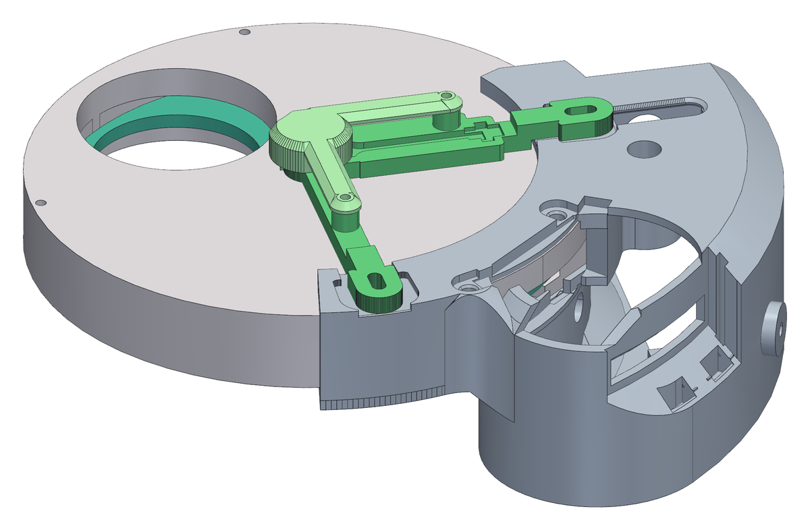
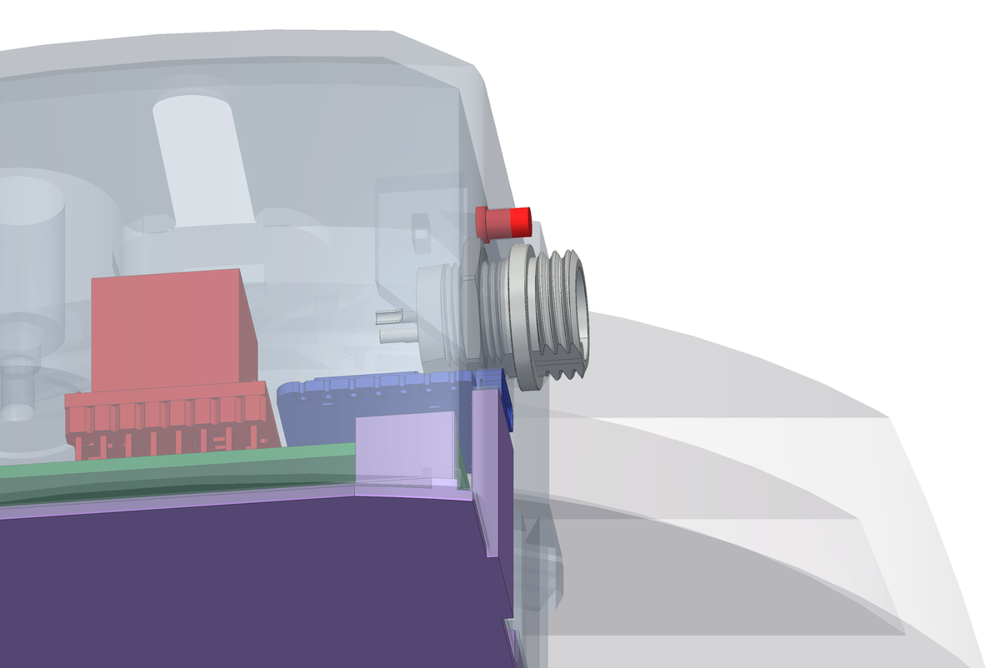
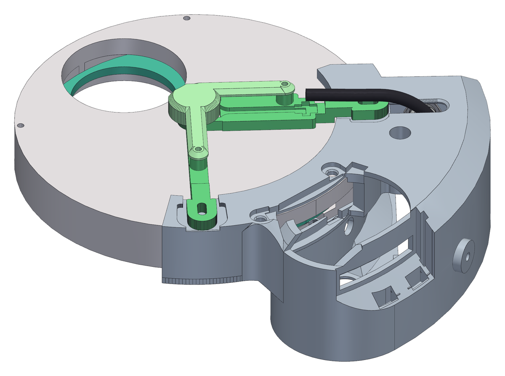
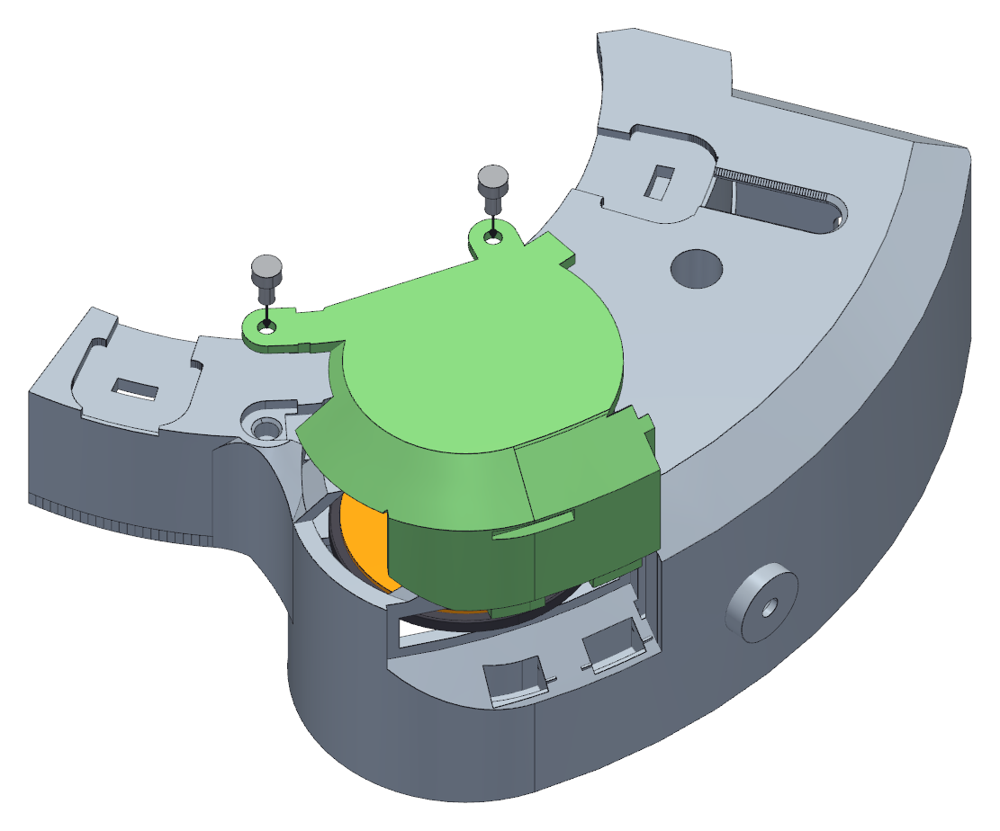

<!--
SPDX-FileCopyrightText: 2026 Matteo Beretta
SPDX-License-Identifier: CC-BY-4.0
-->

*[Leggi in italiano](it/13-first-checks.md)*

# Chapter 13 — First checks

*The published version of this chapter, with pictures side by side and a pinned table of contents, is in [the guide](13-first-checks.html).*

Everything below is done on the bench, with the machine on the table and nothing screwed to a telescope. The order matters, and not only because each check assumes the one before it passed: each one <b>isolates one thing</b>. When something is wrong, you want to be looking at one possible cause and not three - three is how an evening goes, and this project has spent one that way.

## What this chapter needs

| Qty | Part | |
|---:|---|---|
| 1 | grip cover | printed, ASA |
| 2 | M3 screw · grip cover, knurled head | M3 × 6, hex socket head (6.0 mm needed under the head) |

**Tools:** a USB-C cable, the 12 V supply and its <b>GX12</b> lead, 2.0 mm hex key, in case the preload needs a touch, 2.5 mm hex key, only if the knurled cover screws are too tight for your fingers.

<table><tr>
<td width="55%"></td>
<td valign="top"><h3>Step 1 — Before any power, by eye and by the preload screw</h3><ul><li><b>Careful:</b> The disc no longer turns by its own rim: the clutch now fills the window its knurled rim used to stick out of. It turns through the clutch - a thumb on the tyre (better with a glove, so as not to leave grease on it), in the recess at the back of the box that the last step closes - and step 3 uses that. This first step needs no turning at all.</li><li>Look down the gap between the collar and the wheel, all the way round: the wheel must be home against the flange everywhere, with an even gap.</li><li>Look at the sensor bracket from the side. There must be daylight between its pad, under the cover, and the face of the disc.</li><li>The one moving thing you can still reach is the preload. Back the <b>M4 × 14</b> grub screw right out until the spring goes slack, then take it back in to where it was, feeling the point where the spring starts to load. It must move smoothly the whole way - if it grinds or steps, the arm is binding on its pivot, and that is worth opening the box for now rather than on a mount in the dark.</li></ul></td>
</tr></table>

<h3>Step 2 — The two supplies: when the 12 V go on, and when they come off</h3><ul><li>The machine has two supplies, and they do different things. The <b>USB</b> from the computer runs the board: firmware, sensor, status LED. The <b>12 V</b>, through the <b>GX12</b> at the head of the box, run only the motor driver and the motor. Everything the board has to say, it says on USB alone.</li><li><b>On</b> only to turn the motor: from step 4 to step 7 here, and on the telescope. The USB goes in first and the 12 V after, as the wiring booklet does; the other order does not harm the driver, but this way the board is already up and watching when the motor side wakes.</li><li><b>Careful:</b> <b>Off</b> - pull the <b>GX12</b> lead - before you plug or unplug anything inside the box, the motor above all: a stepper pulled off a live driver kills it on the spot. Off before the panel comes out, and off when you have finished: 12 V first, then the USB.</li><li>Turning the disc by hand does not need them off: at rest the motor is released, and a thumb on the clutch turns it. Turn slowly. If you turned a holding current on (Options), take the 12 V off first, or you are fighting the motor; and set the LED to Off if you do not want its alarm flashes - to the firmware, a disc moved by hand is a drift.</li></ul>

<table><tr>
<td width="55%"></td>
<td valign="top"><h3>Step 3 — USB only: the board comes up, and reads the angle</h3><ul><li>Plug in the USB only - the port comes out at the head of the box - and leave the 12 V off. Check that the status LED comes up.</li><li>Turn the disc slowly with a thumb on the clutch tyre, in the grip at the back of the box, and watch the angle the sensor reports. It must change smoothly and come back to the same value at the same filter, to within a fraction of a degree.</li><li><b>Careful:</b> If the reading jumps or sticks, stop: it is almost always the magnet - not centred, or magnetised through its thickness instead of across its diameter.</li></ul></td>
</tr></table>

<h3>Step 4 — Now the 12 V: the driver chip, before anything turns</h3><ul><li>Plug in the 12 V. Then `cd firmware &amp;&amp; ./flash.sh driver_test` asks the board what it can see, which is faster than a multimeter and wrong less often.</li><li>It answers two questions. First, <b>does the single-wire UART echo?</b> Four bytes go out and must come straight back, because TX and RX are joined through the 1 kΩ resistor - and that is true whether or not the driver chip is alive. No echo means the fault is in the wire or that resistor, and the driver is not even a suspect yet.</li><li>Second, <b>who answers, and at which address</b>. It prints the silicon version: `0x20` is a TMC2208, `0x21` a TMC2209. The firmware accepts both.</li><li><b>Careful:</b> From here on the 12 V must be on: without them the chip is simply off and says nothing, and that silence is not a finding.</li><li><b>Careful:</b> Never unplug the motor with the 12 V in - it kills the driver instantly. The motor goes in before the power, not after.</li></ul>

<h3>Step 5 — Does the motor turn, and are the phases paired right?</h3><ul><li>`./flash.sh motor_test` runs one full turn one way and one back, reading the driver&#x27;s status half way through each.</li><li><b>Watch the shaft.</b> This step exists for a fault no register can see: the four driver outputs are two <b>pairs</b>, A with A and B with B, and if the four-way connector breaks a pair the motor buzzes, warms up and stays put. As far as the driver is concerned two coils are connected, so it reports nothing wrong.</li><li>The right pairs on this motor are <b>black+green</b> and <b>red+blue</b>.</li><li>Two opposite turns and the power side is good.</li></ul>

<h3>Step 6 — How much current your clutch wants</h3><ul><li>`./flash.sh torque_test` climbs in steps - 150, 200, 250, 300, 350 mA - and holds the motor turning for eight seconds at each, so you can <b>resist the clutch with your hand</b> and feel where it stops slipping.</li><li>You are at the wheel and not at the screen, so the motor tells you which step it is on: before each one it makes that many short <b>nudges</b>, countable by ear or with a hand on the disc.</li><li>The reference build settled at <b>350 mA</b>, and that is the firmware default. Yours may want less.</li><li><b>Careful:</b> It stops below the motor&#x27;s 400 mA rating on purpose. If the clutch still slips at the top step, the answer is not the last fifty milliampere: it is the <b>spring preload</b>, because that is what sets the slipping threshold, not the motor.</li><li><b>Careful:</b> At 350 mA the motor burns about 7 W while it moves. That is nothing for the two seconds of a filter change, because the holding current is zero and the motor is released at rest - but it would be a different matter with holding turned on.</li></ul>

<table><tr>
<td width="55%"></td>
<td valign="top"><h3>Step 7 — Under power, one position at a time</h3><ul><li>With the 12 V still on, ask for the next filter position. The disc should turn, slow down, and settle on its position.</li><li>Go round all the positions twice. The wheel takes the shortest way round (the panel&#x27;s Direction of travel) and creeps into each position in a few short legs. A move that runs away from its target instead means J1&#x27;s phase order does not match the firmware (chapter 7); a position that is not reached means the motor stalled or the clutch is slipping - check first that the wheel&#x27;s detent is really off (chapter 10).</li><li>It is the first time the wheel finds its positions by itself, so watch and listen for the whole first revolution.</li><li>If it slips, bring the preload grub screw in by a quarter turn at a time - no more - and try again.</li><li><b>Careful:</b> Only when all of this passes should the machine go on a telescope. It is much easier to take the panel off on a table than at the back of a mount in the dark.</li><li>Done: the 12 V off first, then the USB.</li></ul></td>
</tr></table>

<table><tr>
<td width="55%"></td>
<td valign="top"><h3>Step 8 — Turn it by hand, then close the grip</h3><ul><li>Find the recess in the back of the box, in line with the clutch. The black tyre of the clutch stands 2.0 mm out of it: roll it with a thumb and the disc turns. A little over half a turn of the thumb moves one filter along.</li><li>Use it now to check by hand what you have just watched under power, and use it later whenever the filters or the optical train need cleaning with the train off.</li><li>The cover goes in <b>from above</b>. The two thick tabs under its foot drop into their pockets at the bottom of the recess, the tongue at the spring end runs down the groove in the end wall, the flat top drops into the opening over the motor and the two small round tabs into the pockets in the collar. It all comes flush with the top of the box.</li><li>Fix it with two <b>M3 × 6</b> socket head screws with a <b>knurled</b> head, one through each small round tab, into the inserts in the collar. Their heads stand on the tabs, above the top of the box, so they turn by hand. The cover also wraps the top of the curved wall, and the two screws are what make sure it stays closed.</li><li>To take it off, undo both screws with your fingers - no key needed - then hook a fingernail in the notch across its face - the one in line with the clutch - and pull straight up: the flat top of the notch is the face to pull on.</li><li><b>Careful:</b> Leave the cover on whenever you are not turning the wheel by hand. The opening looks onto the friction surface, and dust that settles there is dust between the clutch and the disc.</li></ul></td>
</tr></table>
