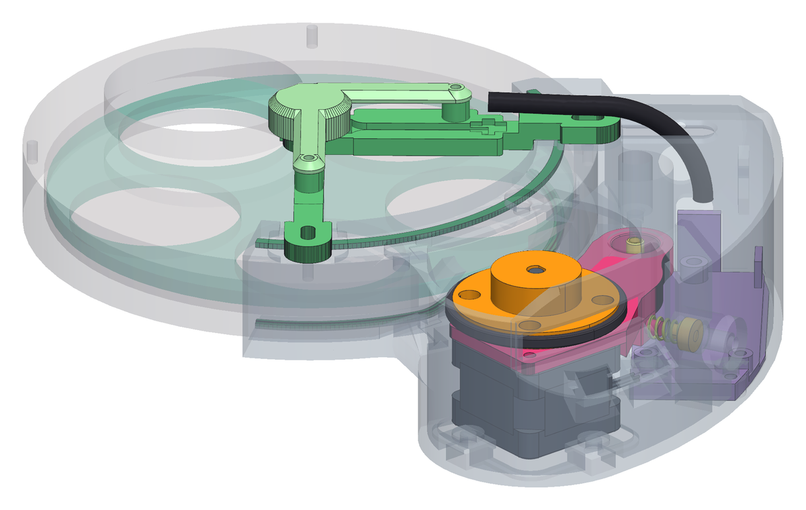
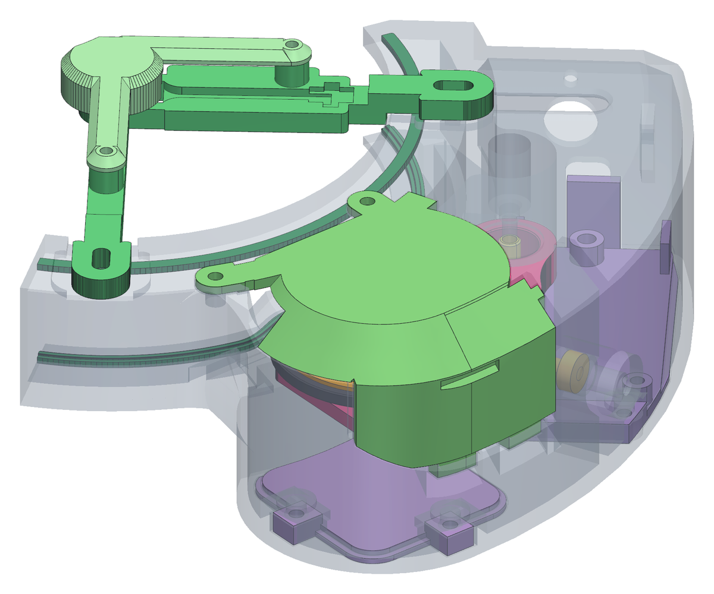
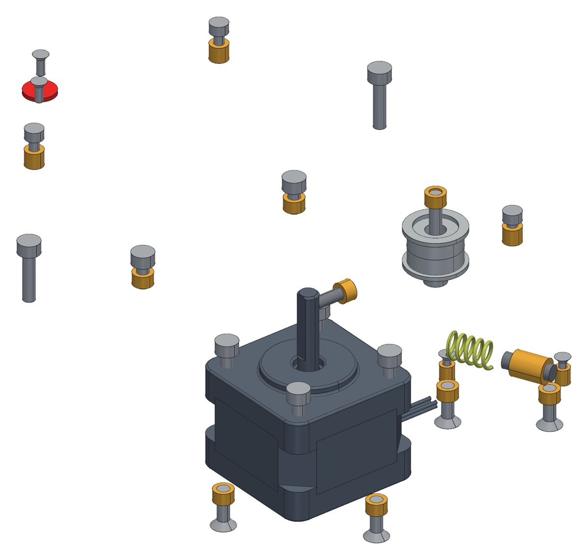
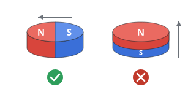

<!--
SPDX-FileCopyrightText: 2026 Matteo Beretta
SPDX-License-Identifier: CC-BY-4.0
-->

*[Read in English](../00-parts-tools-and-printing.md)*

# Capitolo 0 — Pezzi, attrezzi e stampa

*La versione pubblicata di questo capitolo, con le immagini accanto al testo e l'indice sempre in vista, è nella [guida](00-parts-tools-and-printing.html).*

Prima di piantare il primo inserto, ecco la macchina intera: tutto ciò di cui è fatta e tutto quello che ti serve sul banco. I colori che vedi qui sono quelli che ogni pezzo tiene per il resto della guida: se in questa figura distingui il braccio dal collare, li distinguerai anche quindici passi più avanti, mezzi nascosti dietro la scatola.

## Cosa serve per questo capitolo

| Q.tà | Pezzo | |
|---:|---|---|
| | **Pezzi stampati** | |
| 1 | scatola e collare | stampato, ASA, 124,9 g — lo sportello dell'elettronica sul piatto: un piatto da 143 × 143 mm, col pezzo girato di 46°, alto 60 mm; oppure la faccia del connettore GX12 sul piatto: 133 × 133 mm, girato di 145°, alto 140 mm |
| 1 | braccio | stampato, ASA, 14,5 g — faccia superiore sul piatto: corpo e piastra del motore finiscono sullo stesso piano |
| 1 | mozzo della frizione | stampato, ASA, 11,8 g — asse verticale, faccia del collarino sul piatto |
| 1 | battistrada della frizione | stampato, TPU 87A-95A, 1,7 g — co-stampato con il mozzo |
| 1 | staffa del sensore | stampato, ASA, 10,4 g — la faccia piana di sotto, con il pattino, sul piatto |
| 1 | coperchio del sensore | stampato, ASA, 3,2 g — faccia esterna sul piatto |
| 1 | pannellino della basetta | stampato, ASA, 9,9 g — faccia esterna sul piatto |
| 1 | scodellino della molla | stampato, ASA, 0,3 g — dorso piatto sul piatto, scodella in su |
| 1 | coperchio della presa | stampato, ASA, 11,7 g — capovolto, faccia superiore sul piatto |
| 1 | coperchio della botola del motore | stampato, ASA, 5,2 g — faccia esterna sul piatto: è quella in vista, a filo del fondo |
| 1 | rondella del perno | stampato, ASA, 0,2 g — flangia sul piatto, manicotto in su |
| 4 | distanziale del magnete | stampato, ASA, 0,6 g — quattro copie: è un pezzo che si perde |
| 1 | guarnizione anteriore | stampato, TPU 87A-95A, 0,7 g — piatta sul letto, labbro in su (co-stampala con il collare se hai una stampante multimateriale) |
| 1 | guarnizione posteriore | stampato, TPU 87A-95A, 0,7 g — piatta sul letto, labbro in su (co-stampala con il collare se hai una stampante multimateriale) |
| | **Meccanica da comprare** | |
| 2 | cuscinetto F695ZZ | F695ZZ flangiato, 5 × 13 × 4 |
| 1 | grano M3 · frizione | M3 × 10, GRANO a brugola senza testa (dalla fresata dell'albero all'inserto ci sono 10,0) |
| 1 | grano M4 · precarico | M4 × 14, GRANO a brugola senza testa (dal dorso dello scodellino all'imbocco del bosso ci sono 12,1) |
| 2 | inserto M2,5 · coperchio del sensore | inserto a caldo M2,5, Ø4,6 × 4,0 **M** |
| 1 | inserto M2,5 · colonnina della basetta, lato testata | inserto a caldo M2,5, Ø4,6 × 4,0 **M** |
| 2 | inserto M2 · colonnina della basetta | inserto a caldo M2, Ø3,6 × 4,0 **M** |
| 2 | inserto M3 · coperchio della presa | inserto a caldo M3, Ø5,0 × 3,0 **M** |
| 1 | inserto M3 · grano della frizione | inserto a caldo M3, Ø5,0 × 3,0 **M** |
| 2 | inserto M3 · coperchio della botola | inserto a caldo M3, Ø5,0 × 3,0 **M** |
| 3 | inserto M3 · vite del pannellino | inserto a caldo M3, Ø5,0 × 3,0 **M** |
| 1 | inserto M3 · perno | inserto a caldo M3, Ø5,0 × 3,0 **M** |
| 1 | inserto M4 · vite di precarico | inserto a caldo M4, Ø6,3 × 8,1 **M** |
| 1 | magnete | Ø8 × 1, **DIAMETRALMENTE MAGNETIZZATO** |
| 1 | motore passo-passo | NEMA 14 14HS10-0404S |
| 1 | molla di precarico | molla di compressione, filo 0,9, Ø esterno 6,7, libera 13,5, montata 11,1, 5,7 N/mm (quella del prototipo viene da una molletta per i panni) |
| 1 | vite M2,5 · basetta | M2,5 × 6, testa brugola (servono 5,5 sotto testa) |
| 2 | vite M2,5 · coperchio del sensore | M2,5 × 8, testa brugola (servono 7,0 sotto testa) |
| 2 | vite M2 · basetta | M2 × 6, testa svasata (servono 5,5 sotto testa) |
| 2 | vite M2 · modulo AS5600 | M2 × 4, testa svasata (servono 4,0 sotto testa) |
| 2 | vite M3 · serraggio del collare | M3 × 14, testa brugola (servono 12,4 sotto testa) |
| 2 | vite M3 · coperchio della presa, testa zigrinata | M3 × 6, testa brugola (servono 6,0 sotto testa) |
| 2 | vite M3 · coperchio della botola | M3 × 8, testa svasata (servono 8,0 sotto testa) |
| 4 | vite M3 · motore | M3 × 8, testa brugola (servono 8,0 sotto testa) |
| 3 | vite M3 · pannellino | M3 × 8, testa svasata (servono 8,0 sotto testa) |
| 1 | vite M3 · perno | M3 × 20, testa brugola (servono 20,0 sotto testa) |
| | **Elettronica da comprare** | |
| 1 | U1 Seeed XIAO ESP32-S3 | USB-C nativo; antenna FPC su U.FL |
| 1 | U2 driver stepstick TMC2208, con il suo dissipatore | modulo a 8+8 pin, Rsense 0,110 Ω (M, marcata R110). Un TMC2208, non un TMC2209: vedi pcb/BOM.md |
| 1 | C1 condensatore elettrolitico | 47 µF 63 V, Ø6,35 × 13 mm (M) - di riserva sulla VM del driver, obbligatorio, e il suo posto sulla basetta conta |
| 1 | C2 condensatore elettrolitico | 47 µF 63 V - facoltativo, di riserva sull'ingresso a 12 V |
| 1 | R1 resistenza | 10 kΩ ¼ W - pull-up su EN, non in serie |
| 1 | R2 resistenza | 1 kΩ ¼ W - in serie su TX; non metterla se il modulo del driver ne ha già una |
| 1 | R3 resistenza | 1 kΩ ¼ W - in serie al LED |
| 1 | J1 presa JST XH, 4 vie | passo 2,5 - fasi del motore A± B±, un solo connettore; con la sua spina |
| 1 | J3 morsettiera a vite, 2 poli | passo 5,08 - ingresso 12 V |
| 1 | J4 presa JST XH, 4 vie | passo 2,5 - sensore: SDA, SCL, VCC, GND; con la sua spina |
| 1 | J5 presa JST XH, 2 vie | passo 2,5 - LED di stato; con la sua spina |
| 2 | strip femmina, 1 × 7 | piedini tondi passanti da due lati, corpo 3,0 mm - lo zoccolo del XIAO |
| 2 | strip femmina, 1 × 8 | lo zoccolo del driver |
| 1 | basetta millefori | doppia faccia, passo 2,54, tagliata a 70 × 30,3 (24 × 10 fori) |
| 1 | U3 modulo encoder magnetico AS5600 | tondo Ø16,85 spianato a 15, una fila di 8 piazzole; vuole il ponticello VDD5V-VDD3V3, dopo il quale non accetta più i 5 V |
| 1 | C3 condensatore ceramico | 100 nF (104), 16 V o più - sulle piazzole del modulo, non sulla basetta |
| 1 | D1 LED rosso, 3 mm | fuori dalla basetta; se arriva già cablato per i 12 V, togligli la resistenza |
| 1 | connettore GX12, 2 poli | presa da pannello con il suo dado, e la spina corrispondente per il cavo dei 12 V |
| 1 | cavo CAT5 | rigido, Ø5,6 - dal sensore alla basetta |
| 1 | cavo USB, da USB-A a USB-C | gomito laterale a 90 gradi su tutti e due i capi: si attacca e si stacca a ogni sessione |
| 2 | ferriti a clip | sul cavo del motore e sul cavo USB, due o tre giri dentro ciascuna |

**Attrezzi:** una stampante 3D e i filamenti: ASA e TPU, di qualunque durezza da 87A a 95A (provato con l&#x27;87A, calcolato fino al 95A), saldatore con le punte per inserti a caldo <b>M2</b>, <b>M2,5</b>, <b>M3</b> e <b>M4</b>, e una punta fine per cablare la basetta, una punta da trapano da Ø2,7 mm, per un foro della millefori, chiavi a brugola da 1,5, 2 e 2,5 mm, un cacciavite PH0 e un cacciavite piatto da 2 mm, una chiave da 14 mm, per il dado del connettore <b>GX12</b>, un calibro, per controllare quello che esce dal piatto, una fascetta da 2,5 mm per il cavo del sensore, una goccia di colla per il magnete: cianoacrilato o epossidica, un computer con Python 3.12 e Chrome o Edge, e un cavo USB-C, una scheda ESP32 qualsiasi su una breadboard, per regolare il traferro, l&#x27;alimentatore da 12 V col suo cavo <b>GX12</b>, per le prime prove, un blocchetto squadrato contro cui premere gli inserti, una superficie piana e pulita contro cui premere i cuscinetti, 2 viti <b>M2 × 4</b>, a testa cilindrica o svasata, per i piedini del traferro, un cacciavite adatto alle viti del fermo della ruota.

<table><tr>
<td width="55%"></td>
<td valign="top"><h3>Passo 1 — Che cosa stai costruendo</h3><ul><li>Una ruota portafiltri manuale, motorizzata: i pezzi stampati si serrano attorno alla ruota che hai già e si tolgono di nuovo senza tagliare niente. Il progetto è nato attorno a una StarDikor a cinque posizioni per filtri da 2 pollici - è la ruota che vedi in tutte le figure - e per una ruota diversa bastano pochi parametri, non un nuovo progetto.</li><li>Il motore passo-passo è appeso sotto un braccio che ruota su un perno, e una molla spinge il braccio in modo che la frizione prema sul bordo del disco dei filtri. Tutto il resto - il sensore, la scheda, la scatola - si appoggia su questi pochi pezzi.</li><li><b>Il corpo della ruota si monta per ultimo</b>, e il motivo è misurato: sopra la frizione, con la ruota al suo posto, non c&#x27;è spazio per imboccarlo sull&#x27;albero.</li></ul></td>
</tr></table>

<table><tr>
<td width="55%"></td>
<td valign="top"><h3>Passo 2 — I pezzi da stampare</h3><ul><li>14 pezzi stampati: ASA per quelli che restano, TPU per il battistrada e le guarnizioni - di qualunque durezza da 87A a 95A: la macchina è stata provata solo con l&#x27;87A, e fino al 95A è calcolata, non provata. Masse e orientamenti di stampa sono nell&#x27;elenco qui sopra: l&#x27;orientamento fa parte del progetto, non è una scelta lasciata allo slicer.</li><li>Se stai facendo un prototipo, stampalo prima in PETG: è più facile. Le tolleranze di questo progetto però sono state misurate sull&#x27;ASA, quindi un pezzo in PETG può accoppiarsi in modo leggermente diverso.</li><li>Qui i pezzi sono mostrati dove finiscono, non disposti sul piatto, e la scatola è disegnata trasparente perché si veda quello che copre. Guarda i colori: da qui in avanti non cambiano più.</li></ul></td>
</tr></table>

<table><tr>
<td width="55%"></td>
<td valign="top"><h3>Passo 3 — E la meccanica che compri</h3><ul><li>Il motore, due cuscinetti, il magnete, la molla, le viti e gli inserti - mostrati qui da soli, senza i pezzi stampati attorno, così vedi quanto sono pochi e dove va ciascuno.</li><li>Acciaio per le viti e i cuscinetti, ottone per gli inserti a caldo: due colori, perché nella figura di una macchina sarebbero altrimenti la stessa macchia grigia.</li><li>Anche l&#x27;elettronica si compra, ed è nell&#x27;elenco qui sopra, sotto la sua voce: qui non ha una figura perché si cabla sul banco prima di incontrare la macchina, al capitolo 9.</li><li><b>Attenzione:</b> Controlla il magnete prima di comprarlo: deve essere <b>magnetizzato diametralmente</b>. Quello magnetizzato nello spessore è identico a vederlo, si compra per sbaglio facilmente e al sensore non dà niente da leggere.  A sinistra quello da comprare: N e S affiancati, il campo lungo il diametro. A destra quello che sembra uguale e non funziona: N sopra, S sotto.</li></ul></td>
</tr></table>
