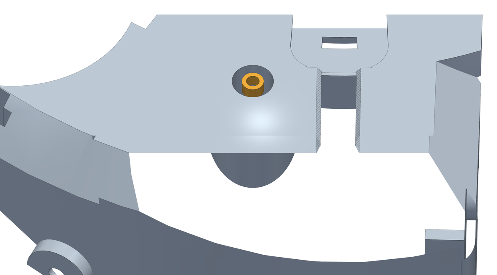
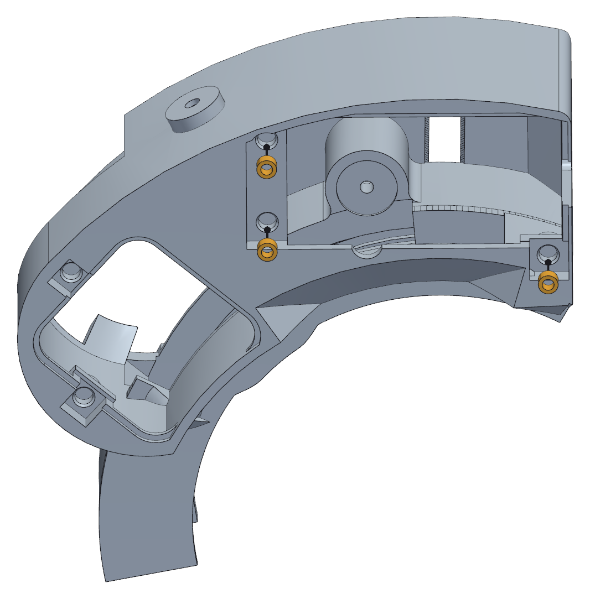
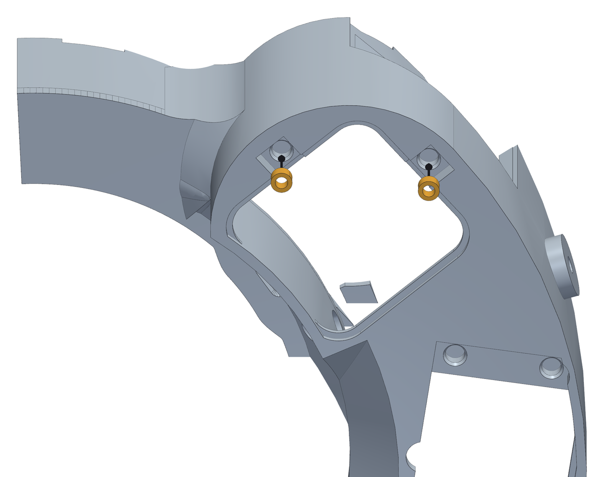
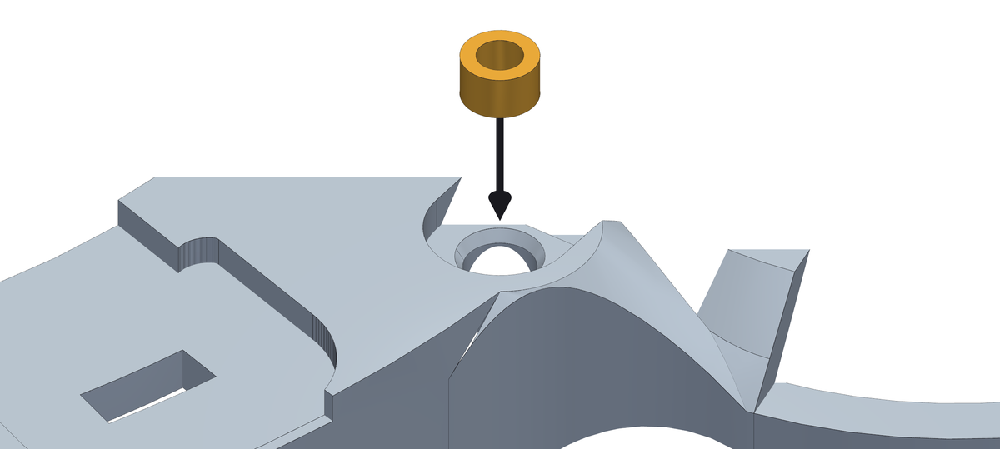
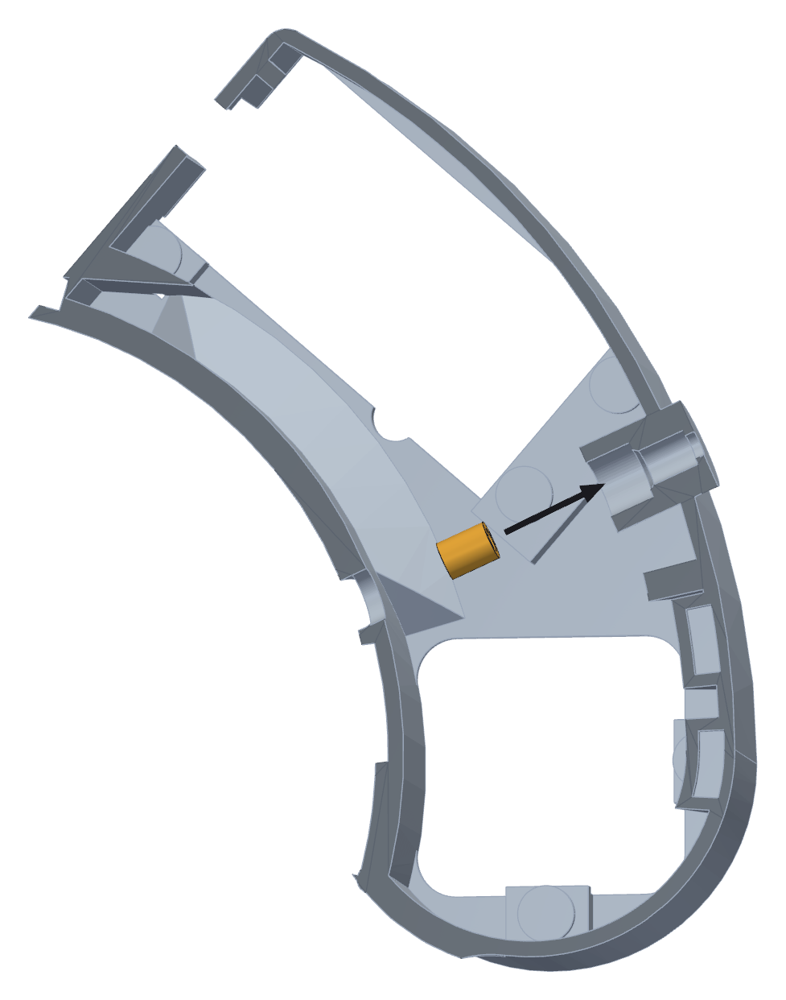
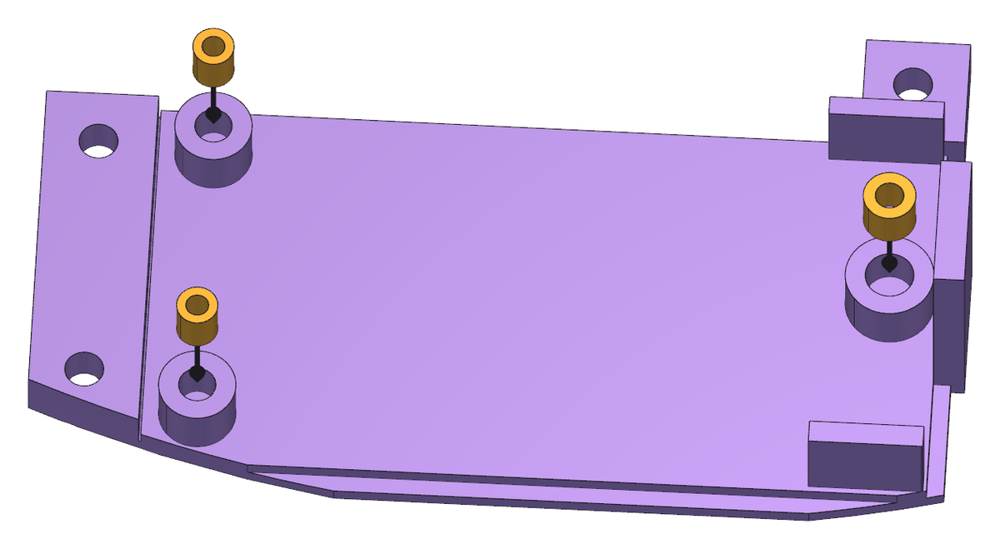
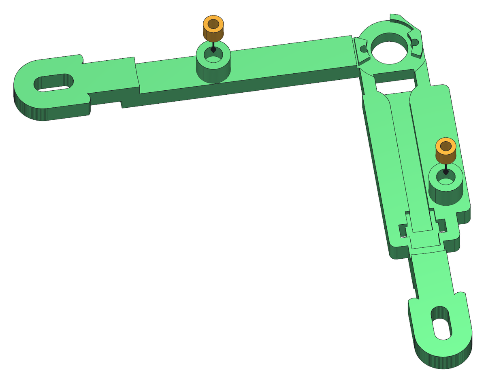
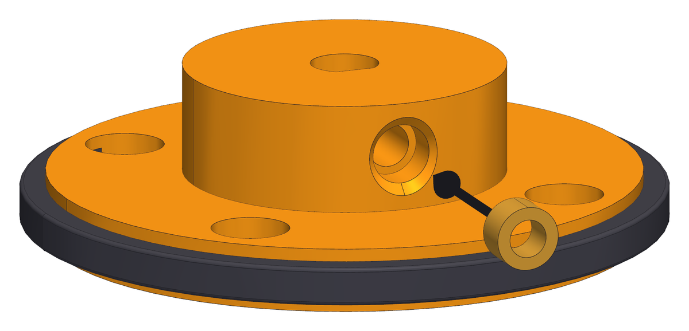

<!--
SPDX-FileCopyrightText: 2026 Matteo Beretta
SPDX-License-Identifier: CC-BY-4.0
-->

*[Read in English](../02-heat-set-inserts.md)*

# Capitolo 2 — Inserti a caldo

*La versione pubblicata di questo capitolo, con le immagini accanto al testo e l'indice sempre in vista, è nella [guida](02-heat-set-inserts.html).*

Prima di montare qualunque cosa, i pezzi stampati ricevono i loro inserti d&#x27;ottone. Farli tutti in una volta non è solo comodità: alcuni si raggiungono solo finché il pezzo è nudo, e l&#x27;inserto del perno è il caso più chiaro - una volta che il braccio è appeso a quel perno, nessun saldatore ci arriverà più. Qui va anche l&#x27;inserto della frizione, per ultimo.

## Cosa serve per questo capitolo

| Q.tà | Pezzo | |
|---:|---|---|
| 1 | scatola e collare | stampato, ASA |
| 1 | inserto M3 · perno | inserto a caldo M3, Ø5,0 × 3,0 **M** |
| 3 | inserto M3 · vite del pannellino | inserto a caldo M3, Ø5,0 × 3,0 **M** |
| 2 | inserto M3 · coperchio della botola | inserto a caldo M3, Ø5,0 × 3,0 **M** |
| 2 | inserto M3 · coperchio della presa | inserto a caldo M3, Ø5,0 × 3,0 **M** |
| 1 | inserto M4 · vite di precarico | inserto a caldo M4, Ø6,3 × 8,1 **M** |
| 1 | pannellino della basetta | stampato, ASA |
| 2 | inserto M2 · colonnina della basetta | inserto a caldo M2, Ø3,6 × 4,0 **M** |
| 1 | inserto M2,5 · colonnina della basetta, lato testata | inserto a caldo M2,5, Ø4,6 × 4,0 **M** |
| 1 | staffa del sensore | stampato, ASA |
| 2 | inserto M2,5 · coperchio del sensore | inserto a caldo M2,5, Ø4,6 × 4,0 **M** |
| 1 | mozzo della frizione | stampato, ASA |
| 1 | battistrada della frizione | stampato, TPU 87A-95A |
| 1 | inserto M3 · grano della frizione | inserto a caldo M3, Ø5,0 × 3,0 **M** |

**Attrezzi:** saldatore con le punte per inserti a caldo <b>M2</b>, <b>M2,5</b>, <b>M3</b> e <b>M4</b>, un blocchetto squadrato su cui fare contrasto, o una mano ferma.

<table><tr>
<td width="55%"></td>
<td valign="top"><h3>Passo 1 — Il collare: prima di tutto l'inserto del perno</h3><ul><li>Metti il collare davanti a te con il lato del telescopio verso l&#x27;alto: è il lato dove sporge il perno.</li><li>Pianta l&#x27;inserto <b>M3</b> da <b>Ø5,0 × 3,0 mm</b> nella punta del perno, a filo con la faccia attorno.</li><li><b>Attenzione:</b> Fai questo prima degli altri e prima di montare qualsiasi cosa. Il braccio si appende a questo perno e la vite che lo tiene arriva dal lato opposto: una volta che il collare è sulla ruota, a questo foro non ci torni più.</li><li>Tieni il saldatore dritto lungo il perno. Il foro è sull&#x27;asse di una colonnina da Ø5 mm, e un inserto che entra storto si porta dietro storta anche la vite.</li></ul></td>
</tr></table>

<table><tr>
<td width="55%"></td>
<td valign="top"><h3>Passo 2 — La scatola: tre inserti per le viti del pannellino</h3><ul><li>La scatola prende tre inserti <b>M3</b>, tutti sulla faccia esterna attorno all&#x27;apertura del pannellino.</li><li>Ancora gli stessi inserti da <b>Ø5,0 × 3,0 mm</b>.</li><li>Le viti del pannellino sono svasate e tirano il pannellino piatto contro questa faccia, quindi qui conta che gli inserti finiscano a filo e non sporgenti.</li></ul></td>
</tr></table>

<table><tr>
<td width="55%"></td>
<td valign="top"><h3>Passo 3 — La scatola: due inserti per la botola del motore</h3><ul><li>Altri due inserti <b>M3</b> da <b>Ø5,0 × 3,0 mm</b>, sulla faccia esterna del fondo, nelle due tasche accanto alla botola quadrata sotto il motore.</li><li>Entrano da sotto, come quelli del pannellino, e finiscono a filo con il cielo della loro tasca: le due orecchie del coperchio della botola si appoggiano in quelle tasche e le sue viti svasate le tirano piatte.</li></ul></td>
</tr></table>

<table><tr>
<td width="55%"></td>
<td valign="top"><h3>Passo 4 — Il collare: l'inserto per la vite del coperchio</h3><ul><li>Un altro inserto <b>M3</b> da <b>Ø5,0 × 3,0 mm</b>, nella piccola tasca tonda sopra il collare, accanto alla grande apertura sopra il motore.</li><li>Entra dall&#x27;alto, dritto in giù, a filo con il fondo della tasca. La linguetta del coperchio si appoggia in quella tasca e la sua vite scende in questo inserto.</li></ul></td>
</tr></table>

<table><tr>
<td width="55%"></td>
<td valign="top"><h3>Passo 5 — Il collare: l'inserto per la seconda vite del coperchio</h3><ul><li>Un secondo inserto <b>M3</b> da <b>Ø5,0 × 3,0 mm</b> per il coperchio, nell&#x27;altra piccola tasca tonda sopra il collare: quella nell&#x27;angolo dove il collare incontra la parete curva attorno al motore, dalla parte opposta all&#x27;elettronica.</li><li>Dritto in giù come il primo, a filo con il fondo della tasca.</li></ul></td>
</tr></table>

<table><tr>
<td width="55%"></td>
<td valign="top"><h3>Passo 6 — La scatola: l'inserto M4 per la vite di precarico</h3><ul><li>Nella scatola ne va ancora uno, ed è quello diverso dagli altri: un inserto <b>M4</b> da <b>Ø6,3 × 8,1 mm</b>, nella parete esterna dietro la sede della molla.</li><li>Entra <b>in orizzontale, dall&#x27;interno della scatola</b>, lungo l&#x27;asse della molla: il saldatore attraversa il vano dal lato della ruota, passa dal piccolo foro tondo nella parete interna e spinge l&#x27;inserto verso la parete esterna. Tieni il saldatore in bolla. (Se la punta per inserti è troppo corta per arrivarci - nella ruota di riferimento lo era quella da 8 mm - usa al suo posto un chiodo, scaldato col saldatore: è così che è entrato questo inserto.)</li><li><b>Attenzione:</b> È l&#x27;inserto in cui lavora il grano del precarico, e la molla ci spinge sopra con 13,5 N per tutta la vita della macchina. Vale il minuto in più che ci vuole per piantarlo in squadra.</li></ul></td>
</tr></table>

<table><tr>
<td width="55%"></td>
<td valign="top"><h3>Passo 7 — Il pannellino: tre piccoli inserti per la scheda</h3><ul><li>Il pannellino prende tre inserti sulla faccia interna, in cima alle colonnine su cui si appoggerà la scheda.</li><li>Due sono <b>M2</b>, da <b>Ø3,6 × 4,0 mm</b>, e quello dal lato della testata è <b>M2,5</b>, da <b>Ø4,6 × 4,0 mm</b>. Non sono intercambiabili: per quello monta la punta <b>M2,5</b>.</li><li><b>Attenzione:</b> Sono piccoli. Lascia lavorare il saldatore e fermati appena l&#x27;ottone è a livello della colonnina: una colonnina spinta troppo si fonde e si accorcia, e poi la scheda poggia sul pannellino invece che sulle colonnine.</li></ul></td>
</tr></table>

<table><tr>
<td width="55%"></td>
<td valign="top"><h3>Passo 8 — La staffa del sensore: due inserti per il suo coperchio</h3><ul><li>Per ultima la staffa del sensore: due inserti <b>M2,5</b> da <b>Ø4,6 × 4,0 mm</b>, uno a ciascuna estremità della sede del coperchio.</li><li>Il coperchio si avvita su questi due e tiene la scheda del sensore contro la staffa, quindi piantali in squadra.</li></ul></td>
</tr></table>

<table><tr>
<td width="55%"></td>
<td valign="top"><h3>Passo 9 — La frizione: l'inserto M3 per il suo grano</h3><ul><li>Prendi la frizione stampata, fuori dalla macchina, in mano, e trova il canale sul fianco del mozzo. Va dritto dall&#x27;esterno fino al foro dell&#x27;albero.</li><li>Spingi l&#x27;inserto <b>Ø5,0 × 3,0 mm</b> <b>M3</b> nel canale con la punta <b>M3</b>, dalla parte dell&#x27;ottone.</li><li>Tieni il saldatore in linea col canale. Il canale è aperto fino all&#x27;esterno proprio per questo: le spalle del battistrada arrivano a Ø46 mm, e un saldatore che entra storto finisce su di loro invece che sull&#x27;inserto.</li><li><b>Attenzione:</b> L&#x27;inserto si ferma da solo dove il canale si stringe nel foro di passaggio del grano. Non spingerlo oltre: non c&#x27;è modo di tirarlo fuori.</li></ul></td>
</tr></table>
