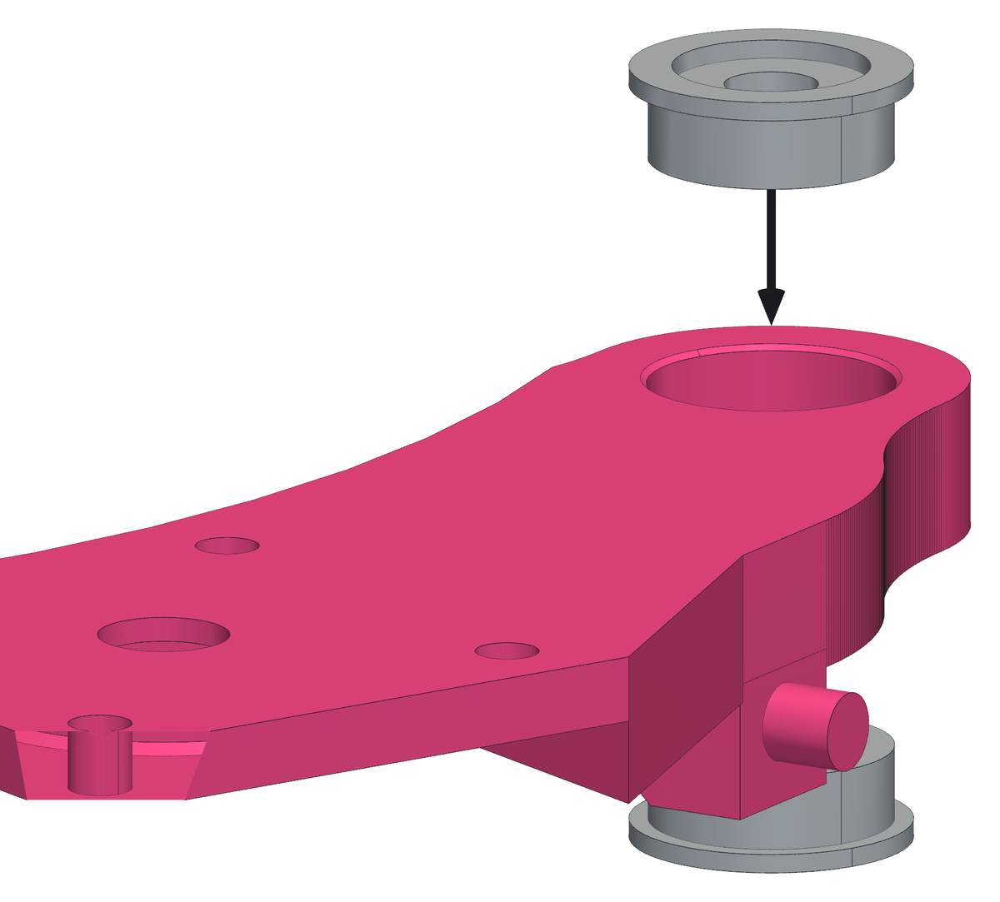
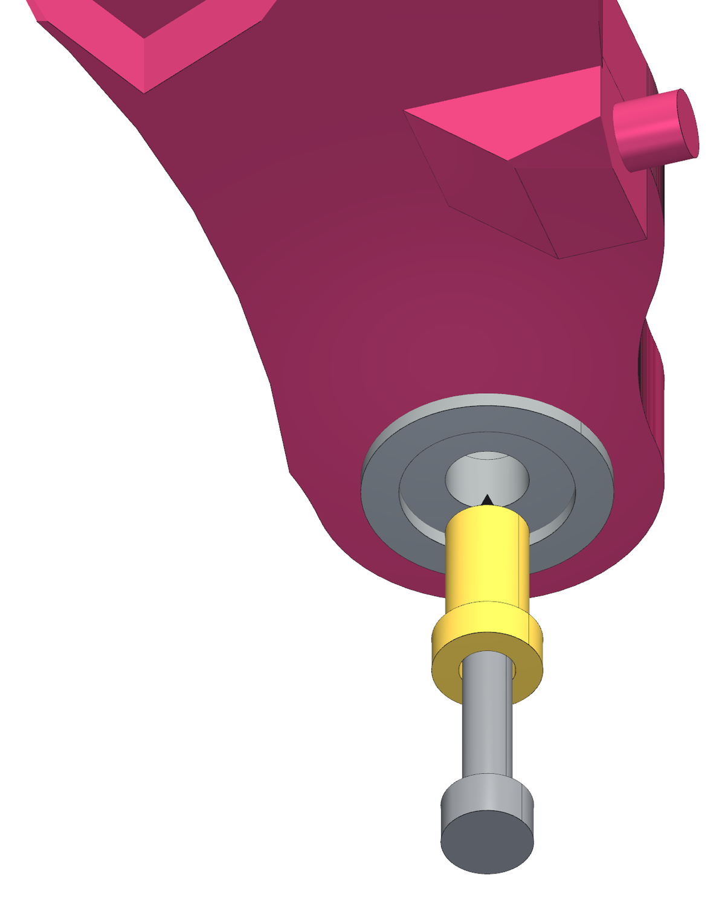
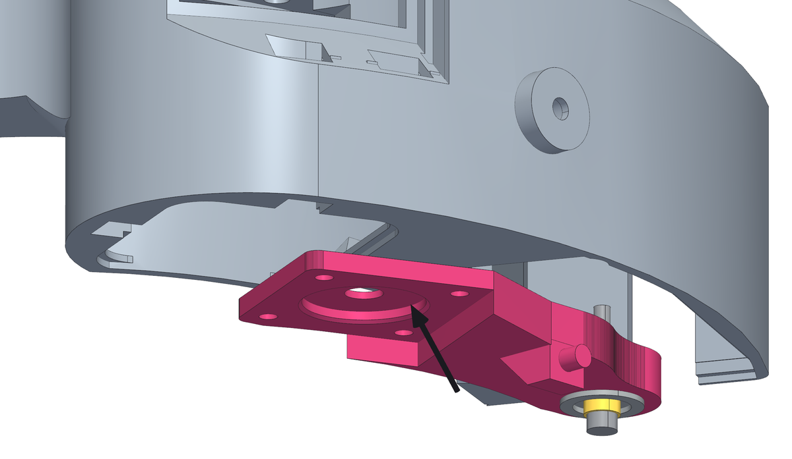
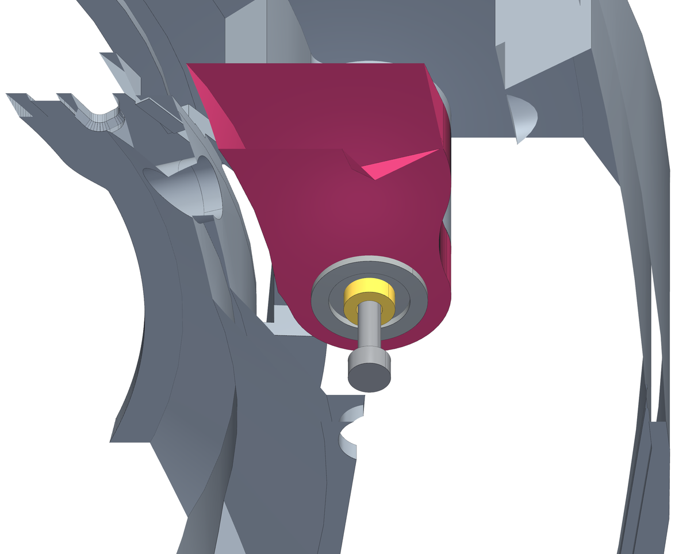

<!--
SPDX-FileCopyrightText: 2026 Matteo Beretta
SPDX-License-Identifier: CC-BY-4.0
-->

*[Read in English](../05-arm-bearings-and-pivot.md)*

# Capitolo 5 — Braccio, cuscinetti e perno

*La versione pubblicata di questo capitolo, con le immagini accanto al testo e l'indice sempre in vista, è nella [guida](05-arm-bearings-and-pivot.html).*

Il braccio porta il motore e lo lascia oscillare contro la molla, quindi tutta la forza della frizione passa da questo snodo. Gira su due cuscinetti piantati nel braccio, che corrono sul perno in cui hai messo l&#x27;inserto nel capitolo 2. Qui niente va stretto: lo snodo deve girare senza il minimo sforzo.

## Cosa serve per questo capitolo

| Q.tà | Pezzo | |
|---:|---|---|
| 1 | braccio | stampato, ASA |
| 2 | cuscinetto F695ZZ | F695ZZ flangiato, 5 × 13 × 4 |
| 1 | rondella del perno | stampato, ASA |
| 1 | vite M3 · perno | M3 × 20, testa brugola (servono 20,0 sotto testa) |

**Attrezzi:** chiave a brugola da 2,5 mm, una superficie piana e pulita contro cui premere i cuscinetti, un cacciavite, per comprimere la molla di precarico.

<table><tr>
<td width="55%"></td>
<td valign="top"><h3>Passo 1 — Pianta i due cuscinetti nel braccio</h3><ul><li>La sede nel braccio è passante, profonda 8 mm: esattamente due cuscinetti <b>F695ZZ</b> da 5 × 13 × 4 mm uno sull&#x27;altro.</li><li>Mettili <b>con la flangia verso l&#x27;esterno</b>: uno per faccia, così le due flange restano fuori e le facce lisce si incontrano in mezzo.</li><li>La sede è disegnata Ø13,2 mm perché esca stampata Ø13. Premi a mano, o fra due ganasce piane: mai martellare sull&#x27;anello interno.</li><li><b>Attenzione:</b> Premi solo sull&#x27;anello esterno. Un cuscinetto piantato battendo sull&#x27;anello interno sembra a posto, e poi gira ruvido per sempre.</li></ul></td>
</tr></table>

<table><tr>
<td width="55%"></td>
<td valign="top"><h3>Passo 2 — Rondella e vite sul braccio, sul banco</h3><ul><li>La rondella stampata porta il perno: una bussola Ø5 mm lunga 9 mm. Infilala attraverso tutti e due i cuscinetti dalla faccia con i quattro fori del motore - il lato camera - finché la rondella non appoggia sull&#x27;anello interno del cuscinetto più vicino.</li><li>Infila la vite <b>M3 × 20</b> nella rondella e nella bussola. Tienila indietro con un dito, così che la punta non sporga dalla bussola: la si avvita a fondo quando il braccio è sul perno.</li></ul></td>
</tr></table>

<table><tr>
<td width="55%"></td>
<td valign="top"><h3>Passo 3 — Il braccio dentro dall'apertura dell'elettronica</h3><ul><li>Capovolgi il pezzo, lato camera in su. Il braccio entra dal basso, dalla grande apertura nel fondo che poi chiuderà il pannellino della scheda - l&#x27;apertura dell&#x27;elettronica - con la rondella e la vite già montate, tenendo la vite indietro.</li><li>Entra <b>dalla parte del perno</b>, poi l&#x27;estremità del motore segue verso la botola mentre il braccio si mette in piano: la figura mostra da dove arriva.</li><li>Aiutandoti con un cacciavite comprimi la molla di precarico e infilala nella sede del braccio.</li><li>Porta la bussola sotto lo spianamento tondo in cima al perno. Il braccio va in un verso solo: la faccia piana con i quattro fori del motore guarda verso il lato camera.</li></ul></td>
</tr></table>

<table><tr>
<td width="55%"></td>
<td valign="top"><h3>Passo 4 — Avvita la vite nel perno</h3><ul><li>Avvita la vite <b>M3 × 20</b> attraverso la bussola nell&#x27;inserto in fondo al perno, dal lato camera.</li><li>La bussola è lunga esattamente quanto i cuscinetti più una flangia: la vite la tira contro il collare, non contro i cuscinetti, così il braccio gira anche a vite serrata.</li><li>Stringi finché la rondella non è ferma, non di più. Poi controlla: il braccio deve oscillare con la punta di un dito e non avere nessun gioco.</li><li>Sopra il braccio ci sono 0,3 mm di luce fino al collare, ed è quello spazio che gli evita di strisciare mentre oscilla. Se il braccio si impunta in qualche punto della corsa, la vite è troppo stretta o manca la rondella.</li></ul></td>
</tr></table>
