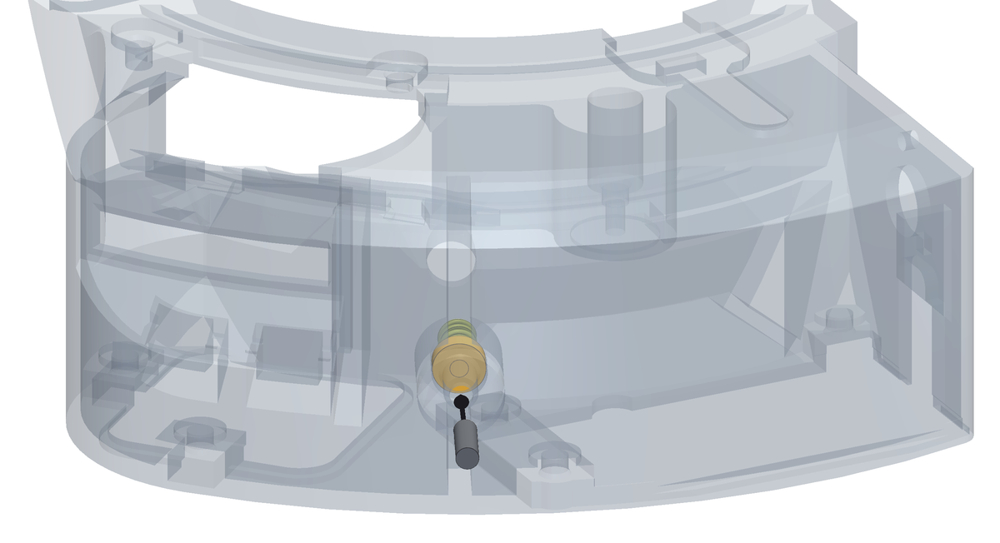

<!--
SPDX-FileCopyrightText: 2026 Matteo Beretta
SPDX-License-Identifier: CC-BY-4.0
-->

*[Read in English](../08-setting-the-preload.md)*

# Capitolo 8 — Regolare il precarico

*La versione pubblicata di questo capitolo, con le immagini accanto al testo e l'indice sempre in vista, è nella [guida](08-setting-the-preload.html).*

La molla è nella sua sede da prima che entrasse il braccio. Ora che braccio e motore ci sono e lei ha qualcosa contro cui spingere, il grano dietro la sede stabilisce quanto forte la frizione preme sul disco dei filtri.

## Cosa serve per questo capitolo

| Q.tà | Pezzo | |
|---:|---|---|
| 1 | grano M4 · precarico | M4 × 14, GRANO a brugola senza testa (dal dorso dello scodellino all'imbocco del bosso ci sono 12,1) |

**Attrezzi:** chiave a brugola da 2,0 mm per il grano del precarico.

<table><tr>
<td width="55%"></td>
<td valign="top"><h3>Passo 1 — Regola il precarico con il grano</h3><ul><li>Il grano <b>M4 × 14</b> entra nell&#x27;inserto <b>M4</b> della parete esterna della scatola, dietro la molla, e preme sul fondo dello scodellino. Serve una chiave a brugola da 2,0 mm.</li><li>Avvitalo finché senti la molla che comincia a caricarsi, poi dagli ancora 2,4 mm: la molla passa da 13,5 a 11,1 mm e spinge con circa 13,5 N. Attraverso la leva del braccio sono circa 7 N della frizione sul disco, una volta montata la ruota. Da lì lo scodellino ha 2,0 mm di corsa in ciascun verso, per aggiungere o togliere precarico.</li><li>Controlla il braccio: deve ancora oscillare libero e tornare indietro da solo. Se si impunta, il problema è nel perno, non qui: torna al capitolo 5.</li><li><b>Attenzione:</b> La regolazione vera la farai nell&#x27;ultimo capitolo, con la ruota montata e il motore che gira. Adesso ti basta una molla carica, non una molla schiacciata.</li></ul></td>
</tr></table>
