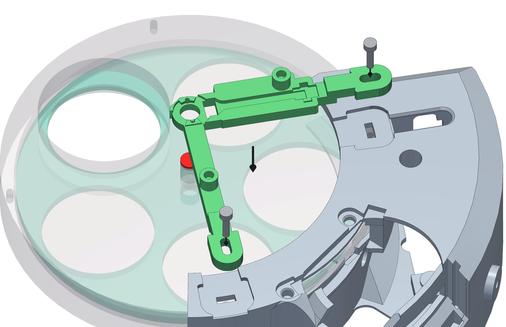
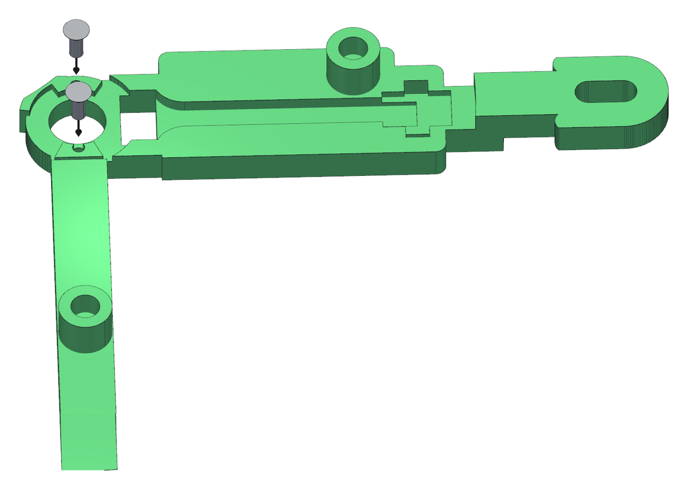
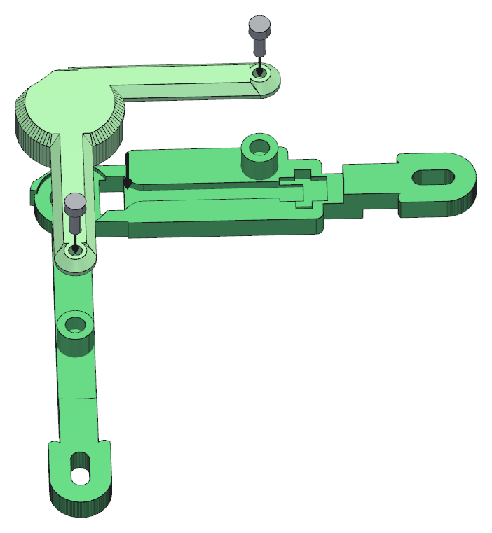
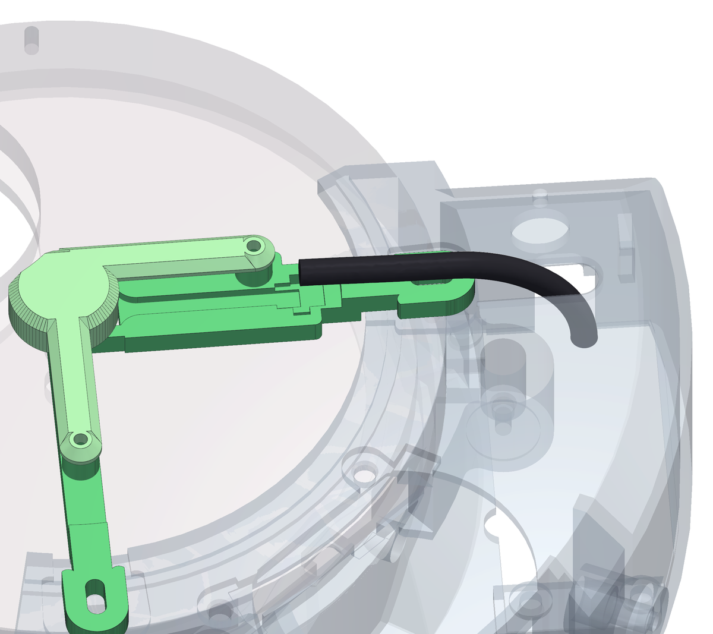
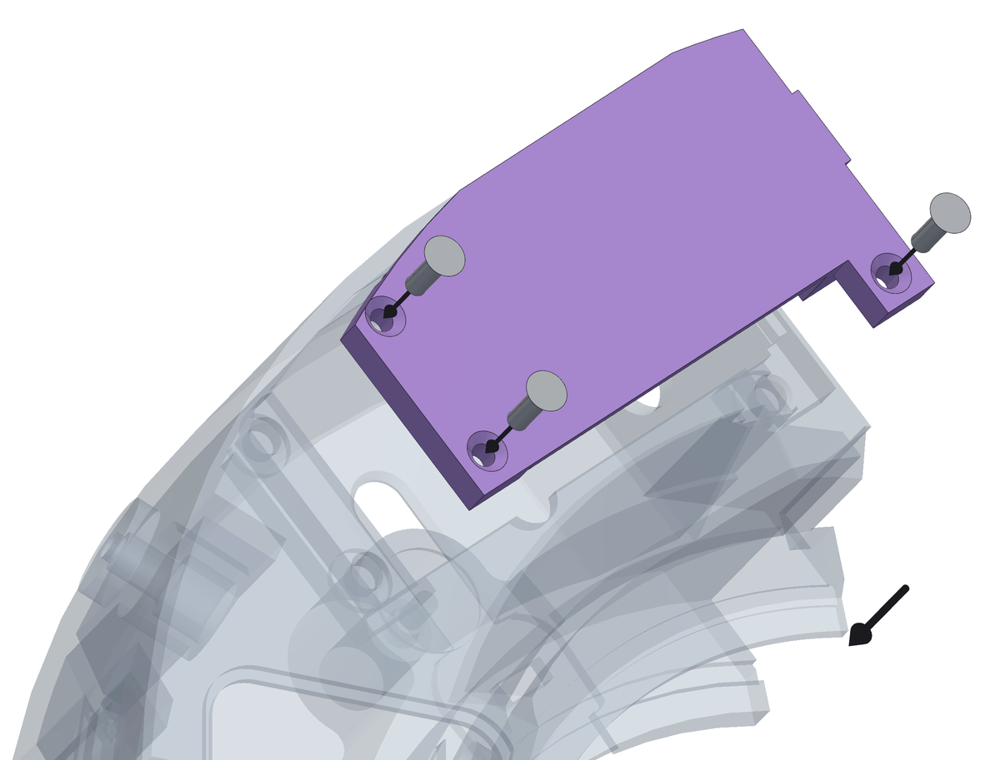

<!--
SPDX-FileCopyrightText: 2026 Matteo Beretta
SPDX-License-Identifier: CC-BY-4.0
-->

*[Read in English](../12-sensor-and-closing-up.md)*

# Capitolo 12 — Il sensore, e si chiude

*La versione pubblicata di questo capitolo, con le immagini accanto al testo e l'indice sempre in vista, è nella [guida](12-sensor-and-closing-up.html).*

L&#x27;arco del sensore si monta per ultimo. Il suo tampone arriva sopra il centro della ruota, a un soffio dalla faccia del disco dei filtri, e il magnete lo guarda da sotto attraverso un foro: per questo non poteva andare su prima della ruota. Collegato il suo cavo alla scheda, il pannellino sale sotto la scatola e la macchina è chiusa.

## Cosa serve per questo capitolo

| Q.tà | Pezzo | |
|---:|---|---|
| 2 | vite M3 · serraggio del collare | M3 × 14, testa brugola (servono 12,4 sotto testa) |
| 2 | vite M2 · modulo AS5600 | M2 × 4, testa svasata (servono 4,0 sotto testa) |
| 1 | coperchio del sensore | stampato, ASA |
| 2 | vite M2,5 · coperchio del sensore | M2,5 × 8, testa brugola (servono 7,0 sotto testa) |
| 1 | cavo CAT5 | rigido, Ø5,6 - dal sensore alla basetta |
| 3 | vite M3 · pannellino | M3 × 8, testa svasata (servono 8,0 sotto testa) |
| 1 | U3 modulo encoder magnetico AS5600 | tondo Ø16,85 spianato a 15, una fila di 8 piazzole; vuole il ponticello VDD5V-VDD3V3, dopo il quale non accetta più i 5 V |
| 1 | C3 condensatore ceramico | 100 nF (104), 16 V o più - sulle piazzole del modulo, non sulla basetta |

**Attrezzi:** chiave a brugola da 2,5 mm, chiave a brugola da 2 mm per le viti del coperchio, un cacciavite PH0 per le viti svasate del modulo e del pannellino, una fascetta da 2,5 mm.

<table><tr>
<td width="55%"></td>
<td valign="top"><h3>Passo 1 — La staffa, sopra la ruota e sul collare</h3><ul><li>Prima di montarla, infila una fascetta da 2,5 mm nel tampone del braccio rivolto verso la scatola: giù da una delle due asole, lungo la scanalatura sotto, su dall&#x27;altra. Lasciala aperta. Quando la staffa è appoggiata sulla ruota, sotto il braccio non ci si arriva più: è la scanalatura che fa passare la fascetta senza sollevare la staffa dalla ruota.</li><li>Abbassa la staffa finché il tampone scende sopra il magnete e i due piedi si appoggiano sulla flangia del collare.</li><li>Viti <b>M3 × 14</b>, una per piede, attraverso il piede e la flangia del collare che gli sta sotto, nei fori filettati <b>M3</b> già presenti nel fondello del corpo della ruota, dal lato del telescopio.</li><li><b>Attenzione:</b> Non forzarla verso il basso. Il tampone passa appena sopra la faccia del disco: se tocca, sotto c&#x27;è qualcosa che non è al suo posto, quasi sempre la ruota che non è entrata fino in fondo nel collare.</li></ul></td>
</tr></table>

<table><tr>
<td width="55%"></td>
<td valign="top"><h3>Passo 2 — Il modulo AS5600, sulle sue due viti</h3><ul><li>Il modulo AS5600 entra nella sede in cima alla staffa, col chip verso il basso, sopra il foro che guarda il magnete. Fra chip e magnete restano circa 1,2 mm d&#x27;aria.</li><li>Fissalo con due viti svasate <b>M2 × 4</b>, attraverso i suoi due fori nei fori pilota della staffa, con un cacciavite PH0. Si formano da sole il filetto nella plastica: stringile quanto basta, non di più.</li></ul></td>
</tr></table>

<table><tr>
<td width="55%"></td>
<td valign="top"><h3>Passo 3 — Il cavo, poi il coperchio sopra il modulo</h3><ul><li>Innesta il cavo sul modulo prima di mettere il coperchio: col coperchio chiuso il connettore non si raggiunge più.</li><li>Il coperchio va sopra e si fissa con due viti <b>M2,5 × 8</b> negli inserti <b>M2,5</b> che hai piantato nella staffa al capitolo 2. Appoggia sulla staffa, mai sul modulo: il modulo è tenuto dalle sue due viti.</li></ul></td>
</tr></table>

<table><tr>
<td width="55%"></td>
<td valign="top"><h3>Passo 4 — Porta il cavo del sensore giù nella scatola</h3><ul><li>Il cavo da Ø5,6 mm esce dal coperchio lungo il canale aperto nel braccio della staffa (ci si appoggia da sopra, non va infilato in niente) e scende nella scatola dall&#x27;apertura nella sua parete.</li><li>Tienilo morbido: in nessun punto deve piegare con un raggio più stretto di circa 22 mm.</li><li>Chiudi sul cavo la fascetta che avevi infilato sotto il braccio, sulla sede piana fra le due asole, e taglia la coda. È lei a tenere gli strappi sul cavo lontani dalle piazzole saldate della schedina del sensore, il giunto più debole di tutta la catena.</li><li><b>Attenzione:</b> Lascia nella scatola cavo a sufficienza perché il pannellino, quando lo riapri, possa restare appeso ai suoi cavi. Un cavo tagliato alla lunghezza giusta al millimetro è un cavo che strappi la seconda volta che apri.</li></ul></td>
</tr></table>

<table><tr>
<td width="55%"></td>
<td valign="top"><h3>Passo 5 — Collega tutto e chiudi il pannellino</h3><ul><li>Alla scheda arrivano tre cavi: il motore, il sensore, e il connettore col LED nella testata della scatola. Collegali tutti col pannellino ancora libero, dove vedi quello che fai.</li><li>Porta il pannellino nel suo gradino sotto la scatola e spingilo in piano. Sta in una battuta, quindi entra in un verso solo.</li><li>Tre viti svasate <b>M3 × 8</b> negli inserti intorno all&#x27;apertura. Imboccale tutte e tre, poi stringile insieme.</li><li><b>Attenzione:</b> Togli il pannellino e rimettilo una volta, adesso, prima che la macchina vada da qualche parte. Quello che va storto con un coperchio non succede mai la prima volta che si chiude: succede la seconda volta che si apre.</li></ul></td>
</tr></table>
