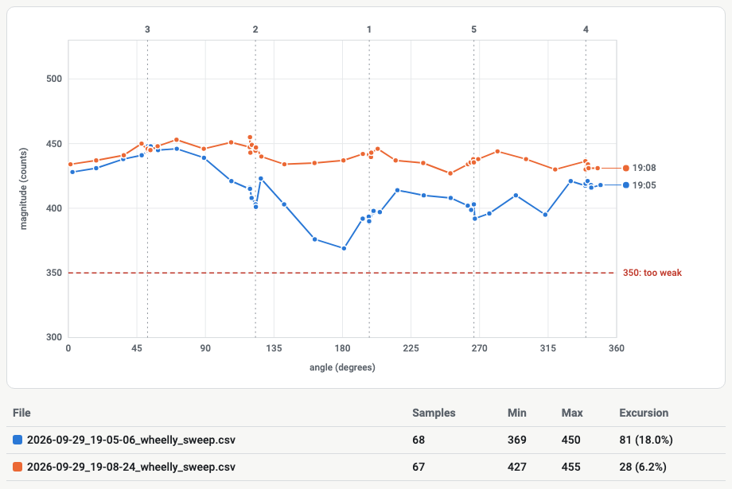

<!--
SPDX-FileCopyrightText: 2026 Matteo Beretta
SPDX-License-Identifier: CC-BY-4.0
-->

# The Wheelly INDI driver: the control panel

*Generated* by `driver/indi-wheelly/doc/panel_guide.py` from the panel the real driver declares (captured with `doc/refresh_panel.sh`) and from `doc/panel_texts.py`: do not edit it by hand. The pictures are drawn from the same capture, in the theme KStars has on AstroArch.

Each entry is marked 🟦 **Wheelly** when the property is this driver's own, or ⬜ *standard INDI* when it comes from INDI itself: every INDI driver of the kind has it, Ekos knows it, and it behaves here as it does everywhere, bar what the entry says.

## Contents

- [Main Control](#main-control)
- [Connection](#connection)
- [Options](#options)
- [Calibration and Diagnostics](#calibration-and-diagnostics)

## Main Control

What you use every night: connect, choose the filter, name the filters, and watch where the wheel really is and how its magnetic sensor is doing. The Wheelly properties appear here only once the wheel is connected; the number of slots and of filter names is the one the wheel reports.

| In this tab | |
|---|---|
| [Connection](#connection) | ⬜ *standard INDI* |
| [Filter slot](#filter-slot) | ⬜ *standard INDI* |
| [Filter names](#filter-names) | ⬜ *standard INDI* |
| [Where the wheel is](#where-the-wheel-is) | 🟦 **Wheelly** |
| [Magnetic sensor](#magnetic-sensor) | 🟦 **Wheelly** |

### Connection

⬜ *standard INDI* · `CONNECTION`

Connects the driver to the wheel and disconnects it. On Connect the driver opens the serial port, sends 'version' and accepts the device only if it answers as a Wheelly speaking protocol 2. It then reads from the wheel its number of slots, the filter names, the taught angles, the tolerances, the motor and holding currents, the direction of travel and the LED mode, and only then shows the Wheelly properties. All the Wheelly-specific properties exist only while connected.

| Element | |
|---|---|
| Connect | Open the port, identify the wheel and show its properties. |
| Disconnect | Close the port; every Wheelly property disappears and the movement log file is closed. |

- The wheel is recognised by what it answers, not by the port name: the firmware reports a serial number derived from the chip, and the driver remembers it in the profile's configuration on the first connection (log: 'From now on this profile looks for the wheel with serial ...').
- With two Wheelly wheels attached, each profile first looks for its own serial number; a different Wheelly is skipped (log: 'This is a different Wheelly ...'). If its own wheel is on no port, the driver connects to whichever Wheelly it finds and says so in the log, then adopts that serial number.
- Looking on the other ports is done by INDI's Auto Search (DEVICE_AUTO_SEARCH); with Auto Search off only the port in DEVICE_PORT is tried.
- Log messages on failure: 'The device on this port did not answer as a Wheelly wheel. Check the port.' or 'This firmware speaks protocol X, this driver speaks Y. Update one of the two.' Protocol 2 has no rotation trim: a firmware of protocol 1 aims at angle + trim, so it is refused rather than half-driven - reflash the wheel and install the driver together.
- If the serial channel drops while connected (read error or cable unplugged), the log says 'The wheel is not answering.' and the connection goes to Alert and disconnected. A single command that gets no answer within 3 s is logged but does not disconnect.

### Filter slot

⬜ *standard INDI* · `FILTER_SLOT`

The standard INDI filter slot: the slot the wheel is on, and the place to ask for another one. Ekos writes here when a sequence changes filter. The driver sends 'go <slot>' and the wheel does the rest by itself: it turns the way WHEELLY_DIRECTION allows (the shortest way round by default, or one way only), holds the stopped motor for 300 ms (WHEELLY_HOLD) while the disc settles, reads the magnet, compares the residual error with the tolerances and retries if needed. The driver only reports the verdict.

| Element | |
|---|---|
| Filter | Slot number, from 1 to the number of slots the wheel reports. (1 to 5, step 1) |

- Range 1 to the number of slots the wheel reports at connection (5 on a factory wheel, at most 12); step 1.
- Busy while the wheel moves. Ok when it arrived within the Good tolerance (log: 'Slot N reached, residual error X deg.').
- Arrived between the Good and the Alert tolerance: still Ok, so the sequence goes on, with a warning in the log ('Slot N reached but off by X deg, beyond the good tolerance. Imaging continues.').
- Still beyond the Alert tolerance after all retries: Alert, which makes Ekos stop the sequence at once (log: 'Slot N NOT reached ... Imaging is stopped so that no frame is taken with the wheel out of place.').
- After every slot not reached, and after the time limit below, a second log line suggests the first thing to check: 'If the motor stalls or the clutch slips, check first that the wheel's detent (its spring click stop) has been removed ...' - the motor cannot climb out of its notches, and the assembly guide removes it in chapter 10, The wheel body.
- Time limits: the wheel derives its own cap on a move from the motor speed, acceleration, retries, direction of travel and hold after arrival, and stops retrying past it; the driver declares Alert itself if the wheel has not finished 3 s after that cap (log: 'The wheel did not finish within N seconds. Imaging is stopped.'). With a firmware that does not report its cap the driver's limit is 28 s.
- Ekos gives up on a filter change after 30 s on its own: when the wheel's cap goes past that, the log says so (see WHEELLY_DIRECTION).
- A move is refused at once, with Alert, if the sensor is not answering or does not see the magnet; the reason is in the log.
- The position is absolute (magnetic encoder): no homing. If the wheel is turned by hand or by another program, this value follows it at the next poll.
- Ekos's filter-change timeout counts from the request; the end of a move is noticed at the next poll, so a long POLLING_PERIOD delays Ok.

### Filter names

⬜ *standard INDI* · `FILTER_NAME`

The standard INDI filter names, one per slot. The names are stored in the wheel itself: at connection the driver reads them from the wheel, so a wheel moved to another computer shows up with its names. When you change a name, the driver writes it to the wheel. Ekos uses these names in the FITS FILTER keyword and in file and folder names, which is why the rule is strict.

| Element | |
|---|---|
| 1 | Name of slot 1. |
| 2 | Name of slot 2. |
| 3 | Name of slot 3. |
| 4 | Name of slot 4. |
| 5 | Name of slot 5. |

- Allowed: letters without accents, digits, _ - and . ; 1 to 32 characters; the first and the last must be a letter or a digit. Windows device names (CON, PRN, AUX, NUL, COM1-COM9, LPT1-LPT9, also with an extension) are refused. Two slots may not have the same name, ignoring upper and lower case.
- A slot without a filter: leave its field empty. The driver names it Empty_ followed by the slot number (Empty_5), which is unique and valid, so several slots can be empty at once; the name is the same on every computer, because it is stored in the wheel and written in the FITS header. The field and Ekos's filter list then show that name, and the log says so.
- A refused name is not corrected silently: the property turns red (Alert), the field goes back to the previous name, and the log says which slot, which name, what is wrong and, when it can, a name that would be accepted, followed by the allowed characters. That line is always the newest in the log, the one on top in KStars; when it is too long for one INDI message, the allowed characters go on the line just before it. FILTER_SLOT is not touched, so a typo never stops a sequence.
- The number of fields follows the number of slots the wheel reports; the panel capture shows the five of a factory wheel.
- Factory names: Lum, Red, Green, Blue, Ha (Filter1, Filter2 ... on a wheel with a different number of slots).
- A new name is kept by the wheel only until it is switched off, unless you press 'Save to the wheel' (WHEELLY_SAVE).
- The names always come from the wheel, at every connection - also when the INDI configuration on the computer has names saved from an earlier session: a wheel renamed on another computer shows its own.

### Where the wheel is

🟦 **Wheelly** · `WHEELLY_POSITION` · read-only

Where the wheel really is, as read by the magnetic sensor, refreshed at every poll (every POLLING_PERIOD, 250 ms by default). Look at it while centring a slot, or when a filter change ended with a warning or a failure: it tells how far off the wheel stopped and how many retries it took.

| Element | |
|---|---|
| Angle | Angle of the disc read by the AS5600 sensor, in degrees, 0 to 360. (0 to 360, step 0) |
| Residual error | Residual error in degrees, with sign: measured angle minus the target angle (the taught angle) of the last slot asked for, the short way round. At rest it keeps being updated, so it also shows a wheel that drifts. (-180 to 180, step 0) |
| Retries | Retries the wheel used in the last positioning (0 = reached at the first attempt). (0 to 99, step 0) |

- Read-only. Display limits: angle 0-360, error -180 to +180, retries 0-99.
- The verdict (arrived, warning, failed) is given by the firmware, not by this property: see FILTER_SLOT and the log.
- If the wheel moves on its own while at rest beyond the Alert tolerance, the log says so once per episode and suggests the holding current at rest (WHEELLY_HOLD), or, if it is already on, looking at the clutch spring preload.

### Magnetic sensor

🟦 **Wheelly** · `WHEELLY_SENSOR` · read-only

The state of the AS5600 magnetic sensor, refreshed at every poll. It is instrumentation to keep an eye on: a sensor wire working loose, or the power jumper of the sensor module lifting, shows here before it shows in a bad frame. The property turns red (Alert) when the magnet is not detected.

| Element | |
|---|---|
| Gain | Automatic gain of the sensor, 0 to 255 as displayed. With the magnet Wheelly uses at 3.3 V it stays at full scale (128) at any gap, so it is shown for diagnosis but it is not the criterion. (0 to 255, step 0) |
| Magnitude | Strength of the magnetic field seen by the sensor, in counts, 0 to 4095. This is the criterion: below 350 the magnet is too far or off centre. Its variation over a full turn measures how well the magnet is centred (see the magnet sweep). (0 to 4095, step 0) |
| Magnet detected | 1 = magnet detected, 0 = not detected (the property then goes to Alert). (0 to 1, step 0) |
| Field too weak | Field too weak flag (1 = weak), as the AS5600 reports it. With the reference magnet at 3.3 V it is normally 1, since the chip's gain stays at full scale; it is also what a broken VDD5V-VDD3V3 bridge on the module looks like, so read it with the magnitude. (0 to 1, step 0) |
| Field too strong | Field too strong flag (1 = strong), as the AS5600 reports it: the magnet is too close to the chip. (0 to 1, step 0) |

- Read-only.
- If the sensor does not answer at all, AGC and Magnitude read 0 and MD reads 0.
- When the magnet disappears the log shows an error: 'The sensor no longer detects the magnet. This is serious: check the sensor wiring before imaging further.' Once per episode: if the magnet comes back and is lost again, it is said again.
- For a full check of the sensor and of the motor driver use 'Hardware check' (WHEELLY_DIAG).

## Connection

The standard INDI serial connection settings. Wheelly connects over the USB cable at 115200 baud and is recognised by what it answers and by its serial number, not by the port name, so with Auto Search on you rarely need to change anything here.

| In this tab | |
|---|---|
| [Driver Info](#driver-info) | ⬜ *standard INDI* |
| [Connection Mode](#connection-mode) | ⬜ *standard INDI* |
| [System Ports](#system-ports) | ⬜ *standard INDI* |
| [Ports](#ports) | ⬜ *standard INDI* |
| [Baud Rate](#baud-rate) | ⬜ *standard INDI* |
| [Auto Search](#auto-search) | ⬜ *standard INDI* |
| [Refresh](#refresh) | ⬜ *standard INDI* |

### Driver Info

⬜ *standard INDI* · `DRIVER_INFO` · read-only

Standard INDI information about the driver: its name, the program that runs it, its version and the kind of device it is.

| Element | |
|---|---|
| Name | Driver name (Wheelly). |
| Exec | Executable name (indi_wheelly). |
| Version | Driver version. |
| Interface | INDI interface code; 16 means a filter wheel. |

- Read-only. The firmware version of the wheel is in WHEELLY_FIRMWARE, under Options.

### Connection Mode

⬜ *standard INDI* · `CONNECTION_MODE`

The standard INDI choice of how to reach the device. Wheelly offers only a serial connection, over the USB cable of the XIAO ESP32-S3.

| Element | |
|---|---|
| Serial | Serial port (the only choice). |

### System Ports

⬜ *standard INDI* · `SYSTEM_PORTS`

Standard INDI shortcut buttons, one for each serial port the system finds: pressing one copies that port into Ports. It appears only when the computer has serial ports; with the wheel plugged in, its button carries the name of the XIAO's USB port (Espressif USB JTAG/serial debug unit, followed by the board's serial number).

| Element | |
|---|---|
| *(one per port found)* | A port the system found; press it to use it. |

- The list is made by libindi when the driver starts: a port plugged in later shows up after 'Refresh' (Scan Ports).

### Ports

⬜ *standard INDI* · `DEVICE_PORT`

The serial port of the wheel. You rarely need to type it: the driver gives INDI a pattern to pick the port of an ESP32-S3 among the ports found, and with Auto Search on it tries the other ports until a Wheelly answers. The wheel is then recognised by its answer and its serial number, not by the port name, which can change when you move the plug to another USB socket.

| Element | |
|---|---|
| Port | Path of the serial port, for example /dev/ttyACM0 on Linux or /dev/cu.usbmodem... on macOS. |

- Pattern given to INDI: '303a|espressif|wheelly|usbmodem', case-insensitive: 303a is Espressif's USB vendor id, and on Linux the ports under /dev/serial/by-id/ carry the vendor name instead (the wheel is usb-Espressif_USB_JTAG_serial_debug_unit_<serial>-if00). Per libindi it is used only when the saved port no longer exists.
- Checked on the Raspberry with the real wheel and no saved configuration: the driver proposes the wheel's port by itself and connects.
- INDI saves the port in the configuration when it changes.
- Typing a path that is not among the ports found turns Auto Search off.

### Baud Rate

⬜ *standard INDI* · `DEVICE_BAUD_RATE`

The standard INDI serial speed. The driver selects 115200 by default, which is the speed the firmware opens its serial port with. Leave it there.

| Element | |
|---|---|
| 9600 | 9600 baud. |
| 19200 | 19200 baud. |
| 38400 | 38400 baud. |
| 57600 | 57600 baud. |
| 115200 | 115200 baud (default, the firmware's speed). |
| 230400 | 230400 baud. |

- It does not matter which one is chosen: the XIAO ESP32-S3 talks over its native USB port, where the baud rate is not used on the wire (checked on the real wheel: it connects at 9600 as at 115200).

### Auto Search

⬜ *standard INDI* · `DEVICE_AUTO_SEARCH`

The standard INDI auto search: if the wheel does not answer on the port in DEVICE_PORT, try all the other serial ports found, in random order, until one answers. For Wheelly this is also what lets a profile find its own wheel when two wheels are plugged in.

| Element | |
|---|---|
| Enabled | Try the other ports when the configured one fails (default). |
| Disabled | Try only the port in DEVICE_PORT. |

- On Linux, libindi turns Auto Search off by itself after it found the device on another port, and saves the new port.
- A Wheelly with a different serial number is not accepted in the first pass, so Auto Search moves on to the next port.

### Refresh

⬜ *standard INDI* · `DEVICE_PORT_SCAN`

The standard INDI button to scan the system again for serial ports, for example after plugging in the wheel. The ports found appear as buttons to choose from.

| Element | |
|---|---|
| Scan Ports | Scan for serial ports now; the log says how many were found. |

## Options

The standard INDI options (debug, simulation, configuration file, polling period, joystick) and the settings of the machine: firmware information, motor current, speed and acceleration, holding current at rest, direction of travel and LED. Motor, holding current, direction and LED settings live in the wheel and are kept after power-off only with 'Save to the wheel', right under Configuration or in the Calibration and Diagnostics tab.

| In this tab | |
|---|---|
| [Debug](#debug) | ⬜ *standard INDI* |
| [Simulation](#simulation) | ⬜ *standard INDI* |
| [Configuration](#configuration) | ⬜ *standard INDI* |
| [Wheel configuration](#wheel-configuration) | 🟦 **Wheelly** |
| [Polling](#polling) | ⬜ *standard INDI* |
| [Joystick](#joystick) | ⬜ *standard INDI* |
| [Snoop Joystick](#snoop-joystick) | ⬜ *standard INDI* |
| [Firmware](#firmware) | 🟦 **Wheelly** |
| [Motor](#motor) | 🟦 **Wheelly** |
| [Holding current at rest](#holding-current-at-rest) | 🟦 **Wheelly** |
| [Direction of travel](#direction-of-travel) | 🟦 **Wheelly** |
| [LED](#led) | 🟦 **Wheelly** |

### Debug

⬜ *standard INDI* · `DEBUG`

The standard INDI debug switch. When enabled, INDI adds the debug level and log output settings; with the level 'Driver Debug' on, the Wheelly driver writes to the log every line exchanged with the wheel, in both directions ('-> ' sent, '<- ' received). It is the first thing to turn on when the wheel does something unexpected, and needs no rebuild.

| Element | |
|---|---|
| Enable | Debug on: more properties for levels and log output appear. |
| Disable | Debug off (default). |

- Saved in the INDI configuration and restored when the driver starts.
- At the debug level the driver also logs 'Moving to slot N.' at the start of each move.
- Status polls are logged too, several per second: turn it off again when done.

### Simulation

⬜ *standard INDI* · `SIMULATION`

The standard INDI simulation switch. The Wheelly driver has no simulation mode: it does not look at this switch, and still talks to the serial port. Leave it disabled. To try the driver without a wheel, use the firmware simulator of the project (firmware/simulator) on a virtual serial port.

| Element | |
|---|---|
| Enable | Has no effect on the wheel; see the note. |
| Disable | Default; leave it here. |

- Pitfall: with simulation on, libindi's Disconnect returns without closing the port, so the serial port stays open after Disconnect.

### Configuration

⬜ *standard INDI* · `CONFIG_PROCESS`

The standard INDI configuration file of this device, kept on the computer running the driver (~/.indi/, named after the device). Note that the calibration does not live here: angles, filter names, currents and LED mode are stored in the wheel with 'Save to the wheel'. The configuration holds the settings of this computer and profile.

| Element | |
|---|---|
| Load | Reload the saved configuration and apply it. |
| Save | Save the current settings to the configuration file. |
| Default | Load the default configuration file that INDI keeps beside the configuration. |
| Purge | Delete the configuration file. |

- What Wheelly adds to the standard INDI items (connection, port, baud rate, auto search, debug, polling period, filter slot, filter names, joystick): the firmware data including the serial number of this profile's wheel, the tolerances, the sweeps folder and the movement log switch.
- Load re-applies the saved values as if typed: the tolerances are sent to the wheel (working memory only), and the saved filter slot is requested, so the wheel may move.
- Purge also forgets which wheel belongs to this profile; the next connection adopts whichever Wheelly it finds.
- Some items are saved on their own when they change: the sweeps folder, the movement log switch, the learned serial number, the port.

### Wheel configuration

🟦 **Wheelly** · `WHEELLY_CONFIG`

'Save to the wheel', here too: it writes to the wheel's permanent memory everything the wheel holds, as the button of the same name in the Calibration and Diagnostics tab (WHEELLY_SAVE) does. It sits right under Configuration so that the settings of this tab that live in the wheel - motor, holding current, direction, LED - are saved without leaving it.

| Element | |
|---|---|
| Save to the wheel | Writes number of slots, taught angles, filter names, tolerances, run and holding current, hold after arrival, speed, acceleration, direction of travel and LED mode to the wheel. Log: 'Calibration saved in the wheel.' |

- Configuration above it is INDI's own and saves the settings of this computer and profile, not the wheel's: the two do not replace each other. A separate row and not a fifth button in Configuration: Ekos counts on its four, and KStars would show five as a drop-down menu.
- Always shown, like Configuration; pressed with the wheel disconnected it goes to Alert and the log says 'Connect the wheel first.'

### Polling

⬜ *standard INDI* · `POLLING_PERIOD`

The standard INDI polling period. For Wheelly it is how often the driver asks the wheel for its status: position, residual error, sensor readings, the end of a move, a wheel moved by hand. The driver sets it to 250 ms.

| Element | |
|---|---|
| Period (ms) | Time between two status requests, in milliseconds. Default 250. (10 to 600000, step 1000) |

- Limits in the panel: 10 to 600000 ms.
- The end of a filter change is noticed at the next poll, and the driver's move time limit is also checked at each poll: a long period makes filter changes look slower and delays failure reports.
- During a magnet sweep the driver polls every 100 ms regardless.
- Saved in the INDI configuration and restored when the driver starts.
- A status line is about 2 ms of serial traffic, so the default costs little.

### Joystick

⬜ *standard INDI* · `USEJOYSTICK`

The standard INDI joystick switch of filter wheels. When enabled, the driver listens to a joystick device served by INDI's joystick driver and lets you change filter with it.

| Element | |
|---|---|
| Enable | Listen to the joystick; a property to map controls appears. |
| Disable | Ignore the joystick (default). |

- Mapping by libindi: the 'Change Filter' joystick (default JOYSTICK_1) pushed fully up goes to the previous slot, down to the next one, wrapping round; the 'Reset' button (default BUTTON_1) goes to slot 1.
- Nothing Wheelly-specific: each request becomes a normal move with the same tolerances and retries.
- A move asked from the joystick shows in Filter slot as any other: busy while the wheel turns.

### Snoop Joystick

⬜ *standard INDI* · `SNOOP_JOYSTICK`

The name of the INDI joystick device this driver listens to when the joystick is enabled. Standard INDI property.

| Element | |
|---|---|
| Device | Device name of the joystick driver. Default 'Joystick'. |

- Change it only if your joystick device has another name in INDI.

### Firmware

🟦 **Wheelly** · `WHEELLY_FIRMWARE` · read-only

What the wheel said about itself when the driver connected: firmware version, protocol version and serial number. Useful when reporting a problem, and to know which wheel this profile is bound to.

| Element | |
|---|---|
| Version | Firmware version running on the wheel. |
| Protocol | Protocol version of the firmware. The driver accepts only the version it was built for; another one is refused at connection. |
| Serial number | Serial number of the wheel, derived by the firmware from the chip's MAC address, so it differs for every wheel. |

- Read-only.
- Saved in the INDI configuration: the saved serial number is what the profile looks for at the next connection (see CONNECTION).
- A firmware with another protocol version is refused at connection, with a log message saying which side to update.

### Motor

🟦 **Wheelly** · `WHEELLY_MOTOR`

The settings of the stepper motor while it turns the wheel. The run current is the one to tune: raise it until the friction drive stops slipping, and no further, since more current means more heat.

| Element | |
|---|---|
| Run current (mA) | Run current, in mA (RMS, set in the TMC motor driver). Default 350. (1 to 800, step 5) |
| Speed | Maximum speed, in full motor steps per second. Default 300. (1 to 5000, step 10) |
| Acceleration | Acceleration, in full motor steps per second squared. Default 1200. (1 to 50000, step 50) |

- Limits in the panel: run current 1 to 800 mA (step 5), speed 1 to 5000 (step 10), acceleration 1 to 50000 (step 50).
- The default of 350 mA was measured on the reference wheel, where the clutch stops slipping; the motor is rated 400 mA per phase. With its detent still in place the wheel needed 400 mA to climb out of a notch; with the detent removed, as the assembly guide always does, 350 mA arrived at every speed from 100 to 1000 steps/s.
- Set sends the three values to the wheel together; the fields then show what the wheel accepted.
- Lowering the run current below the holding current also lowers the holding current in the wheel.
- Speed and acceleration are in full motor steps: 200 steps/s is one motor turn per second, about 124 degrees of disc per second on Wheelly (the clutch turns the disc 2.9 times slower than the motor); the default 300 steps/s is about 186 degrees per second.
- Slower is not gentler: this motor has little torque below about 250 steps/s (75 rpm, where its datasheet curve starts), and at 50 steps/s it stalled and vibrated at some notches of the reference wheel's detent (now removed) even in the easy direction, while from 100 up to 1000 every move arrived. The default is 300/1200. After a leg that stalls anyway, the wheel runs the next one at twice the speed and acceleration (at most 1000 steps/s) to break out of the notch.
- The wheel's time cap on a move follows the speed: if with the new values the longest possible filter change would go past the 30 s after which Ekos gives up, the log warns ('With these motor settings the longest filter change can take up to N s ...').
- Kept by the wheel until switched off; press 'Save to the wheel' to keep it. Not stored in the INDI configuration.
- Alert if the wheel refused the value; the reason is in the log.

### Holding current at rest

🟦 **Wheelly** · `WHEELLY_HOLD`

Whether the motor stays powered when the wheel is at rest. The default is 0: at the end of each move the motor is released, with no current, no heat next to the camera and no chopper noise during exposures. The wheel's detent is always removed (the motor cannot climb out of its notches), so what keeps the disc still at rest is the clutch pressing on it; if the wheel drifts at rest anyway - the log says so - set a reduced holding current so the disc cannot turn on its own. The second field is how long the stopped motor keeps holding the disc, at the run current, after every move before it is released - also when the holding current at rest is 0.

| Element | |
|---|---|
| Current (mA, 0 = released) | Holding current at rest, in mA; 0 = motor released. The field shows the value the wheel has, 0 included. (0 to 800, step 5) |
| Hold after arrival (ms) | Hold after arrival, in ms: how long the motor stays powered at the run current after every leg of a move stops, before the wheel reads where the disc is and - at the end of the move - releases it. Default 300; 0 = read and release at once. (0 to 2000, step 50) |

- The light says it too: green while the holding current is on, grey when the motor is released (0), whether it was set from the panel or read at connection.
- Where to start, if the wheel drifts: 150 mA, the value this project suggests. The log says it too, in the message that reports the drift. The field shows what the wheel holds, 0 included, and not 150 as a suggestion: a wheel saved at 0 would seem to have gone back to 150.
- Limits in the panel: 0 to 800 mA, step 5. The wheel refuses a holding current above the run current (log explains, property goes to Alert).
- Setting a value above 0 writes a warning to the log: the motor warms up next to the sensor and the driver sings during exposures.
- 150 mA and not the run current because holding lasts all night: about 1.35 W instead of 7.4 W.
- Why the hold after arrival: the motor drives the disc by friction, and a stopped motor that is still powered holds the tyre, which brakes the disc; released at once, the disc could coast on. The wheel reads its verdict at the end of the hold, so a disc that went on moving is judged where it stopped and corrected like any other miss. A heavier disc or a softer tyre may want longer; 0 reads before the disc has settled and costs extra legs.
- Limits for the hold after arrival: 0 to 2000 ms, step 50. It lengthens every leg, so the wheel's time cap on a move grows with it (the log warns if it goes past Ekos's 30 s, see WHEELLY_DIRECTION). It is read back from the wheel at connection; an older firmware does not have it, keeps its fixed 300 ms, and a change of this field goes to Alert.
- Kept by the wheel until switched off; press 'Save to the wheel' to keep it. Not stored in the INDI configuration.

### Direction of travel

🟦 **Wheelly** · `WHEELLY_DIRECTION`

Which way the wheel may turn to reach a slot. A mechanism that is stiffer one way than the other - as a wheel with an asymmetric detent is, a gentle flank one way and a steep one the other - can stall the stiff way: the motor hums and vibrates and the disc does not move. Turning one way only avoids it. The switch shows the value read back from the wheel.

| Element | |
|---|---|
| Shortest way | The shortest way round, in either direction. The factory default, since the assembly guide removes the wheel's detent. |
| Increasing angles only | Always towards increasing angles, as the sensor reads them. |
| Decreasing angles only | Always towards decreasing angles. The way the reference wheel's asymmetric detent let through - going up, the motor stalled at every notch. Up and down stay for a mechanism stiffer one way. |

- One way, every move and every retry go that way: after an overshoot the wheel goes round the whole turn instead of backing up the stiff way. So that it does not overshoot, each leg stops a little short of the target and the next ones creep in: a move takes a few legs, and these approach legs are not retries. Whether it arrived is still judged by the angle read.
- One way, a move can be almost a whole turn, and one retry another turn: the wheel's time cap on a move grows with it. If the longest possible filter change would go past the 30 s after which Ekos gives up, the log warns ('With these motor settings the longest filter change can take up to N s ...') - when the direction or the motor speed is set, and at connection. Raise the speed, or choose the shortest way if the wheel allows it.
- Kept by the wheel until switched off; press 'Save to the wheel' to keep it. Not stored in the INDI configuration.
- Grey (Idle) only with a firmware that does not know the setting; Alert if the wheel refused the command.

### LED

🟦 **Wheelly** · `WHEELLY_LED`

What the LED on the wheel does. The LED sits inside the light path, so the default keeps it dark while all is well: it breathes gently while the wheel goes to another filter, and blinks a signal of its own when something is wrong - the table below says which. The switch shows the mode read back from the wheel.

| Element | |
|---|---|
| Steady on | On, steady; the alarm signals still show. |
| Pulses while moving | Off at rest; pulses slowly while the wheel moves to a different slot. Default. |
| Off | Always off - pulse and alarm signals included - for no light at all near the optics, or to turn the wheel by hand. |
| Test (blinks WHEELLY) | Blinks WHEELLY in Morse code once (about 6.7 s), then goes back to the mode in use. Answers the question 'is the LED alive?'. |

| What the LED does | What it means | Until |
|---|---|---|
| Dark | All is well, the wheel at rest | - |
| Breathes slowly (1.7 s) | Moving to another slot (in 'Pulses while moving') | It gets there |
| Blinks fast, 4 a second | It did not reach the slot after every retry | It reaches a slot, or is sent again |
| Two short flashes every 2 s | The wheel moved on its own at rest, beyond the tolerance | It is sent to a slot |
| Three short flashes every 2 s | The sensor no longer sees the magnet | It sees it again |
| Spells WHEELLY in Morse | The LED test | About 6.7 s |

- A new mode is kept by the wheel only until it is switched off; the log reminds you to press 'Save to the wheel' to keep it.
- Do the test with the cover open or in daylight: the LED is inside the optical path. The log says so when the test starts.
- During the test the switch already shows the mode in use again; the blinking goes on for its 6.7 s.
- The alarm signals in the table show one at a time, the gravest first (magnet, then slot not reached, then drift), at the brightness of the top of the pulse. In 'Off' there are none: that is also the mode to turn the wheel by hand with the motor unpowered, which would otherwise read as a drift.
- Alert if the wheel refused the command.

## Calibration and Diagnostics

Teaching and checking the wheel, done with the cover open or while setting up, not in the middle of a sequence: the taught angles, the jog steps, the save button, the tolerances, the hardware check, the magnet sweep, and the movement log. Changes to the calibration live in the wheel's working memory until you press 'Save to the wheel'. The explanations of what happened go to the log panel at the bottom, not into extra fields.

| In this tab | |
|---|---|
| [Number of slots](#number-of-slots) | 🟦 **Wheelly** |
| [▶ 1](#1) | 🟦 **Wheelly** |
| [2](#2) | 🟦 **Wheelly** |
| [3](#3) | 🟦 **Wheelly** |
| [4](#4) | 🟦 **Wheelly** |
| [5](#5) | 🟦 **Wheelly** |
| [Step back](#step-back) | 🟦 **Wheelly** |
| [Step forward](#step-forward) | 🟦 **Wheelly** |
| [Calibration actions](#calibration-actions) | 🟦 **Wheelly** |
| [Tolerances](#tolerances) | 🟦 **Wheelly** |
| [Hardware check](#hardware-check) | 🟦 **Wheelly** |
| [Magnet sweep](#magnet-sweep) | 🟦 **Wheelly** |
| [Sweeps folder](#sweeps-folder) | 🟦 **Wheelly** |
| [Movement log](#movement-log) | 🟦 **Wheelly** |
| [Files on disk](#files-on-disk) | 🟦 **Wheelly** |

### Number of slots

🟦 **Wheelly** · `WHEELLY_SLOTS`

How many filter positions the wheel has. The number lives in the wheel, and the driver reads it at every connection: set it here once, when the wheel is built. Changing it restarts the calibration from evenly spaced angles and generic filter names, and the panel is redrawn at once with the new number of positions, names and angles, and the slot-pitch jog buttons follow (360 divided by the number).

| Element | |
|---|---|
| Slots | The number of filter positions of the wheel. (2 to 12, step 1) |

- After changing it: teach each position (the steps, then Set on its row of the angles), name the filters, then press 'Save to the wheel'. The log says so.
- Nothing is written in the wheel's permanent memory until 'Save to the wheel': switching the wheel off brings back the previous number and calibration, so a wrong click costs nothing.
- Refused while the wheel is moving; the reason is in the log.

### ▶ 1

🟦 **Wheelly** · `WHEELLY_ANGLE_1`

The calibration angles, one row per slot, each with its own Set: this is slot 1's, and the rows of the other slots work the same. The number is the taught angle, in degrees, where that filter sits in the light path and where the wheel goes for it, as stored in the wheel. The slot the wheel is on is marked with an arrow, '▶ 1'. CALIBRATING A SLOT: choose it in FILTER_SLOT; centre the filter with the steps (WHEELLY_JOG_DOWN and WHEELLY_JOG_UP) - after every step its row shows the angle the wheel is at now, with an asterisk, '▶ 1 *', which means not taught yet; press Set on that row to teach it; do the same for every slot, then press 'Save to the wheel'.

| Element | |
|---|---|
| Calibration angle (°) | Taught angle of the slot, in degrees (0 to 360); after a step, on the current slot, the angle the wheel is at now. (0 to 360, step 0.01) |

- The asterisk, '▶ 1 *': the row shows where the wheel is after the steps, NOT what the slot has learnt. Set with the value as it is confirms it: the slot takes that angle and the wheel does not move, it is already there (log: 'Slot 1 now means the angle the wheel is at right now ...'). Leave the slot without pressing Set - choose another filter, run the sweep, or press Set on another row - and the row goes back to the taught angle, without the asterisk: the steps taught nothing.
- Set on a row with a different value - typed in, on any row, the starred one included: the slot takes the new angle and the wheel goes there at once, as if the slot had been chosen in FILTER_SLOT, which goes Busy and then Ok or Alert. That is how a filter is centred by numbers, and how the calibration is corrected while watching a star or a flat. Set on a row with its value unchanged only takes the wheel to that slot.
- Every change is written in the log - 'Slot 2: 122.87° → 123.10°.' - and, with the movement log on, as a row of wheelly_movements.csv whose outcome is angle-taught (a confirmed asterisk) or angle-set (a typed value): the new angle under target, the old one under angle, the change under error. That is the history of the corrections: an angle that keeps moving night after night means something in the mechanics is moving.
- Kept by the wheel only until it is switched off: press 'Save to the wheel' to keep them. Restarting the wheel without saving brings back the last saved calibration, which is the way to undo an experiment.
- A value outside 0-360 is refused by the wheel: the row goes to Alert, the old value stays, and the log says why. Refused too while the wheel is moving.
- A wheel turned by hand is not followed by its row (only the steps are): to teach where the hand left it, type the angle shown in WHEELLY_POSITION into the row and press Set.
- The arrow stays on the slot while the wheel is stepped off it to centre it. INDI cannot colour a field, and a label reaches the client only when the property is defined, so the driver defines the rows again - and with them the properties after them in this tab, which would otherwise end up above them - only at the end of a step, at a change of slot and at a teach, never while the wheel is simply watched.
- A wheel never taught has the slots evenly spaced (0, 72, 144, 216 and 288 degrees on a five-slot wheel): usable, but not a calibration.
- One property per slot, not a single WHEELLY_ANGLES with one Set for all of them and a separate 'Save position' button (WHEELLY_TEACH): the Set on the starred row does what that button would. A wheel saved by an older firmware with a 'Rotation trim' per slot gets the trims added to its angles, once, at the first start of the current firmware. The sweep viewer marks these angles on the magnet sweep.

### 2

🟦 **Wheelly** · `WHEELLY_ANGLE_2`

Slot 2's calibration angle, with its own Set: it works as slot 1's row (WHEELLY_ANGLE_1), which says how.

| Element | |
|---|---|
| Calibration angle (°) | Taught angle of the slot, in degrees (0 to 360); after a step, on the current slot, the angle the wheel is at now. (0 to 360, step 0.01) |

### 3

🟦 **Wheelly** · `WHEELLY_ANGLE_3`

Slot 3's calibration angle, with its own Set: it works as slot 1's row (WHEELLY_ANGLE_1), which says how.

| Element | |
|---|---|
| Calibration angle (°) | Taught angle of the slot, in degrees (0 to 360); after a step, on the current slot, the angle the wheel is at now. (0 to 360, step 0.01) |

### 4

🟦 **Wheelly** · `WHEELLY_ANGLE_4`

Slot 4's calibration angle, with its own Set: it works as slot 1's row (WHEELLY_ANGLE_1), which says how.

| Element | |
|---|---|
| Calibration angle (°) | Taught angle of the slot, in degrees (0 to 360); after a step, on the current slot, the angle the wheel is at now. (0 to 360, step 0.01) |

### 5

🟦 **Wheelly** · `WHEELLY_ANGLE_5`

Slot 5's calibration angle, with its own Set: it works as slot 1's row (WHEELLY_ANGLE_1), which says how.

| Element | |
|---|---|
| Calibration angle (°) | Taught angle of the slot, in degrees (0 to 360); after a step, on the current slot, the angle the wheel is at now. (0 to 360, step 0.01) |

### Step back

🟦 **Wheelly** · `WHEELLY_JOG_DOWN`

Moves the wheel back by a step, towards decreasing angles, to centre the filter of the current slot; WHEELLY_JOG_UP goes the other way, and the Set on the slot's row, which follows the steps, keeps the result. The first button is one slot pitch, 360 degrees divided by the number of slots (72 on a five-slot wheel), which goes to the neighbouring filter; the others are 10, 1 and 0.1 degrees. Each step is a move TO the angle read now minus the step, made by the wheel with its closed loop - the same legs as a filter change, with the clutch tyre's play taken up - not a count of motor steps: the tyre swallows about 0.6 degrees before the disc moves. Each button acts once and springs back.

| Element | |
|---|---|
| -72° | Moves the wheel one slot pitch (360 / slots) towards decreasing angles. |
| -10° | Moves the wheel 10 degrees towards decreasing angles. |
| -1° | Moves the wheel 1 degree towards decreasing angles. |
| -0.1° | Moves the wheel 0.1 degrees towards decreasing angles. |

- Busy while the wheel moves, then Ok, and the log says where it is: 'The wheel is at A degrees, E degrees from where the step asked.' Alert if it did not get there (log: 'The wheel did not get where the step asked ...', followed by the line that suggests checking that the wheel's detent was removed), or if the wheel refused the step.
- A step that did not cover at least half of itself is a failure, never a warning: the Alert band of a filter change is wider than the small steps, so a 0.5 degree step that did not move at all would otherwise be reported as done.
- A step is not a filter change: FILTER_SLOT stays as it is, and the step always goes its own way, whatever WHEELLY_DIRECTION says - one way only, a step against it would go round the whole wheel. On a mechanism stiffer one way a step the stiff way may stall.
- The pitch lands on the next filter on a wheel whose angles are evenly spaced; the label follows the number of slots. On a two-slot wheel the pitch is half a turn, and it goes the way its button says.
- Refused while the wheel is moving (log: 'Cannot move the wheel by a step while it is moving ...').
- Two rows and not one: KStars shows more than four exclusive buttons as a drop-down menu. There is no 0.05 degree step: it is below what the sensor can read (one count is 0.088 degrees), so a 0.05 step that did not move could not be told from one that did.

### Step forward

🟦 **Wheelly** · `WHEELLY_JOG_UP`

Moves the wheel forward by a step, towards increasing angles: the mirror of WHEELLY_JOG_DOWN, which says how a step works.

| Element | |
|---|---|
| +0.1° | Moves the wheel 0.1 degrees towards increasing angles. |
| +1° | Moves the wheel 1 degree towards increasing angles. |
| +10° | Moves the wheel 10 degrees towards increasing angles. |
| +72° | Moves the wheel one slot pitch (360 / slots) towards increasing angles. |

- Busy while the wheel moves, then Ok or Alert, as WHEELLY_JOG_DOWN.

### Calibration actions

🟦 **Wheelly** · `WHEELLY_SAVE`

Everything you change in the calibration panel lives in the wheel's working memory until you press 'Save to the wheel'; saving is a deliberate act, so you can experiment freely. The button acts once and springs back. The same button is in Options, under 'Wheel configuration' (WHEELLY_CONFIG).

| Element | |
|---|---|
| Save to the wheel | Writes to the wheel's permanent memory everything it holds: number of slots, taught angles, filter names, tolerances, run and holding current, hold after arrival, speed, acceleration, direction of travel and LED mode. Log: 'Calibration saved in the wheel.' |

- Ok when the wheel saved, Alert when it could not; the reason is in the log (for instance 'The wheel could not save to its memory.').
- The position of a slot is taught with the Set on its row of the angles (WHEELLY_ANGLE_1 and the others), so there is no 'Set current slot here' button here, and no trims to clear.

### Tolerances

🟦 **Wheelly** · `WHEELLY_TOLERANCE`

How precise a filter change has to be, and how hard the wheel tries. After a move the wheel compares the residual error with two thresholds: within Good it is a success; between Good and Alert it is a success with a warning in the log, and imaging continues; beyond Alert it retries, up to Max retries, and then declares the failure, which stops the Ekos sequence.

| Element | |
|---|---|
| Good (deg) | Good tolerance, in degrees: within it the move is a plain success. Default 0.30. (0.01 to 45, step 0.01) |
| Alert (deg) | Alert tolerance, in degrees: beyond it the wheel retries, and fails after the last retry. Default 0.80. It is also the band within which the wheel reports itself on a slot, and the threshold for reporting a drift at rest. (0.01 to 45, step 0.01) |
| Max retries | Maximum number of retries after the first attempt. Default 3. (0 to 20, step 1) |

- Limits in the panel: 0.01 to 45 degrees (step 0.01) for both tolerances, 0 to 20 retries (step 1). The wheel also requires Good not larger than Alert; otherwise it refuses the three values, the property goes to Alert and the log explains.
- Retries are also capped in time: the wheel stops retrying after 25 s from the start of the move.
- Kept by the wheel until switched off; press 'Save to the wheel' to keep them.
- Also saved in the INDI configuration, but at connection the values shown are the ones read from the wheel; the saved copy is sent to the wheel only when the configuration is loaded (CONFIG_PROCESS, Load).
- For scale: one count of the AS5600 is 0.088 degrees; the wheel averages 8 readings per measurement. One degree of disc moves a filter about 0.9 mm on a filter circle of about 50 mm radius (an estimate). The defaults allow for the last half degree to one degree that the drive's TPU tyre absorbs; tighter values can be tried once the movement log shows the real errors.

### Hardware check

🟦 **Wheelly** · `WHEELLY_DIAG`

Asks the wheel one question: is it really talking to its sensor and to its motor driver? The answer goes to the log panel. It is the first thing to press when the wheel does something unexpected: a loose wire on the motor driver shows up as 'the motor does not turn' and sends you looking in the wrong places.

| Element | |
|---|---|
| Ask the wheel | Send the check; the answer appears in the log. |

- Log lines, in order: 'Asking the wheel whether it can really talk to its sensor and its motor driver:', then 'AS5600 at 0x36: responding' with a line 'STATUS md=... AGC=... MAG=...', or 'AS5600 at 0x36: SILENT' with a hint to check the wiring and the VDD5V-VDD3V3 jumper on the module.
- When the magnitude is below 350 an extra line says the magnet is too far or off centre.
- Then the motor driver: '<chip> over UART: responding, run X mA, hold Y mA', or '<chip> over UART: SILENT - check VM at the driver, then the 1k on the single wire'. The chip name (TMC2208 or TMC2209) is read from the chip itself; a silent chip cannot say which it is, so that line reads 'TMC2208/2209 over UART: SILENT'.
- The lines of this check are firmware text and are not translated.
- Ok when the wheel answered, Alert when it did not.
- It does not move the wheel.

### Magnet sweep

🟦 **Wheelly** · `WHEELLY_SWEEP`

The magnet sweep: the wheel turns once all the way round, one slot at a time, always in the same direction, and the driver records the sensor magnitude and the angle at every poll. At the end it writes them to a CSV file in the sweeps folder. The smaller the variation over the turn, the better the magnet is centred: use it before and after adjusting the sensor gap or the magnet.

| Element | |
|---|---|
| Turn all the way round | Start the sweep. The wheel moves. |

*The reference wheel before (19:05) and after (19:08) centring the sensor, in the sweep viewer: the excursion over the turn fell from 81 to 28 counts, and the weakest point rose from 369 to 427, well clear of the 350 line.*

- The wheel really moves: do it with the cover open, never during a sequence (log: 'Turning all the way round and measuring the magnet at every step ...'). FILTER_SLOT goes Busy at each step.
- One jump per slot (5 on a factory wheel): the wheel ends on the slot it started from.
- During the sweep the driver polls every 100 ms instead of every POLLING_PERIOD, to get enough samples.
- Refused, with Alert, while a filter change or another sweep is running.
- At the end: Ok, the samples are written to the sweeps folder, and the log gives the number of samples, the magnitude minimum and maximum and the excursion in counts and in percent, then the file path.
- To see the sweep as a curve, open the file with the sweep viewer, https://teoteo.github.io/Wheelly/tools/sweep.html: a single page, to use online or saved and opened from the disk, with no network. It draws the magnitude against the angle with the taught angles marked, and several sweeps over each other, to compare a before and an after. The file stays on your computer. It is a plain CSV too, which any spreadsheet opens.
- The driver draws nothing itself: an INDI driver measures and reports, and the picture is the viewer's job.
- If a jump fails or times out, or fewer than 4 samples were taken, nothing is written and the property goes to Alert (log: 'The sweep stopped before finishing the turn ...').
- Each jump is an ordinary move, so it is also written in the movement log when that is on.

### Sweeps folder

🟦 **Wheelly** · `WHEELLY_SWEEP_DIR`

The folder where the driver writes each sweep. The default is the Documents folder in the home directory of the computer running the driver (on a Raspberry, the Raspberry's, not your laptop's). Point it elsewhere, for example to an external disk, if you keep your data there.

| Element | |
|---|---|
| Folder | Folder path. A leading '~/' is expanded to the home directory. |

- Each sweep gets its own file, named YYYY-MM-DD_HH-MM-SS_wheelly_sweep.csv in local time, so a sweep before and one after an adjustment can be compared; nothing is overwritten.
- The file: header lines starting with '#' - the number of slots and their taught angles - then 'angle_deg,magnitude' and one line per sample.
- When you change it the driver creates the folder (one level only) and checks it can write there. If not, the property turns red and the log says 'The folder ... cannot be used right now: ... The sweeps will not be saved until it can.' The value is kept anyway (a disk may simply not be mounted yet).
- Saved in the INDI configuration immediately.
- An empty folder means the default.

### Movement log

🟦 **Wheelly** · `WHEELLY_LOG`

Turns on or off the movement log: a CSV file with one line per finished filter change, to open in a spreadsheet when you want to see how precise the wheel is over a night or over months. Off by default.

| Element | |
|---|---|
| On | Write the movement log (log: 'Movement log on: <path>'). |
| Off | Stop writing it (log: 'Movement log off.'). |

- The file is ~/.indi/wheelly_movements.csv on the computer running the driver, fixed; its path is always shown in 'Files on disk'. New lines are appended; nothing is deleted.
- Columns: timestamp (UTC, ISO 8601), slot (asked for), target (target angle, degrees), angle, error (degrees), retries, outcome (arrived, warning, failed or timeout), agc, magnitude.
- The choice is saved in the INDI configuration and applied at the next connection.
- If the file cannot be opened the log says why and the switch goes back to Off.

### Files on disk

🟦 **Wheelly** · `WHEELLY_FILES` · read-only

Where the two files the driver writes are, so the paths are not lost in the log: the movement log and the last sweep. Both paths are on the computer running the driver.

| Element | |
|---|---|
| Movement log | Path of the movement log CSV. Shown even when the log is off. |
| Last sweep | Path of the last sweep CSV written by the driver, or 'not written yet'. |

- Read-only.
- 'Last sweep' shows 'not written yet' after each start of the driver, until a sweep is done; older sweeps stay in the sweeps folder.
- Alert when the last sweep could not be written; the reason is in the log ('Cannot write the sweep to ...').
