<!--
SPDX-FileCopyrightText: 2026 Matteo Beretta
SPDX-License-Identifier: CC-BY-4.0
-->

# Il driver INDI di Wheelly: il pannello di controllo

*Generato* da `driver/indi-wheelly/doc/panel_guide.py` a partire dal pannello che dichiara il driver vero (catturato con `doc/refresh_panel.sh`) e dai testi di `doc/panel_texts.py`, tradotti in `doc/panel_texts_it.py`: non va modificato a mano. Le immagini sono disegnate dalla stessa cattura, col tema che KStars ha su AstroArch. Il pannello è in inglese, come quello di ogni driver INDI: le etichette sono riportate come appaiono sullo schermo, e il testo le spiega in italiano.

Ogni voce è segnata 🟦 **Wheelly** quando la proprietà è di questo driver, o ⬜ *INDI standard* quando viene da INDI stesso: ce l'ha ogni driver INDI del genere, Ekos la conosce, e qui si comporta come dappertutto, salvo quello che dice la voce.

## Indice

- [Main Control](#main-control)
- [Connection](#connection)
- [Options](#options)
- [Calibration and Diagnostics](#calibration-and-diagnostics)

## Main Control

Quello che usi ogni notte: collegarti, scegliere il filtro, dare i nomi ai filtri, e guardare dove si trova davvero la ruota e come sta il suo sensore magnetico. Le proprietà Wheelly compaiono qui solo quando la ruota è collegata; il numero di posizioni e di nomi dei filtri è quello che la ruota dichiara.

| In questa scheda | |
|---|---|
| [Connection](#connection) | ⬜ *INDI standard* |
| [Filter slot](#filter-slot) | ⬜ *INDI standard* |
| [Filter names](#filter-names) | ⬜ *INDI standard* |
| [Where the wheel is](#where-the-wheel-is) | 🟦 **Wheelly** |
| [Magnetic sensor](#magnetic-sensor) | 🟦 **Wheelly** |

### Connection

⬜ *INDI standard* · `CONNECTION`

Collega il driver alla ruota e lo scollega. Su Connect il driver apre la porta seriale, manda 'version' e accetta il dispositivo solo se risponde come una Wheelly che parla il protocollo 2. Poi legge dalla ruota il numero di posizioni, i nomi dei filtri, gli angoli di taratura, le tolleranze, la corrente di marcia e quella di tenuta, il verso di rotazione e il modo del LED, e solo allora mostra le proprietà Wheelly. Tutte le proprietà proprie di Wheelly esistono solo finché si è collegati.

| Elemento | |
|---|---|
| Connect | Apre la porta, riconosce la ruota e ne mostra le proprietà. |
| Disconnect | Chiude la porta; tutte le proprietà Wheelly spariscono e il file del registro dei movimenti viene chiuso. |

- La ruota si riconosce da quello che risponde, non dal nome della porta: il firmware comunica un numero di serie ricavato dal chip, e il driver lo ricorda nella configurazione del profilo al primo collegamento (log: «From now on this profile looks for the wheel with serial ...»).
- Con due ruote Wheelly collegate, ogni profilo cerca prima il proprio numero di serie; una Wheelly diversa viene saltata (log: «This is a different Wheelly ...»). Se la sua ruota non è su nessuna porta, il driver si collega alla prima Wheelly che trova, lo dice nel log, e da lì in poi adotta quel numero di serie.
- La ricerca sulle altre porte la fa l'Auto Search di INDI (DEVICE_AUTO_SEARCH); con Auto Search spento si prova solo la porta in DEVICE_PORT.
- Messaggi nel log quando non riesce: «The device on this port did not answer as a Wheelly wheel. Check the port.» oppure «This firmware speaks protocol X, this driver speaks Y. Update one of the two.» Il protocollo 2 non ha il ritocco di rotazione: un firmware del protocollo 1 punta all'angolo + il ritocco, quindi viene rifiutato invece di essere guidato a metà - si ricarica il firmware della ruota e si installa il driver insieme.
- Se il canale seriale cade mentre si è collegati (errore di lettura o cavo staccato), il log dice «The wheel is not answering.» e il collegamento va in Alert e si scollega. Un singolo comando che non riceve risposta entro 3 s viene scritto nel log ma non fa scollegare.

### Filter slot

⬜ *INDI standard* · `FILTER_SLOT`

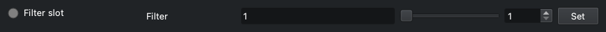

La posizione del filtro standard di INDI: la posizione su cui sta la ruota, e il posto dove chiederne un'altra. Ekos scrive qui quando una sequenza cambia filtro. Il driver manda 'go <slot>' e la ruota fa il resto da sola: gira nel verso che WHEELLY_DIRECTION consente (di base la via più corta, oppure un verso solo), tiene il motore fermo alimentato per 300 ms (WHEELLY_HOLD) mentre il disco si assesta, legge il magnete, confronta l'errore residuo con le tolleranze e ritenta se serve. Il driver riferisce soltanto il verdetto.

| Elemento | |
|---|---|
| Filter | Numero della posizione, da 1 al numero di posizioni che la ruota dichiara. (da 1 a 5, passo 1) |

- Intervallo da 1 al numero di posizioni che la ruota dichiara al collegamento (5 su una ruota di fabbrica, al massimo 12); passo 1.
- Busy mentre la ruota si muove. Ok quando è arrivata entro la tolleranza Buona (log: «Slot N reached, residual error X deg.»).
- Arrivata fra la tolleranza Buona e quella d'Allarme: ancora Ok, quindi la sequenza va avanti, con un avviso nel log («Slot N reached but off by X deg, beyond the good tolerance. Imaging continues.»).
- Ancora oltre la tolleranza d'Allarme dopo tutti i ritentativi: Alert, che fa fermare subito la sequenza a Ekos (log: «Slot N NOT reached ... Imaging is stopped so that no frame is taken with the wheel out of place.»).
- Dopo ogni posizione non raggiunta, e dopo il limite di tempo qui sotto, una seconda riga del log suggerisce la prima cosa da controllare: «If the motor stalls or the clutch slips, check first that the wheel's detent (its spring click stop) has been removed ...» - il motore non riesce a uscire dalle sue tacche, e la guida di montaggio lo toglie nel capitolo 10, Il corpo della ruota.
- Limiti di tempo: la ruota ricava da sé il tetto di tempo di un movimento dalla velocità del motore, dall'accelerazione, dai ritentativi, dal verso di rotazione e dalla tenuta dopo l'arrivo, e oltre quel tetto smette di ritentare; il driver dichiara Alert da sé se la ruota non ha finito 3 s dopo quel tetto (log: «The wheel did not finish within N seconds. Imaging is stopped.»). Con un firmware che non dichiara il suo tetto il limite del driver è 28 s.
- Ekos rinuncia per conto suo a un cambio filtro dopo 30 s: quando il tetto della ruota va oltre, il log lo dice (vedi WHEELLY_DIRECTION).
- Un movimento viene rifiutato subito, con Alert, se il sensore non risponde o non vede il magnete; il motivo è nel log.
- La posizione è assoluta (encoder magnetico): niente ricerca dello zero. Se la ruota viene girata a mano o da un altro programma, questo valore la segue all'interrogazione successiva.
- Il tempo massimo di Ekos per il cambio filtro conta dalla richiesta; la fine di un movimento si nota all'interrogazione successiva, quindi un POLLING_PERIOD lungo ritarda l'Ok.

### Filter names

⬜ *INDI standard* · `FILTER_NAME`

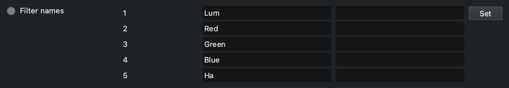

I nomi dei filtri standard di INDI, uno per posizione. I nomi sono conservati nella ruota stessa: al collegamento il driver li legge dalla ruota, così una ruota spostata su un altro computer si presenta coi suoi nomi. Quando cambi un nome, il driver lo scrive nella ruota. Ekos usa questi nomi nella parola chiave FITS FILTER e nei nomi di file e cartelle, ed è per questo che la regola è severa.

| Elemento | |
|---|---|
| 1 | Nome della posizione 1. |
| 2 | Nome della posizione 2. |
| 3 | Nome della posizione 3. |
| 4 | Nome della posizione 4. |
| 5 | Nome della posizione 5. |

- Ammessi: lettere non accentate, cifre, _ - e . ; da 1 a 32 caratteri; il primo e l'ultimo devono essere una lettera o una cifra. I nomi di dispositivo di Windows (CON, PRN, AUX, NUL, COM1-COM9, LPT1-LPT9, anche con un'estensione) vengono rifiutati. Due posizioni non possono avere lo stesso nome, senza distinguere maiuscole e minuscole.
- Una posizione senza filtro: lascia vuoto il suo campo. Il driver le dà il nome Empty_ seguito dal numero della posizione (Empty_5), che è unico e valido, così più posizioni possono essere vuote insieme; il nome è lo stesso su ogni computer, perché è conservato nella ruota e scritto nell'intestazione FITS. Il campo e l'elenco dei filtri di Ekos mostrano poi quel nome, e il log lo dice.
- Un nome rifiutato non viene corretto di nascosto: la proprietà diventa rossa (Alert), il campo torna al nome di prima, e il log dice quale posizione, quale nome, cosa non va e, quando può, un nome che sarebbe accettato, seguiti dai caratteri ammessi. Quella riga è sempre la più recente del log, quella in cima in KStars; quando è troppo lunga per un solo messaggio INDI, i caratteri ammessi vanno nella riga subito prima. FILTER_SLOT non viene toccata, così un errore di battitura non ferma mai una sequenza.
- Il numero dei campi segue il numero di posizioni che la ruota dichiara; la cattura del pannello mostra i cinque di una ruota di fabbrica.
- Nomi di fabbrica: Lum, Red, Green, Blue, Ha (Filter1, Filter2 ... su una ruota con un numero diverso di posizioni).
- Un nome nuovo resta nella ruota solo fino allo spegnimento, a meno che tu non prema «Save to the wheel» (WHEELLY_SAVE).
- I nomi vengono sempre dalla ruota, a ogni collegamento - anche quando la configurazione INDI del computer ha dei nomi salvati da una sessione precedente: una ruota rinominata su un altro computer mostra i suoi.

### Where the wheel is

🟦 **Wheelly** · `WHEELLY_POSITION` · sola lettura

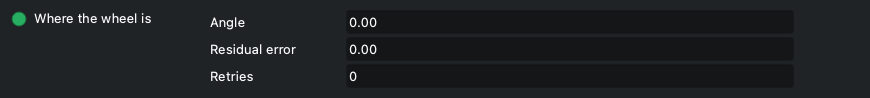

Dove si trova davvero la ruota, letto dal sensore magnetico, aggiornato a ogni interrogazione (ogni POLLING_PERIOD, 250 ms di base). Guardalo mentre centri una posizione, o quando un cambio filtro è finito con un avviso o un fallimento: dice di quanto la ruota si è fermata fuori posto e quanti ritentativi ci sono voluti.

| Elemento | |
|---|---|
| Angle | Angolo del disco letto dal sensore AS5600, in gradi, da 0 a 360. (da 0 a 360, passo 0) |
| Residual error | Errore residuo in gradi, col segno: angolo misurato meno l'angolo obiettivo (l'angolo di taratura) dell'ultima posizione chiesta, dalla parte più corta. A riposo continua ad aggiornarsi, quindi mostra anche una ruota che deriva. (da -180 a 180, passo 0) |
| Retries | Ritentativi usati dalla ruota nell'ultimo posizionamento (0 = raggiunta al primo tentativo). (da 0 a 99, passo 0) |

- Sola lettura. Limiti di visualizzazione: angolo 0-360, errore da -180 a +180, ritentativi 0-99.
- Il verdetto (arrivata, avviso, fallita) lo dà il firmware, non questa proprietà: vedi FILTER_SLOT e il log.
- Se la ruota si sposta da sola a riposo oltre la tolleranza d'Allarme, il log lo dice una volta per episodio e consiglia la tenuta a riposo (WHEELLY_HOLD) o, se è già accesa, di guardare il precarico della molla della frizione.

### Magnetic sensor

🟦 **Wheelly** · `WHEELLY_SENSOR` · sola lettura

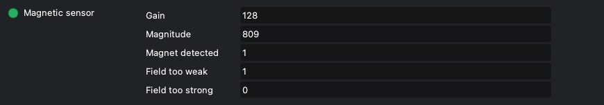

Lo stato del sensore magnetico AS5600, aggiornato a ogni interrogazione. È strumentazione da tenere d'occhio: un filo del sensore che si allenta, o il ponticello di alimentazione del modulo del sensore che si solleva, si vede qui prima che in un fotogramma rovinato. La proprietà diventa rossa (Alert) quando il magnete non viene rilevato.

| Elemento | |
|---|---|
| Gain | Guadagno automatico del sensore, da 0 a 255 come viene mostrato. Col magnete che usa Wheelly a 3,3 V resta a fondo scala (128) a qualunque traferro, quindi si mostra per la diagnosi ma non è il criterio. (da 0 a 255, passo 0) |
| Magnitude | Intensità del campo magnetico vista dal sensore, in conteggi, da 0 a 4095. È questo il criterio: sotto 350 il magnete è troppo lontano o fuori centro. La sua variazione su un giro completo misura quanto bene è centrato il magnete (vedi la spazzolata del magnete). (da 0 a 4095, passo 0) |
| Magnet detected | 1 = magnete rilevato, 0 = non rilevato (la proprietà allora va in Alert). (da 0 a 1, passo 0) |
| Field too weak | Segnale di campo troppo debole (1 = debole), come lo riporta l'AS5600. Col magnete di riferimento a 3,3 V di solito vale 1, perché il guadagno del chip resta a fondo scala; è anche l'aspetto di un ponticello VDD5V-VDD3V3 interrotto sul modulo, quindi va letto insieme alla magnitude. (da 0 a 1, passo 0) |
| Field too strong | Segnale di campo troppo forte (1 = forte), come lo riporta l'AS5600: il magnete è troppo vicino al chip. (da 0 a 1, passo 0) |

- Sola lettura.
- Se il sensore non risponde affatto, Guadagno e Magnitude valgono 0 e MD vale 0.
- Quando il magnete sparisce il log mostra un errore: «The sensor no longer detects the magnet. This is serious: check the sensor wiring before imaging further.» Una volta per episodio: se il magnete torna e poi si perde di nuovo, lo ridice.
- Per un controllo completo del sensore e del driver del motore usa «Hardware check» (WHEELLY_DIAG).

## Connection

Le impostazioni standard di INDI per il collegamento seriale. Wheelly si collega sul cavo USB a 115200 baud e si riconosce da quello che risponde e dal numero di serie, non dal nome della porta, quindi con Auto Search acceso raramente serve cambiare qualcosa qui.

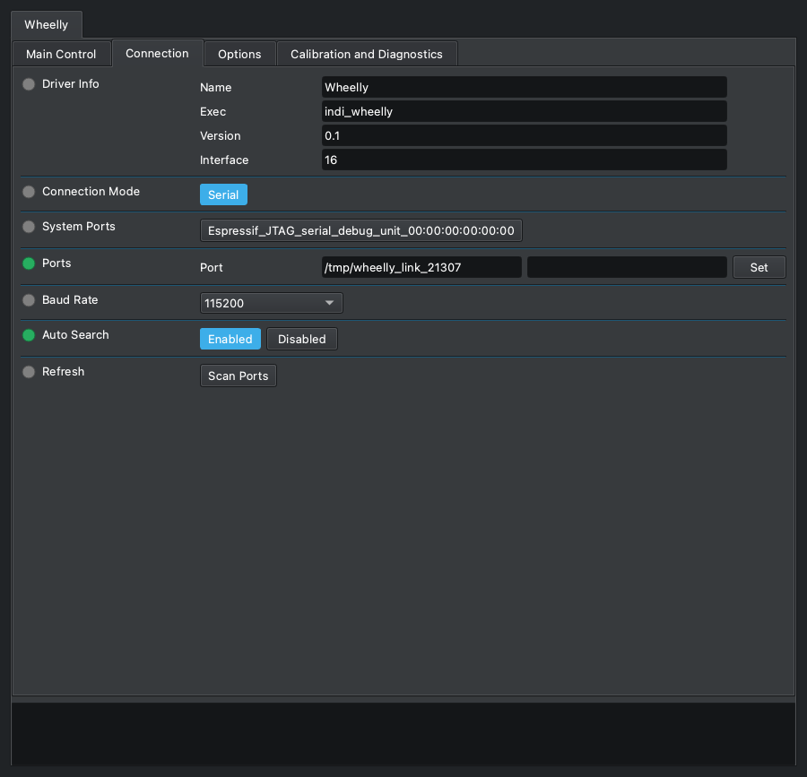

| In questa scheda | |
|---|---|
| [Driver Info](#driver-info) | ⬜ *INDI standard* |
| [Connection Mode](#connection-mode) | ⬜ *INDI standard* |
| [System Ports](#system-ports) | ⬜ *INDI standard* |
| [Ports](#ports) | ⬜ *INDI standard* |
| [Baud Rate](#baud-rate) | ⬜ *INDI standard* |
| [Auto Search](#auto-search) | ⬜ *INDI standard* |
| [Refresh](#refresh) | ⬜ *INDI standard* |

### Driver Info

⬜ *INDI standard* · `DRIVER_INFO` · sola lettura

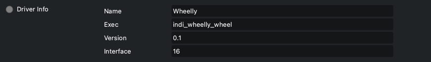

Informazioni standard di INDI sul driver: il nome, il programma che lo esegue, la versione e il tipo di dispositivo.

| Elemento | |
|---|---|
| Name | Nome del driver (Wheelly). |
| Exec | Nome dell'eseguibile (indi_wheelly). |
| Version | Versione del driver. |
| Interface | Codice dell'interfaccia INDI; 16 vuol dire ruota portafiltri. |

- Sola lettura. La versione del firmware della ruota è in WHEELLY_FIRMWARE, sotto Options.

### Connection Mode

⬜ *INDI standard* · `CONNECTION_MODE`

La scelta standard di INDI del modo di raggiungere il dispositivo. Wheelly offre solo il collegamento seriale, sul cavo USB dello XIAO ESP32-S3.

| Elemento | |
|---|---|
| Serial | Porta seriale (l'unica scelta). |

### System Ports

⬜ *INDI standard* · `SYSTEM_PORTS`

Pulsanti scorciatoia standard di INDI, uno per ogni porta seriale che il sistema trova: premerne uno copia quella porta in Ports. Compare solo quando il computer ha delle porte seriali; con la ruota collegata, il suo pulsante porta il nome della porta USB dello XIAO (Espressif USB JTAG/serial debug unit, seguito dal numero di serie della scheda).

| Elemento | |
|---|---|
| *(una per porta trovata)* | Una porta trovata dal sistema; premila per usarla. |

- L'elenco lo fa libindi all'avvio del driver: una porta collegata dopo compare dopo 'Refresh' (Scan Ports).

### Ports

⬜ *INDI standard* · `DEVICE_PORT`

La porta seriale della ruota. Raramente serve scriverla: il driver dà a INDI uno schema per scegliere la porta di un ESP32-S3 fra quelle trovate, e con Auto Search acceso prova le altre porte finché una Wheelly risponde. La ruota poi si riconosce dalla risposta e dal numero di serie, non dal nome della porta, che può cambiare quando sposti la spina in un'altra presa USB.

| Elemento | |
|---|---|
| Port | Percorso della porta seriale, per esempio /dev/ttyACM0 su Linux o /dev/cu.usbmodem... su macOS. |

- Schema dato a INDI: '303a|espressif|wheelly|usbmodem', senza distinguere maiuscole e minuscole: 303a è l'identificativo USB del produttore Espressif, e su Linux le porte sotto /dev/serial/by-id/ portano invece il nome del produttore (la ruota è usb-Espressif_USB_JTAG_serial_debug_unit_<serial>-if00). Secondo libindi si usa solo quando la porta salvata non esiste più.
- Verificato sul Raspberry con la ruota vera e nessuna configurazione salvata: il driver propone da solo la porta della ruota e si collega.
- INDI salva la porta nella configurazione quando cambia.
- Scrivere un percorso che non è fra le porte trovate spegne Auto Search.

### Baud Rate

⬜ *INDI standard* · `DEVICE_BAUD_RATE`

La velocità seriale standard di INDI. Il driver sceglie 115200 di base, che è la velocità con cui il firmware apre la sua porta seriale. Lasciala lì.

| Elemento | |
|---|---|
| 9600 | 9600 baud. |
| 19200 | 19200 baud. |
| 38400 | 38400 baud. |
| 57600 | 57600 baud. |
| 115200 | 115200 baud (di base, la velocità del firmware). |
| 230400 | 230400 baud. |

- Non importa quale si sceglie: lo XIAO ESP32-S3 parla sulla sua porta USB nativa, dove il baud rate non viene usato sul filo (verificato sulla ruota vera: si collega a 9600 come a 115200).

### Auto Search

⬜ *INDI standard* · `DEVICE_AUTO_SEARCH`

La ricerca automatica standard di INDI: se la ruota non risponde sulla porta in DEVICE_PORT, prova tutte le altre porte seriali trovate, in ordine casuale, finché una risponde. Per Wheelly è anche ciò che permette a un profilo di trovare la sua ruota quando ce ne sono due collegate.

| Elemento | |
|---|---|
| Enabled | Prova le altre porte quando quella configurata non va (di base). |
| Disabled | Prova solo la porta in DEVICE_PORT. |

- Su Linux, libindi spegne Auto Search da sé dopo aver trovato il dispositivo su un'altra porta, e salva la porta nuova.
- Una Wheelly con un numero di serie diverso non viene accettata al primo giro, quindi Auto Search passa alla porta successiva.

### Refresh

⬜ *INDI standard* · `DEVICE_PORT_SCAN`

Il pulsante standard di INDI per cercare di nuovo le porte seriali del sistema, per esempio dopo aver collegato la ruota. Le porte trovate compaiono come pulsanti fra cui scegliere.

| Elemento | |
|---|---|
| Scan Ports | Cerca le porte seriali adesso; il log dice quante ne ha trovate. |

## Options

Le opzioni standard di INDI (debug, simulazione, file di configurazione, periodo di interrogazione, joystick) e le impostazioni della macchina: informazioni sul firmware, corrente del motore, velocità e accelerazione, tenuta a riposo, verso di rotazione e LED. Motore, tenuta, verso e LED stanno nella ruota e restano dopo lo spegnimento solo con «Save to the wheel», subito sotto Configuration o nella scheda Calibration and Diagnostics.

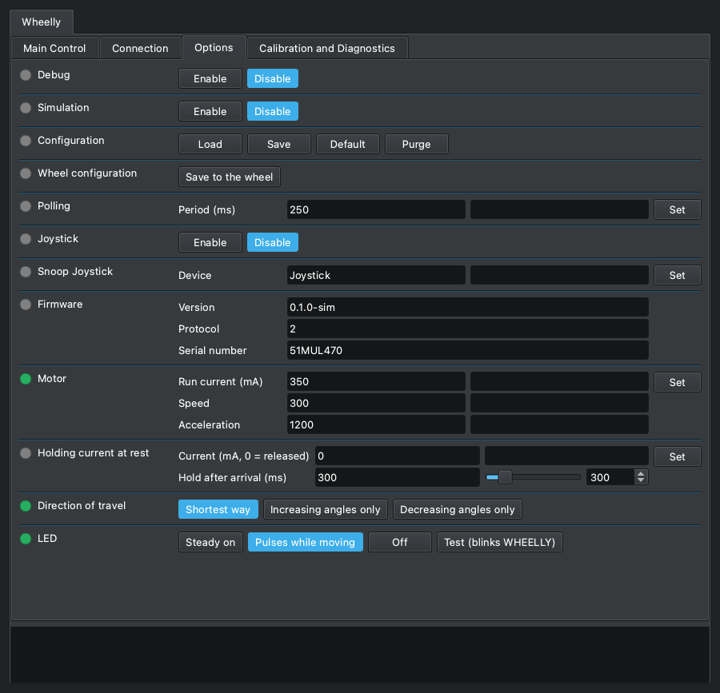

| In questa scheda | |
|---|---|
| [Debug](#debug) | ⬜ *INDI standard* |
| [Simulation](#simulation) | ⬜ *INDI standard* |
| [Configuration](#configuration) | ⬜ *INDI standard* |
| [Wheel configuration](#wheel-configuration) | 🟦 **Wheelly** |
| [Polling](#polling) | ⬜ *INDI standard* |
| [Joystick](#joystick) | ⬜ *INDI standard* |
| [Snoop Joystick](#snoop-joystick) | ⬜ *INDI standard* |
| [Firmware](#firmware) | 🟦 **Wheelly** |
| [Motor](#motor) | 🟦 **Wheelly** |
| [Holding current at rest](#holding-current-at-rest) | 🟦 **Wheelly** |
| [Direction of travel](#direction-of-travel) | 🟦 **Wheelly** |
| [LED](#led) | 🟦 **Wheelly** |

### Debug

⬜ *INDI standard* · `DEBUG`

L'interruttore di debug standard di INDI. Quando è abilitato, INDI aggiunge le impostazioni del livello di debug e dell'uscita del log; col livello 'Driver Debug' acceso, il driver Wheelly scrive nel log ogni riga scambiata con la ruota, nei due sensi ('-> ' mandata, '<- ' ricevuta). È la prima cosa da accendere quando la ruota fa qualcosa di inatteso, e non serve ricompilare niente.

| Elemento | |
|---|---|
| Enable | Debug acceso: compaiono altre proprietà per i livelli e l'uscita del log. |
| Disable | Debug spento (di base). |

- Salvato nella configurazione INDI e ripristinato all'avvio del driver.
- Al livello di debug il driver scrive anche «Moving to slot N.» all'inizio di ogni movimento.
- Finiscono nel log anche le interrogazioni di stato, parecchie al secondo: rispegnilo quando hai finito.

### Simulation

⬜ *INDI standard* · `SIMULATION`

L'interruttore di simulazione standard di INDI. Il driver Wheelly non ha un modo di simulazione: non guarda questo interruttore, e parla comunque con la porta seriale. Lascialo disabilitato. Per provare il driver senza una ruota, usa il simulatore del firmware del progetto (firmware/simulator) su una porta seriale virtuale.

| Elemento | |
|---|---|
| Enable | Non ha effetto sulla ruota; vedi la nota. |
| Disable | Di base; lascialo qui. |

- Trappola: con la simulazione accesa, il Disconnect di libindi ritorna senza chiudere la porta, quindi la porta seriale resta aperta dopo Disconnect.

### Configuration

⬜ *INDI standard* · `CONFIG_PROCESS`

Il file di configurazione standard di INDI di questo dispositivo, tenuto sul computer su cui gira il driver (~/.indi/, col nome del dispositivo). Attenzione: la taratura non sta qui: angoli, nomi dei filtri, correnti e modo del LED sono conservati nella ruota con «Save to the wheel». La configurazione tiene le impostazioni di questo computer e di questo profilo.

| Elemento | |
|---|---|
| Load | Ricarica la configurazione salvata e la applica. |
| Save | Salva le impostazioni correnti nel file di configurazione. |
| Default | Carica il file di configurazione di base che INDI tiene accanto alla configurazione. |
| Purge | Cancella il file di configurazione. |

- Cosa aggiunge Wheelly alle voci standard di INDI (collegamento, porta, baud rate, ricerca automatica, debug, periodo di interrogazione, posizione del filtro, nomi dei filtri, joystick): i dati del firmware, compreso il numero di serie della ruota di questo profilo, le tolleranze, la cartella delle spazzolate e l'interruttore del registro dei movimenti.
- Load riapplica i valori salvati come se fossero stati scritti a mano: le tolleranze vengono mandate alla ruota (solo nella memoria di lavoro), e viene chiesta la posizione del filtro salvata, quindi la ruota può muoversi.
- Purge dimentica anche quale ruota appartiene a questo profilo; il collegamento successivo adotta la prima Wheelly che trova.
- Alcune voci si salvano da sole quando cambiano: la cartella delle spazzolate, l'interruttore del registro dei movimenti, il numero di serie imparato, la porta.

### Wheel configuration

🟦 **Wheelly** · `WHEELLY_CONFIG`

«Save to the wheel», anche qui: scrive nella memoria permanente della ruota tutto quello che la ruota contiene, come fa il pulsante con lo stesso nome nella scheda Calibration and Diagnostics (WHEELLY_SAVE). Sta subito sotto Configuration perché le impostazioni di questa scheda che stanno nella ruota - motore, tenuta, verso, LED - si salvino senza uscirne.

| Elemento | |
|---|---|
| Save to the wheel | Scrive nella ruota numero di posizioni, angoli di taratura, nomi dei filtri, tolleranze, corrente di marcia e di tenuta, tenuta dopo l'arrivo, velocità, accelerazione, verso di rotazione e modo del LED. Log: «Calibration saved in the wheel.» |

- Configuration, sopra, è di INDI e salva le impostazioni di questo computer e di questo profilo, non quelle della ruota: l'una non sostituisce l'altra. Una riga a sé e non un quinto pulsante in Configuration: Ekos conta sui suoi quattro, e KStars ne mostrerebbe cinque come un menu a tendina.
- C'è sempre, come Configuration; premuto con la ruota scollegata va in Alert e il log dice «Connect the wheel first.»

### Polling

⬜ *INDI standard* · `POLLING_PERIOD`

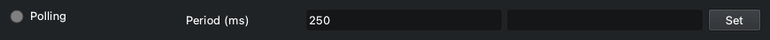

Il periodo di interrogazione standard di INDI. Per Wheelly è ogni quanto il driver chiede alla ruota il suo stato: posizione, errore residuo, letture del sensore, la fine di un movimento, una ruota girata a mano. Il driver lo imposta a 250 ms.

| Elemento | |
|---|---|
| Period (ms) | Tempo fra due richieste di stato, in millisecondi. Di base 250. (da 10 a 600000, passo 1000) |

- Limiti nel pannello: da 10 a 600000 ms.
- La fine di un cambio filtro si nota all'interrogazione successiva, e anche il limite di tempo del driver per un movimento viene controllato a ogni interrogazione: un periodo lungo fa sembrare più lenti i cambi filtro e ritarda la segnalazione dei fallimenti.
- Durante una spazzolata del magnete il driver interroga comunque ogni 100 ms.
- Salvato nella configurazione INDI e ripristinato all'avvio del driver.
- Una riga di stato sono circa 2 ms di traffico seriale, quindi il valore di base costa poco.

### Joystick

⬜ *INDI standard* · `USEJOYSTICK`

L'interruttore standard di INDI del joystick per le ruote portafiltri. Quando è abilitato, il driver ascolta un joystick servito dal driver joystick di INDI e ti permette di cambiare filtro con quello.

| Elemento | |
|---|---|
| Enable | Ascolta il joystick; compare una proprietà per associare i comandi. |
| Disable | Ignora il joystick (di base). |

- Associazione fatta da libindi: la leva 'Change Filter' (di base JOYSTICK_1) spinta tutta in su va alla posizione precedente, in giù alla successiva, ricominciando dal fondo; il pulsante 'Reset' (di base BUTTON_1) va alla posizione 1.
- Niente di specifico di Wheelly: ogni richiesta diventa un movimento normale con le stesse tolleranze e gli stessi ritentativi.
- Un movimento chiesto dal joystick compare in «Filter slot» come ogni altro: Busy mentre la ruota gira.

### Snoop Joystick

⬜ *INDI standard* · `SNOOP_JOYSTICK`

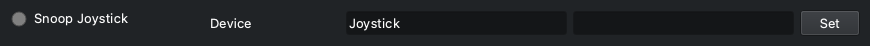

Il nome del dispositivo joystick INDI che questo driver ascolta quando il joystick è abilitato. Proprietà standard di INDI.

| Elemento | |
|---|---|
| Device | Nome del dispositivo del driver joystick. Di base 'Joystick'. |

- Cambialo solo se il tuo joystick ha un altro nome in INDI.

### Firmware

🟦 **Wheelly** · `WHEELLY_FIRMWARE` · sola lettura

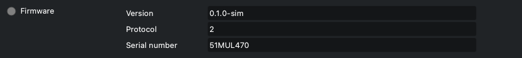

Quello che la ruota ha detto di sé quando il driver si è collegato: versione del firmware, versione del protocollo e numero di serie. Utile quando si segnala un problema, e per sapere a quale ruota è legato questo profilo.

| Elemento | |
|---|---|
| Version | Versione del firmware che gira sulla ruota. |
| Protocol | Versione del protocollo del firmware. Il driver accetta solo la versione per cui è stato compilato; un'altra viene rifiutata alla connessione. |
| Serial number | Numero di serie della ruota, ricavato dal firmware dall'indirizzo MAC del chip, quindi diverso per ogni ruota. |

- Sola lettura.
- Salvato nella configurazione INDI: il numero di serie salvato è quello che il profilo cerca al collegamento successivo (vedi CONNECTION).
- Un firmware con un'altra versione di protocollo viene rifiutato al collegamento, con un messaggio nel log che dice quale parte aggiornare.

### Motor

🟦 **Wheelly** · `WHEELLY_MOTOR`

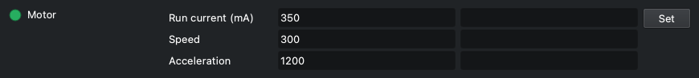

Le impostazioni del motore passo-passo mentre gira la ruota. La corrente di marcia è quella da regolare: alzala finché la trasmissione a frizione smette di slittare, e non oltre, perché più corrente vuol dire più calore.

| Elemento | |
|---|---|
| Run current (mA) | Corrente di marcia, in mA (RMS, impostata nel driver del motore TMC). Di base 350. (da 1 a 800, passo 5) |
| Speed | Velocità massima, in passi interi del motore al secondo. Di base 300. (da 1 a 5000, passo 10) |
| Acceleration | Accelerazione, in passi interi del motore al secondo quadrato. Di base 1200. (da 1 a 50000, passo 50) |

- Limiti nel pannello: corrente di marcia da 1 a 800 mA (passo 5), velocità da 1 a 5000 (passo 10), accelerazione da 1 a 50000 (passo 50).
- Il valore di base di 350 mA è misurato sulla ruota di riferimento, dove la frizione smette di slittare; il motore è dato per 400 mA per fase. Col fermo ancora al suo posto la ruota voleva 400 mA per uscire da una tacca; col fermo tolto, come la guida di montaggio fa sempre, a 350 mA è arrivata a ogni velocità da 100 a 1000 passi/s.
- Set manda i tre valori alla ruota insieme; poi i campi mostrano quello che la ruota ha accettato.
- Abbassare la corrente di marcia sotto quella di tenuta abbassa anche la corrente di tenuta nella ruota.
- Velocità e accelerazione sono in passi interi del motore: 200 passi/s è un giro di motore al secondo, circa 124 gradi di disco al secondo su Wheelly (la frizione fa girare il disco 2,9 volte più lento del motore); i 300 passi/s di base sono circa 186 gradi al secondo.
- Più lento non vuol dire più delicato: questo motore ha poca coppia sotto i 250 passi/s circa (75 giri al minuto, dove comincia la curva del suo datasheet), e a 50 passi/s si bloccava vibrando su alcune tacche del fermo della ruota di riferimento (ora tolto) anche nel verso facile, mentre da 100 fino a 1000 ogni movimento arrivava. Il valore di base è 300/1200. Dopo un tratto che si blocca comunque, la ruota fa il successivo al doppio della velocità e dell'accelerazione (al massimo 1000 passi/s) per uscire dalla tacca.
- Il tetto di tempo della ruota su un movimento segue la velocità: se con i nuovi valori il cambio filtro più lungo possibile andasse oltre i 30 s dopo i quali Ekos rinuncia, il log avverte («With these motor settings the longest filter change can take up to N s ...»).
- Resta nella ruota fino allo spegnimento; premi «Save to the wheel» per tenerla. Non viene salvata nella configurazione INDI.
- Alert se la ruota ha rifiutato il valore; il motivo è nel log.

### Holding current at rest

🟦 **Wheelly** · `WHEELLY_HOLD`

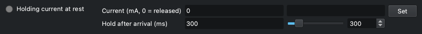

Se il motore resta alimentato quando la ruota è ferma. Di base è 0: alla fine di ogni movimento il motore viene rilasciato, senza corrente, senza calore accanto alla camera e senza il rumore del chopper durante le pose. Il fermo della ruota si toglie sempre (il motore non riesce a uscire dalle sue tacche), quindi a tenere fermo il disco a riposo è la frizione che ci preme sopra; se la ruota si sposta comunque da sola - il log lo dice - imposta una corrente di tenuta ridotta così il disco non può girare da solo. Il secondo campo è per quanto il motore fermo continua a tenere il disco, alla corrente di marcia, dopo ogni movimento prima di essere rilasciato - anche quando la corrente di tenuta a riposo è 0.

| Elemento | |
|---|---|
| Current (mA, 0 = released) | Corrente di tenuta a riposo, in mA; 0 = motore rilasciato. Il campo mostra il valore che ha la ruota, 0 compreso. (da 0 a 800, passo 5) |
| Hold after arrival (ms) | Tenuta dopo l'arrivo, in ms: per quanto il motore resta alimentato alla corrente di marcia dopo che ogni tratto di un movimento si è fermato, prima che la ruota legga dove sta il disco e - alla fine del movimento - lo rilasci. Di base 300; 0 = legge e rilascia subito. (da 0 a 2000, passo 50) |

- Lo dice anche la luce: verde finché la corrente di tenuta è accesa, grigia quando il motore è rilasciato (0), sia che il valore sia stato impostato dal pannello sia che sia stato letto al collegamento.
- Da dove partire, se la ruota si sposta da sola: 150 mA, il valore che questo progetto consiglia. Lo dice anche il log, nel messaggio che segnala lo spostamento. Il campo mostra quello che la ruota tiene, 0 compreso, e non 150 come suggerimento: una ruota salvata a 0 sembrerebbe tornata a 150.
- Limiti nel pannello: da 0 a 800 mA, passo 5. La ruota rifiuta una corrente di tenuta più alta di quella di marcia (il log spiega, la proprietà va in Alert).
- Impostare un valore sopra 0 scrive un avviso nel log: il motore scalda accanto al sensore e il driver canta durante le pose.
- 150 mA e non la corrente di marcia perché la tenuta dura tutta la notte: circa 1,35 W invece di 7,4 W.
- Perché la tenuta dopo l'arrivo: il motore muove il disco per attrito, e un motore fermo ancora alimentato tiene la gomma, che frena il disco; rilasciato subito, il disco potrebbe proseguire per inerzia. La ruota legge il verdetto alla fine della tenuta, così un disco che ha continuato a muoversi viene giudicato dove si è fermato e corretto come qualunque altro errore. Un disco più pesante o una gomma più morbida possono volerne di più; 0 legge prima che il disco si sia assestato e costa tratti in più.
- Limiti della tenuta dopo l'arrivo: da 0 a 2000 ms, passo 50. Allunga ogni tratto, quindi il tetto di tempo della ruota su un movimento cresce con lei (il log avvisa se supera i 30 s di Ekos, vedi WHEELLY_DIRECTION). Viene riletta dalla ruota al collegamento; un firmware precedente non ce l'ha, tiene i suoi 300 ms fissi, e una modifica di questo campo va in Alert.
- Resta nella ruota fino allo spegnimento; premi «Save to the wheel» per tenerla. Non viene salvata nella configurazione INDI.

### Direction of travel

🟦 **Wheelly** · `WHEELLY_DIRECTION`

Da che parte può girare la ruota per raggiungere una posizione. Una meccanica più dura in un verso che nell'altro - come una ruota con un fermo asimmetrico, un fianco dolce da una parte e uno ripido dall'altra - può bloccarsi nel verso duro: il motore ronza e vibra e il disco non si muove. Girare in un verso solo lo evita. L'interruttore mostra il valore riletto dalla ruota.

| Elemento | |
|---|---|
| Shortest way | La via più corta, in un verso o nell'altro. Il valore di fabbrica, perché la guida di montaggio toglie il fermo della ruota. |
| Increasing angles only | Sempre verso angoli crescenti, come li legge il sensore. |
| Decreasing angles only | Sempre verso angoli decrescenti. Il verso in cui il fermo asimmetrico della ruota di riferimento lasciava passare - salendo, il motore si bloccava a ogni tacca. Crescenti e decrescenti restano per una meccanica più dura in un verso. |

- In un verso solo, ogni movimento e ogni ritentativo vanno da quella parte: dopo un sorpasso la ruota fa tutto il giro invece di tornare indietro nel verso duro. Perché non sorpassi, ogni tratto si ferma un po' prima della meta e i successivi si avvicinano a piccoli passi: un movimento richiede qualche tratto, e questi tratti di avvicinamento non sono ritentativi. Se è arrivata lo giudica sempre l'angolo letto.
- In un verso solo un movimento può essere quasi un giro intero, e un ritentativo un altro giro: il tetto di tempo della ruota su un movimento cresce di conseguenza. Se il cambio filtro più lungo possibile andasse oltre i 30 s dopo i quali Ekos rinuncia, il log avverte («With these motor settings the longest filter change can take up to N s ...») - quando si imposta il verso o la velocità del motore, e al collegamento. Alza la velocità, o scegli la via più corta se la ruota lo permette.
- La ruota la tiene finché non viene spenta; premi «Save to the wheel» per conservarla. Non è salvata nella configurazione di INDI.
- Grigio (Idle) solo con un firmware che non conosce l'impostazione; Alert se la ruota ha rifiutato il comando.

### LED

🟦 **Wheelly** · `WHEELLY_LED`

Cosa fa il LED sulla ruota. Il LED sta dentro il cammino della luce, quindi di base resta spento finché va tutto bene: respira piano mentre la ruota va a un altro filtro, e lampeggia un segnale suo quando qualcosa non va - la tabella qui sotto dice quale. L'interruttore mostra il modo riletto dalla ruota.

| Elemento | |
|---|---|
| Steady on | Acceso fisso; i segnali d'allarme si vedono comunque. |
| Pulses while moving | Spento a riposo; pulsa piano mentre la ruota va a un'altra posizione. Di base. |
| Off | Sempre spento - pulsazione e segnali d'allarme compresi - per non avere nessuna luce vicino all'ottica, o per girare la ruota a mano. |
| Test (blinks WHEELLY) | Lampeggia WHEELLY in codice Morse una volta (circa 6,7 s), poi torna al modo in uso. Risponde alla domanda «il LED è vivo?». |

| Cosa fa il LED | Cosa vuol dire | Fino a quando |
|---|---|---|
| Spento | Va tutto bene, la ruota è ferma | - |
| Respira piano (1,7 s) | Va a un'altra posizione (in «Pulses while moving») | Arriva |
| Lampeggia veloce, 4 al secondo | Non ha raggiunto la posizione dopo tutti i ritentativi | Raggiunge una posizione, o viene mandata di nuovo |
| Due lampi brevi ogni 2 s | La ruota si è spostata da sola a riposo, oltre la tolleranza | Viene mandata a una posizione |
| Tre lampi brevi ogni 2 s | Il sensore non vede più il magnete | Lo rivede |
| Scrive WHEELLY in Morse | La prova del LED | Circa 6,7 s |

- Un modo nuovo resta nella ruota solo fino allo spegnimento; il log ti ricorda di premere «Save to the wheel» per tenerlo.
- Fai la prova a coperchio aperto o di giorno: il LED sta dentro il cammino ottico. Il log lo dice quando la prova comincia.
- Durante la prova l'interruttore mostra già di nuovo il modo in uso; il lampeggio va avanti per i suoi 6,7 s.
- I segnali d'allarme della tabella si mostrano uno alla volta, prima il più grave (magnete, poi posizione non raggiunta, poi deriva), alla luminosità del culmine della pulsazione. In «Off» non ce n'è nessuno: è anche il modo per girare la ruota a mano col motore non alimentato, cosa che altrimenti verrebbe letta come una deriva.
- Alert se la ruota ha rifiutato il comando.

## Calibration and Diagnostics

Tarare e controllare la ruota, cose da fare a coperchio aperto o durante la messa a punto, non nel mezzo di una sequenza: gli angoli di taratura, i passi, il pulsante per salvare, le tolleranze, il controllo dell'hardware, la spazzolata del magnete, e il registro dei movimenti. Le modifiche alla taratura stanno nella memoria di lavoro della ruota finché non premi «Save to the wheel». Le spiegazioni di quello che è successo vanno nel riquadro del log in fondo, non in campi aggiunti.

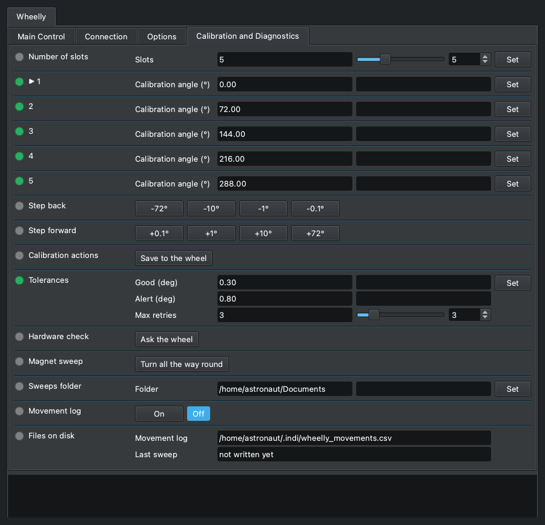

| In questa scheda | |
|---|---|
| [Number of slots](#number-of-slots) | 🟦 **Wheelly** |
| [▶ 1](#1) | 🟦 **Wheelly** |
| [2](#2) | 🟦 **Wheelly** |
| [3](#3) | 🟦 **Wheelly** |
| [4](#4) | 🟦 **Wheelly** |
| [5](#5) | 🟦 **Wheelly** |
| [Step back](#step-back) | 🟦 **Wheelly** |
| [Step forward](#step-forward) | 🟦 **Wheelly** |
| [Calibration actions](#calibration-actions) | 🟦 **Wheelly** |
| [Tolerances](#tolerances) | 🟦 **Wheelly** |
| [Hardware check](#hardware-check) | 🟦 **Wheelly** |
| [Magnet sweep](#magnet-sweep) | 🟦 **Wheelly** |
| [Sweeps folder](#sweeps-folder) | 🟦 **Wheelly** |
| [Movement log](#movement-log) | 🟦 **Wheelly** |
| [Files on disk](#files-on-disk) | 🟦 **Wheelly** |

### Number of slots

🟦 **Wheelly** · `WHEELLY_SLOTS`

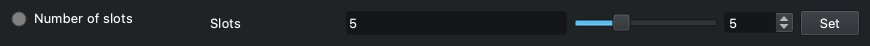

Quante posizioni per i filtri ha la ruota. Il numero sta nella ruota, e il driver lo legge a ogni collegamento: impostalo qui una volta, quando la ruota viene costruita. Cambiarlo fa ripartire la taratura da angoli equidistanti e nomi di filtro generici, e il pannello si ridisegna subito col nuovo numero di posizioni, nomi e angoli, e i pulsanti di passo di una posizione lo seguono (360 diviso il numero).

| Elemento | |
|---|---|
| Slots | Il numero di posizioni per i filtri della ruota. (da 2 a 12, passo 1) |

- Dopo averlo cambiato: insegna ogni posizione (i passi, poi Set sulla sua riga degli angoli), dai i nomi ai filtri, poi premi «Save to the wheel». Il log lo ricorda.
- Nella memoria permanente della ruota non si scrive niente fino a «Save to the wheel»: spegnendo la ruota tornano il numero e la taratura di prima, quindi un clic sbagliato non costa niente.
- Rifiutato mentre la ruota si muove; il motivo è nel log.

### ▶ 1

🟦 **Wheelly** · `WHEELLY_ANGLE_1`

Gli angoli di taratura, una riga per posizione, ognuna col suo Set: questa è quella della posizione 1, e le righe delle altre posizioni funzionano allo stesso modo. Il numero è l'angolo di taratura, in gradi, a cui quel filtro sta nel cammino della luce e dove la ruota va per portarcelo, come è conservato nella ruota. La posizione su cui sta la ruota è segnata con una freccia, «▶ 1». PER TARARE UNA POSIZIONE: sceglila in FILTER_SLOT; centra il filtro coi passi (WHEELLY_JOG_DOWN e WHEELLY_JOG_UP) - dopo ogni passo la sua riga mostra l'angolo in cui la ruota si trova adesso, con un asterisco, «▶ 1 *», che vuol dire non ancora tarato; premi Set su quella riga per tararla; fai lo stesso per ogni posizione, poi premi «Save to the wheel».

| Elemento | |
|---|---|
| Calibration angle (°) | Angolo di taratura della posizione, in gradi (da 0 a 360); dopo un passo, sulla posizione corrente, l'angolo in cui la ruota si trova adesso. (da 0 a 360, passo 0.01) |

- L'asterisco, «▶ 1 *»: la riga mostra dove si trova la ruota dopo i passi, NON quello che la posizione ha imparato. Set col valore così com'è lo conferma: la posizione prende quell'angolo e la ruota non si muove, perché è già lì (log: «Slot 1 now means the angle the wheel is at right now ...»). Se lasci la posizione senza premere Set - scegliendo un altro filtro, facendo la spazzolata, o premendo Set su un'altra riga - la riga torna all'angolo di taratura, senza asterisco: i passi non hanno insegnato niente.
- Set su una riga con un valore diverso - scritto a mano, su qualunque riga, compresa quella con l'asterisco: la posizione prende il nuovo angolo e la ruota ci va subito, come se la posizione fosse stata scelta in FILTER_SLOT, che va in Busy e poi in Ok o Alert. È così che si centra un filtro coi numeri, e che si corregge la taratura guardando una stella o un flat. Set su una riga col valore invariato porta soltanto la ruota a quella posizione.
- Ogni cambiamento è scritto nel log - «Slot 2: 122.87° → 123.10°.» - e, col registro dei movimenti acceso, come riga di wheelly_movements.csv con esito angle-taught (un asterisco confermato) o angle-set (un valore scritto): il nuovo angolo nella colonna target, il vecchio nella colonna angle, la differenza nella colonna error. È la storia delle correzioni: un angolo che continua a spostarsi notte dopo notte vuol dire che qualcosa nella meccanica si muove.
- Restano nella ruota solo fino allo spegnimento: premi «Save to the wheel» per tenerli. Riavviare la ruota senza salvare riporta l'ultima taratura salvata, ed è il modo di annullare un esperimento.
- Un valore fuori da 0-360 viene rifiutato dalla ruota: la riga va in Alert, resta il valore vecchio, e il log dice perché. Rifiutato anche mentre la ruota si muove.
- Se la ruota viene girata a mano la sua riga non la segue (segue solo i passi): per insegnare il punto in cui l'ha lasciata la mano, scrivi nella riga l'angolo mostrato in WHEELLY_POSITION e premi Set.
- La freccia resta sulla posizione mentre la ruota viene spostata a passi fuori da lì per centrarla. INDI non sa colorare un campo, e un'etichetta arriva al client solo quando la proprietà viene definita, quindi il driver definisce di nuovo le righe - e con loro le proprietà che le seguono in questa scheda, che altrimenti finirebbero sopra - solo alla fine di un passo, a un cambio di posizione e a una taratura, mai mentre la ruota viene soltanto osservata.
- Una ruota mai tarata ha le posizioni equidistanti (0, 72, 144, 216 e 288 gradi su una ruota a cinque posizioni): si può usare, ma non è una taratura.
- Una proprietà per posizione, non un solo WHEELLY_ANGLES con un unico Set per tutti e un pulsante a parte, «Save position» (WHEELLY_TEACH): il Set sulla riga con l'asterisco fa quello che farebbe quel pulsante. Una ruota salvata da un firmware precedente con un «Rotation trim» per posizione trova i ritocchi sommati ai suoi angoli, una volta, alla prima accensione col firmware attuale. Il visualizzatore delle spazzolate segna questi angoli sulla spazzolata del magnete.

### 2

🟦 **Wheelly** · `WHEELLY_ANGLE_2`

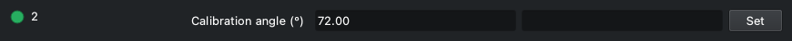

L'angolo di taratura della posizione 2, col suo Set: funziona come la riga della posizione 1 (WHEELLY_ANGLE_1), che spiega come.

| Elemento | |
|---|---|
| Calibration angle (°) | Angolo di taratura della posizione, in gradi (da 0 a 360); dopo un passo, sulla posizione corrente, l'angolo in cui la ruota si trova adesso. (da 0 a 360, passo 0.01) |

### 3

🟦 **Wheelly** · `WHEELLY_ANGLE_3`

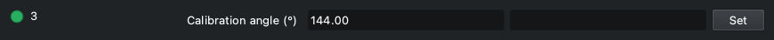

L'angolo di taratura della posizione 3, col suo Set: funziona come la riga della posizione 1 (WHEELLY_ANGLE_1), che spiega come.

| Elemento | |
|---|---|
| Calibration angle (°) | Angolo di taratura della posizione, in gradi (da 0 a 360); dopo un passo, sulla posizione corrente, l'angolo in cui la ruota si trova adesso. (da 0 a 360, passo 0.01) |

### 4

🟦 **Wheelly** · `WHEELLY_ANGLE_4`

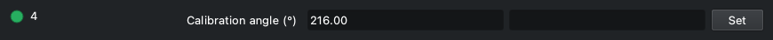

L'angolo di taratura della posizione 4, col suo Set: funziona come la riga della posizione 1 (WHEELLY_ANGLE_1), che spiega come.

| Elemento | |
|---|---|
| Calibration angle (°) | Angolo di taratura della posizione, in gradi (da 0 a 360); dopo un passo, sulla posizione corrente, l'angolo in cui la ruota si trova adesso. (da 0 a 360, passo 0.01) |

### 5

🟦 **Wheelly** · `WHEELLY_ANGLE_5`

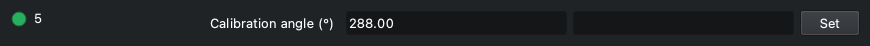

L'angolo di taratura della posizione 5, col suo Set: funziona come la riga della posizione 1 (WHEELLY_ANGLE_1), che spiega come.

| Elemento | |
|---|---|
| Calibration angle (°) | Angolo di taratura della posizione, in gradi (da 0 a 360); dopo un passo, sulla posizione corrente, l'angolo in cui la ruota si trova adesso. (da 0 a 360, passo 0.01) |

### Step back

🟦 **Wheelly** · `WHEELLY_JOG_DOWN`

Sposta la ruota indietro di un passo, verso angoli decrescenti, per centrare il filtro della posizione corrente; WHEELLY_JOG_UP va dall'altra parte, e il Set sulla riga della posizione, che segue i passi, tiene il risultato. Il primo pulsante è una posizione, 360 gradi diviso il numero di posizioni (72 su una ruota a cinque posizioni), e porta al filtro vicino; gli altri sono 10, 1 e 0,1 gradi. Ogni passo è un movimento VERSO l'angolo letto adesso meno il passo, fatto dalla ruota ad anello chiuso - gli stessi tratti di un cambio filtro, col gioco della gomma della frizione recuperato - e non un conto di passi del motore: la gomma si mangia circa 0,6 gradi prima che il disco si muova. Ogni pulsante agisce una volta e torna su.

| Elemento | |
|---|---|
| -72° | Sposta la ruota di una posizione (360 / posizioni) verso angoli decrescenti. |
| -10° | Sposta la ruota di 10 gradi verso angoli decrescenti. |
| -1° | Sposta la ruota di 1 grado verso angoli decrescenti. |
| -0.1° | Sposta la ruota di 0,1 gradi verso angoli decrescenti. |

- Busy mentre la ruota si muove, poi Ok, e il log dice dov'è: «The wheel is at A degrees, E degrees from where the step asked.» Alert se non ci è arrivata (log: «The wheel did not get where the step asked ...», seguita dalla riga che suggerisce di controllare che il fermo della ruota sia stato tolto), o se la ruota ha rifiutato il passo.
- Un passo che non ha coperto almeno metà di sé stesso è un fallimento, mai un avviso: la fascia di allarme di un cambio filtro è più larga dei passi piccoli, quindi altrimenti un passo di 0,5 gradi che non si è mosso affatto risulterebbe fatto.
- Un passo non è un cambio filtro: FILTER_SLOT resta com'è, e il passo va sempre nel suo verso, qualunque cosa dica WHEELLY_DIRECTION - in un verso solo, un passo al contrario farebbe tutto il giro della ruota. Su una meccanica più dura in un verso che nell'altro, un passo nel verso duro può bloccarsi.
- Il passo di una posizione arriva sul filtro successivo su una ruota con gli angoli equidistanti; l'etichetta segue il numero di posizioni. Su una ruota a due posizioni il passo è mezzo giro, e va nel verso che dice il suo pulsante.
- Rifiutato mentre la ruota si muove (log: «Cannot move the wheel by a step while it is moving ...»).
- Due righe e non una: KStars mostra più di quattro pulsanti esclusivi come un menu a tendina. Non c'è un passo di 0,05 gradi: è sotto quello che il sensore sa leggere (un conteggio vale 0,088 gradi), quindi un passo di 0,05 che non si è mosso non si distinguerebbe da uno che si è mosso.

### Step forward

🟦 **Wheelly** · `WHEELLY_JOG_UP`

Sposta la ruota avanti di un passo, verso angoli crescenti: lo specchio di WHEELLY_JOG_DOWN, che spiega come funziona un passo.

| Elemento | |
|---|---|
| +0.1° | Sposta la ruota di 0,1 gradi verso angoli crescenti. |
| +1° | Sposta la ruota di 1 grado verso angoli crescenti. |
| +10° | Sposta la ruota di 10 gradi verso angoli crescenti. |
| +72° | Sposta la ruota di una posizione (360 / posizioni) verso angoli crescenti. |

- Busy mentre la ruota si muove, poi Ok o Alert, come WHEELLY_JOG_DOWN.

### Calibration actions

🟦 **Wheelly** · `WHEELLY_SAVE`

Tutto quello che cambi nel pannello di taratura sta nella memoria di lavoro della ruota finché non premi «Save to the wheel»; salvare è un atto voluto, così puoi sperimentare liberamente. Il pulsante agisce una volta e torna su. Lo stesso pulsante c'è anche in Options, sotto «Wheel configuration» (WHEELLY_CONFIG).

| Elemento | |
|---|---|
| Save to the wheel | Scrive nella memoria permanente della ruota tutto quello che contiene: numero di posizioni, angoli di taratura, nomi dei filtri, tolleranze, corrente di marcia e di tenuta, tenuta dopo l'arrivo, velocità, accelerazione, verso di rotazione e modo del LED. Log: «Calibration saved in the wheel.» |

- Ok quando la ruota ha salvato, Alert quando non ci è riuscita; il motivo è nel log (per esempio «The wheel could not save to its memory.»).
- La posizione di un filtro si insegna col Set sulla sua riga degli angoli (WHEELLY_ANGLE_1 e le altre), quindi qui non c'è un pulsante «Set current slot here», e non ci sono ritocchi da azzerare.

### Tolerances

🟦 **Wheelly** · `WHEELLY_TOLERANCE`

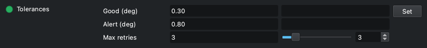

Quanto preciso deve essere un cambio filtro, e quanto ci prova la ruota. Dopo un movimento la ruota confronta l'errore residuo con due soglie: entro Buona è un successo; fra Buona e Allarme è un successo con un avviso nel log, e la ripresa prosegue; oltre Allarme ritenta, fino a Ritentativi massimi, e poi dichiara il fallimento, che ferma la sequenza di Ekos.

| Elemento | |
|---|---|
| Good (deg) | Tolleranza Buona, in gradi: entro questa il movimento è un successo pieno. Di base 0.30. (da 0.01 a 45, passo 0.01) |
| Alert (deg) | Tolleranza d'Allarme, in gradi: oltre questa la ruota ritenta, e fallisce dopo l'ultimo ritentativo. Di base 0.80. È anche la fascia entro cui la ruota si dichiara su una posizione, e la soglia per segnalare una deriva a riposo. (da 0.01 a 45, passo 0.01) |
| Max retries | Numero massimo di ritentativi dopo il primo tentativo. Di base 3. (da 0 a 20, passo 1) |

- Limiti nel pannello: da 0.01 a 45 gradi (passo 0.01) per entrambe le tolleranze, da 0 a 20 ritentativi (passo 1). La ruota pretende anche che Buona non sia più grande di Allarme; altrimenti rifiuta i tre valori, la proprietà va in Alert e il log spiega.
- I ritentativi hanno anche un limite di tempo: la ruota smette di ritentare dopo 25 s dall'inizio del movimento.
- Restano nella ruota fino allo spegnimento; premi «Save to the wheel» per tenerle.
- Salvate anche nella configurazione INDI, ma al collegamento i valori mostrati sono quelli letti dalla ruota; la copia salvata viene mandata alla ruota solo quando si carica la configurazione (CONFIG_PROCESS, Load).
- Per avere un'idea: un conteggio dell'AS5600 vale 0,088 gradi; la ruota fa la media di 8 letture per ogni misura. Un grado di disco sposta un filtro di circa 0,9 mm su un cerchio dei filtri di circa 50 mm di raggio (una stima). I valori di base tengono conto dell'ultimo mezzo grado, fino a un grado, che assorbe la gomma in TPU della trasmissione; valori più stretti si possono provare quando il registro dei movimenti mostra gli errori veri.

### Hardware check

🟦 **Wheelly** · `WHEELLY_DIAG`

Fa alla ruota una domanda sola: sta parlando davvero col suo sensore e col suo driver del motore? La risposta va nel riquadro del log. È la prima cosa da premere quando la ruota fa qualcosa di inatteso: un filo allentato sul driver del motore si presenta come «the motor does not turn» e ti manda a cercare nei posti sbagliati.

| Elemento | |
|---|---|
| Ask the wheel | Manda il controllo; la risposta compare nel log. |

- Righe del log, in ordine: «Asking the wheel whether it can really talk to its sensor and its motor driver:», poi 'AS5600 at 0x36: responding' con una riga 'STATUS md=... AGC=... MAG=...', oppure 'AS5600 at 0x36: SILENT' con il consiglio di controllare il cablaggio e il ponticello VDD5V-VDD3V3 sul modulo.
- Quando la magnitude è sotto 350 una riga in più dice che il magnete è troppo lontano o fuori centro.
- Poi il driver del motore: '<chip> over UART: responding, run X mA, hold Y mA', oppure '<chip> over UART: SILENT - check VM at the driver, then the 1k on the single wire'. Il nome del chip (TMC2208 o TMC2209) viene letto dal chip stesso; un chip muto non può dire quale sia, e quella riga si legge 'TMC2208/2209 over UART: SILENT'.
- Le righe di questo controllo sono testo del firmware e non vengono tradotte.
- Ok quando la ruota ha risposto, Alert quando no.
- Non muove la ruota.

### Magnet sweep

🟦 **Wheelly** · `WHEELLY_SWEEP`

La spazzolata del magnete: la ruota fa un giro completo, una posizione alla volta, sempre nello stesso verso, e il driver registra a ogni interrogazione la magnitudine del sensore e l'angolo. Alla fine li scrive in un file CSV nella cartella delle spazzolate. Più la variazione lungo il giro è piccola, più il magnete è centrato: usala prima e dopo aver regolato il traferro del sensore o il magnete.

| Elemento | |
|---|---|
| Turn all the way round | Avvia la spazzolata. La ruota si muove. |

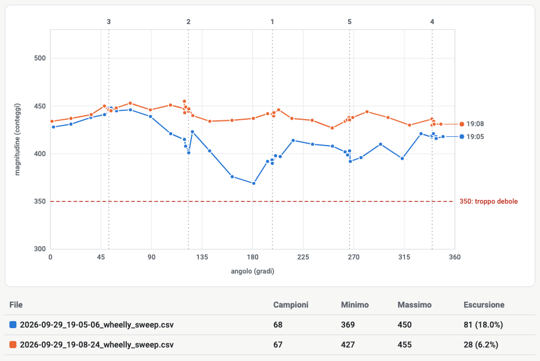

*La ruota di riferimento prima (19:05) e dopo (19:08) aver centrato il sensore, nel visualizzatore delle spazzolate: l'escursione lungo il giro è scesa da 81 a 28 conteggi, e il punto più debole è salito da 369 a 427, ben lontano dalla linea dei 350.*

- La ruota si muove davvero: falla a coperchio aperto, mai durante una sequenza (log: «Turning all the way round and measuring the magnet at every step ...»). FILTER_SLOT va in Busy a ogni passo.
- Un salto per posizione (5 su una ruota di fabbrica): la ruota finisce sulla posizione da cui era partita.
- Durante la spazzolata il driver interroga ogni 100 ms invece che ogni POLLING_PERIOD, per avere abbastanza campioni.
- Rifiutata, con Alert, mentre è in corso un cambio filtro o un'altra spazzolata.
- Alla fine: Ok, i campioni vengono scritti nella cartella delle spazzolate, e il log dà il numero di campioni, il minimo e il massimo della magnitudine e l'escursione in conteggi e in percentuale, poi il percorso del file.
- Per vedere la spazzolata come curva, apri il file con il visualizzatore delle spazzolate, https://teoteo.github.io/Wheelly/tools/sweep.html: una pagina sola, da usare online oppure salvata e aperta dal disco, senza rete. Disegna la magnitudine al variare dell'angolo con gli angoli di taratura segnati, e più spazzolate sovrapposte, per confrontare un prima e un dopo. Il file resta sul tuo computer. È anche un normale CSV, che si apre con qualunque foglio di calcolo.
- Il driver non disegna niente: un driver INDI misura e comunica, e l'immagine è compito del visualizzatore.
- Se un salto fallisce o va oltre il tempo, o se i campioni sono meno di 4, non viene scritto niente e la proprietà va in Alert (log: «The sweep stopped before finishing the turn ...»).
- Ogni salto è un movimento normale, quindi finisce anche nel registro dei movimenti quando è acceso.

### Sweeps folder

🟦 **Wheelly** · `WHEELLY_SWEEP_DIR`

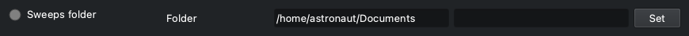

La cartella in cui il driver scrive ogni spazzolata. Se non la cambi è la cartella Documents nella home del computer su cui gira il driver (su un Raspberry, quella del Raspberry, non del tuo portatile). Puntala altrove, per esempio su un disco esterno, se tieni lì i tuoi dati.

| Elemento | |
|---|---|
| Folder | Percorso della cartella. Un '~/' iniziale diventa la cartella home. |

- Ogni spazzolata ha il suo file, con nome AAAA-MM-GG_HH-MM-SS_wheelly_sweep.csv in ora locale, così si possono confrontare una spazzolata prima e una dopo una regolazione; niente viene sovrascritto.
- Il file: righe d'intestazione che cominciano con «#» - il numero di posizioni e i loro angoli di taratura - poi «angle_deg,magnitude» e una riga per campione.
- Quando la cambi, il driver crea la cartella (un livello solo) e controlla di poterci scrivere. Se non può, la proprietà diventa rossa e il log dice «The folder ... cannot be used right now: ... The sweeps will not be saved until it can.» Il valore viene tenuto comunque (un disco può semplicemente non essere ancora montato).
- Salvata subito nella configurazione INDI.
- Una cartella vuota vuol dire quella predefinita.

### Movement log

🟦 **Wheelly** · `WHEELLY_LOG`

Accende o spegne il registro dei movimenti: un file CSV con una riga per ogni cambio filtro finito, da aprire in un foglio di calcolo quando vuoi vedere quanto è precisa la ruota nell'arco di una notte o di mesi. Spento di base.

| Elemento | |
|---|---|
| On | Scrive il registro dei movimenti (log: «Movement log on: <path>»). |
| Off | Smette di scriverlo (log: «Movement log off.»). |

- Il file è ~/.indi/wheelly_movements.csv sul computer su cui gira il driver, fisso; il suo percorso è sempre mostrato in «Files on disk». Le righe nuove si aggiungono in fondo; non si cancella niente.
- Colonne: timestamp (UTC, ISO 8601), slot (la posizione chiesta), target (angolo obiettivo, gradi), angle, error (gradi), retries, outcome (arrived, warning, failed o timeout), agc, magnitude.
- La scelta viene salvata nella configurazione INDI e applicata al collegamento successivo.
- Se il file non si può aprire il log dice perché e l'interruttore torna su Spento.

### Files on disk

🟦 **Wheelly** · `WHEELLY_FILES` · sola lettura

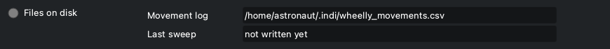

Dove stanno i due file che il driver scrive, perché i percorsi non si perdano nel log: il registro dei movimenti e l'ultima spazzolata. Tutti e due i percorsi sono sul computer su cui gira il driver.

| Elemento | |
|---|---|
| Movement log | Percorso del CSV del registro dei movimenti. Mostrato anche quando il registro è spento. |
| Last sweep | Percorso dell'ultimo CSV di spazzolata scritto dal driver, oppure «not written yet». |

- Sola lettura.
- «Last sweep» mostra «not written yet» a ogni avvio del driver, finché non si fa una spazzolata; quelle più vecchie restano nella cartella delle spazzolate.
- Alert quando l'ultima spazzolata non si è potuta scrivere; il motivo è nel log («Cannot write the sweep to ...»).
